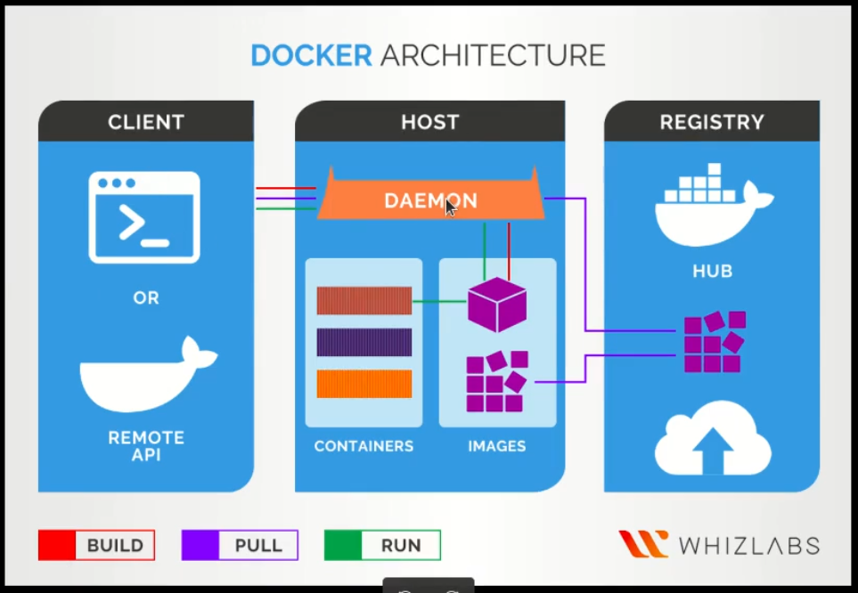
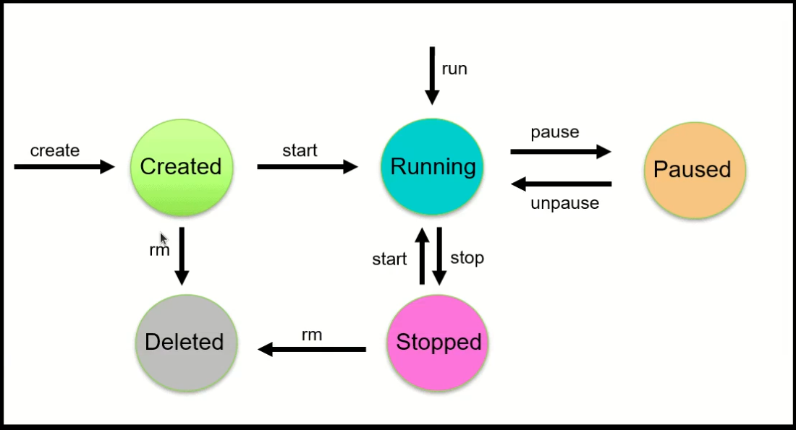
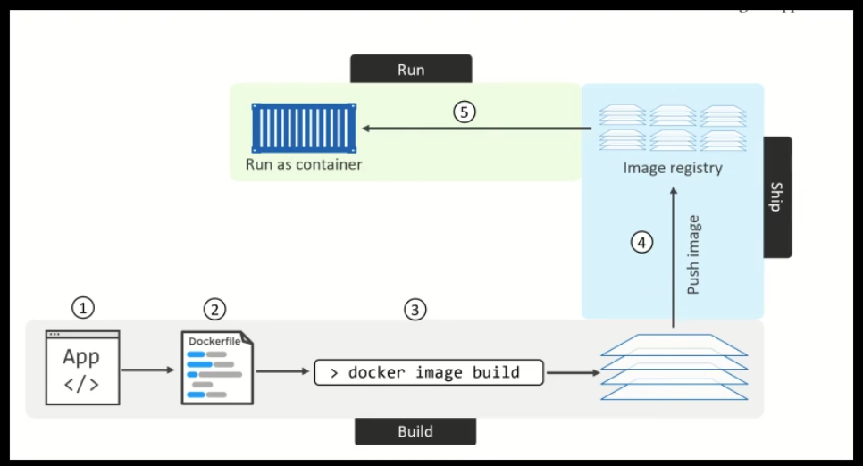

To generate this message, Docker took the following steps:
1. The Docker client contacted the Docker daemon.
2. The Docker daemon pulled the "hello-world" image from the Docker Hub.
(amd64)
3. The Docker daemon created a new container from that image which runs the
executable that produces the output you are currently reading.
4. The Docker daemon streamed that output to the Docker client, which sent it
to your terminal.


Docker pull image from docker hub 
```
docker pull <image_name>
```

Show list of images
```
docker images
```

Show list containers
```
docker ps

docker ps -a # all container
```



run image
```
docker run
```

run image by name
```
docker run --name <container name>
```

for remove container 
```
docker rm <container name>
```

for remove all of stopped container 
```
docker container prune
```

for run image and delete from stopped container 
```
docker run --rm <image name>
```

for remove image 
```
docker rmi <image name>
```

docker run container with command
```
docker run <container name> <command>
```
```
docker run busybox ls 
```

for interactive 
```
docker run -it <conatiner name>
```

run container in background and print container ID
```
docker run <image name> --detach(-d)
``` 

lifecycle and not stopped
```
docker run -dit <image name>
```

for example 
```
docker run -dit busybox
```


for create container
```
docker create --name <container name> <image>
``` 

for start container
```
docker start <container name>
```

for restart container
```
docker restart <container name>
```

for stop container
```
docker stop <container name>
```

for kill (stop force) container
```
docker kill <container name>
```

execute a command in a running container
```
docker exec <container name> <command>
```

for inteactive terminal
```
docker exec -it <container name> (bash or sh) 
```

## Restart policy

1. no
Do not automatically restart the container. (the default)

2. on-failure[:max-retries]
Restart the container if it exits due to an error, which manifests as a non-zero exi]]]t code. Optionally, limit the number of times the Docker daemon attempts to restart the container using the :max-retries option.

3. always 
Always restart the container if it stops. If it is manually stopped, it is restarted only when Docker daemon restarts or the container itself is manually restarted. (See the second bullet listed in restart policy details)

4. unless-stopped 	
Similar to always, except that when the container is stopped (manually or otherwise), it is not restarted even after Docker daemon restarts.

### always vs unless-stopped 
always -> restart after Docker daemon(sudo systemctl restart docker) 
unless-stopped  -> not restart after Docker daemon(sudo systemctl restart docker)

```
docker run -d --restart <restart poilicy> <image>
```

## Dockerfile

### FROM
```
FROM [--platform=<platform>] <image> [AS <name>]
Or
FROM [--platform=<platform>] <image>[:<tag>] [AS <name>]
Or
FROM [--platform=<platform>] <image>[@<digest>] [AS <name>]
```
The FROM instruction initializes a new build stage and sets the Base Image for subsequent instructions. As such, a valid Dockerfile must start with a FROM instruction. The image can be any valid image – it is especially easy to start by pulling an image from the Public Repositories.

### ENV
```
ENV <key>=<value> ...
```

The ENV instruction sets the environment variable <key> to the value <value>. This value will be in the environment for all subsequent instructions in the build stage and can be replaced inline in many as well. The value will be interpreted for other environment variables, so quote characters will be removed if they are not escaped. Like command line parsing, quotes and backslashes can be used to include spaces within values.
Example:
```
ENV MY_NAME="John Doe"
ENV MY_DOG=Rex\ The\ Dog
ENV MY_CAT=fluffy
```

### RUN
RUN has 2 forms:
```
RUN <command> (shell form, the command is run in a shell, which by default is /bin/sh -c on Linux or cmd /S /C on Windows)
RUN ["executable", "param1", "param2"] (exec form)
```

The RUN instruction will execute any commands in a new layer on top of the current image and commit the results. The resulting committed image will be used for the next step in the Dockerfile.

Layering RUN instructions and generating commits conforms to the core concepts of Docker where commits are cheap and containers can be created from any point in an image’s history, much like source control.

The exec form makes it possible to avoid shell string munging, and to RUN commands using a base image that does not contain the specified shell executable.

The default shell for the shell form can be changed using the SHELL command.

In the shell form you can use a \ (backslash) to continue a single RUN instruction onto the next line. For example, consider these two lines:
```
RUN /bin/bash -c 'source $HOME/.bashrc && \
echo $HOME'
```

Together they are equivalent to this single line:
```
RUN /bin/bash -c 'source $HOME/.bashrc && echo $HOME'
```

To use a different shell, other than ‘/bin/sh’, use the exec form passing in the desired shell. For example:
```
RUN ["/bin/bash", "-c", "echo hello"]
```

### CMD
The CMD instruction has three forms:
```
CMD ["executable","param1","param2"] (exec form, this is the preferred form)
CMD ["param1","param2"] (as default parameters to ENTRYPOINT)
CMD command param1 param2 (shell form)
```

**There can only be one CMD instruction in a Dockerfile. If you list more than one CMD then only the last CMD will take effect.**

The main purpose of a CMD is to provide defaults for an executing container. These defaults can include an executable, or they can omit the executable, in which case you must specify an ENTRYPOINT instruction as well.

If CMD is used to provide default arguments for the ENTRYPOINT instruction, both the CMD and ENTRYPOINT instructions should be specified with the JSON array format.

for build of Dockerfile
```
docker build -t <name image>:<tag name> <path Dockerfile>
```
for example
```
docker build -t web:latest .
```
