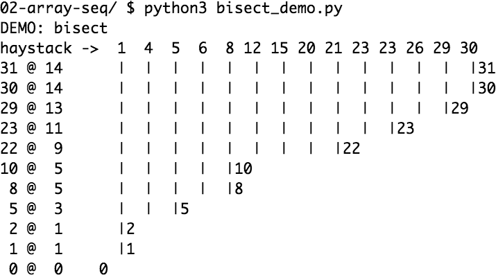
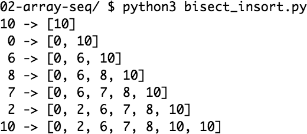

# The Python Data Model
strange to use len(collection) instead of collection.len().

The Python interpreter invokes special methods to perform basic object
operations, often triggered by special syntax. The special method names are always
written with leading and trailing double underscores. For example, the syntax
obj[key] is supported by the __getitem__ special method. In order to evaluate
my_collection[key], the interpreter calls my_collection.__getitem__(key).

"double underscore before and after.” That’s
why the special methods are also known as dunder methods. The
“Lexical Analysis” chapter of The Python Language Reference warns
that “Any use of __*__ names"

"One reason to still use my_fmt.format() is when the definition of
my_fmt must be in a different place in the code than 
where the formatting operation needs to happen"


We use ***namedtuple*** to build classes of objects that
are just bundles of attributes with no custom methods, like a database record

```
import collections

Card = collections.namedtuple('Card', ['rank', 'suit'])

class FrenchDeck:
    ranks = [str(n) for n in range(2, 11)] + list('JQKA')
    suits = 'spades diamonds clubs hearts'.split()
    
    def __init__(self):
        self._cards = [Card(rank, suit) for suit in self.suits
                                        for rank in self.ranks]
    
    def __len__(self):
        return len(self._cards)
    
    def __getitem__(self, position):
        return self._cards[position]
```

```
>>> beer_card = Card('7', 'diamonds')
>>> beer_card
Card(rank='7', suit='diamonds')
```

We’ve just seen two advantages of using special methods to leverage the Python Data Model:

• Users of your classes don’t have to memorize arbitrary method names for standard operations.
(“How to get the number of items? Is it .size(), .length(), or what?”)

• It’s easier to benefit from the rich Python standard library and avoid reinventing
the wheel, like the random.choice function.

As implemented so far, a FrenchDeck cannot be shuffled because it is immutable (namedtuple, tuple : immutable): the cards and their positions cannot be changed

The first thing to know about special methods is that they are meant to be called by
the Python interpreter, and not by you. You don’t write my_object.__len__(). You
write len(my_object) and, if my_object is an instance of a user-defined class, then
Python calls the __len__ method you implemented.

But the interpreter takes a shortcut when dealing for built-in types like list, str,
bytearray, or extensions like the NumPy arrays. Python variable-sized collections
written in C include a struct2 called PyVarObject, which has an ob_size field holding
the number of items in the collection. So, if my_object is an instance of one of those
built-ins, then len(my_object) retrieves the value of the ob_size field, and this is
much faster than calling a method.

Normally, your code should not have many direct calls to special methods. Unless
you are doing a lot of metaprogramming, you should be implementing special meth‐
ods more often than invoking them explicitly. The only special method that is fre‐
quently called by user code directly is __init__ to invoke the initializer of the
superclass in your own __init__ implementation.

```
import math

class Vector:
    def __init__(self, x=0, y=0):
        self.x = x
        self.y = y
    
    def __repr__(self):
        return f'Vector({self.x!r}, {self.y!r})'
    
    def __abs__(self):
        return math.hypot(self.x, self.y)
    
    def __bool__(self):
        return bool(abs(self))
    
    def __add__(self, other):
        x = self.x + other.x
        y = self.y + other.y
        return Vector(x, y)
    
    def __mul__(self, scalar):
        return Vector(self.x * scalar, self.y * scalar)
```

!r in fstring actually call __repr__ object for example : 

print("{obj!r}") == print("{obj.__repr__()"})
print("{obj"}) == print("{obj.__str__()}")

```
class A:
    def __str__(self):
        return "str"

    def __repr__(self):
        return "repr"


class B:
    def __init__(self, a_obj):
        self.obj = a_obj

    def show(self):
        print(f"{self.obj}")  # str
        print(f"{self.obj!r}")  # repr


a = A()
b = B(a)
b.show()
# str
# repr
```

implements two operators: + and *, to show basic usage of __add__ and
__mul__. In both cases, the methods create and return a new instance of Vector, and
do not modify either operand—self or other are merely read

```
a * b -> a.__mul__(b)
a * b -> b.__rmul__(a)
```

The __repr__ special method is called by the repr built-in to get the string represen‐
tation of the object for inspection. Without a custom __repr__, Python’s console
would display a Vector instance <Vector object at 0x10e100070>

The interactive console and debugger call repr on the results of the expressions eval‐
uated, as does the %r placeholder in classic formatting with the % operator, and the !r
conversion field in the new format string syntax used in f-strings the str.format
method

classic formatting
```
"old format %r" % ("str") -> "old format 'str'"
```

new formatting
```
"new format {'str'!r}" -> "new format 'str'"
```

Sometimes same string returned by __repr__ is user-friendly, and you don’t need to
code __str__ because the implementation inherited from the object class calls
__repr__ as a fallback.

Programmers with prior experience in languages with a toString
method tend to implement __str__ and not __repr__. If you only
implement one of these special methods in Python, choose
__repr__.

By default, instances of user-defined classes are considered truthy, unless either
__bool__ or __len__ is implemented. Basically, bool(x) calls x.__bool__() and uses
the result. If __bool__ is not implemented, Python tries to invoke x.__len__(), and
if that returns zero, bool returns False. Otherwise bool returns True.

```
class A:
    # must return True or False
    def __bool__(self):
        return true

    def __len__(self):
        return 0

a = A()

bool(a)
# call __bool__()
# if not exist __bool__() then call __len__() if return 0 bool func return False else return True 
```

## Collection API
documents the interfaces of the essential collection types in the language.
All the classes in the diagram are ABCs—abstract base classes.


UML class diagram with fundamental collection types. Method names in
italic are abstract, so they must be implemented by concrete subclasses such as list
and dict. The remaining methods have concrete implementations, therefore subclasses
can inherit them.

concrete method (normal method) != abstract method 
concrete class != abstract class 

every collection should implement:
• Iterable to support for, unpacking, and other forms of iteration
• Sized to support the len built-in function
• Container to support the in operator

Python does not require concrete classes to actually inherit from any of these ABCs.
Any class that implements __len__ satisfies the Sized interface.

Three very important specializations of Collection are:
• Sequence, formalizing the interface of built-ins like list and str
• Mapping, implemented by dict, collections.defaultdict, etc.
• Set, the interface of the set and frozenset built-in types

Defaultdict is a container like dictionaries present in the module collections. Defaultdict is a sub-class of the dictionary class that returns a dictionary-like object. The functionality of both dictionaries and defaultdict are almost same except for the fact that defaultdict never raises a KeyError. It provides a default value for the key that does not exists

```
Syntax: defaultdict(default_factory)
Parameters:  

    default_factory: A function returning the default value for the dictionary defined. If this argument is absent then the dictionary raises a KeyError.
```

```
from collections import defaultdict

def def_value():
    return "Not Present"

d = defaultdict(def_value)
d["a"] = 1
d["b"] = 2

print(d["a"])
print(d["b"])
print(d["c"])
```

Output:
```
1
2
Not Present 
```

Inner Working of defaultdict
The __missing__(self, key) method defines the behavior of a dictionary subclass if you access a non-existent key. More specifically, Python’s __getitem__() dictionary method internally calls the __missing__() method if the key doesn’t exist. The return value of __missing__() is the value to be returned when trying to access a non-existent key.

Since Python 3.7, the dict type is officially “ordered,” but that only
means that the key insertion order is preserved. You cannot
rearrange the keys in a dict however you like.

https://www.fluentpython.com/extra/internals-of-sets-and-dicts/  or  [link](set_and_dict.html)
https://tenthousandmeters.com/

__init_subclass__

To have a clear understanding of using init_subclass, let’s have a look at a simple example. Imagine a base class, Animal, with diverse subclasses, along with Cat, Dog, and Fish. We want to ensure that each time a new Animal subclass is created, a category attribute called 'species' is assigned.
```
class Animal:
    def __init_subclass__(cls, **kwargs):
        super().__init_subclass__(**kwargs)
        if not hasattr(cls, 'species'):
            raise TypeError(f"{cls.__name__} must have a 'species' attribute")
   
class Cat(Animal):
    species = 'Feline'

class Dog(Animal):
    species = 'Canine'

class Fish(Animal):  # This will raise a TypeError
    pass
```

```
class Plugin:
    _registry = {}
   
    def __init_subclass__(cls, **kwargs):
        super().__init_subclass__(**kwargs)
        cls._registry[cls.__name__] = cls

class PluginA(Plugin):
    pass

class PluginB(Plugin):
    pass

print(Plugin._registry)
```

Output
```
{'PluginA': <class 'main.PluginA'>, 'PluginB': <class 'main.PluginB'>}
```

Always Invoke super().__init_subclass__()

When enforcing __init_subclass__, it is important to name the super().__init_subclass__(**kwargs) technique. This ensures that the base class's __init_subclass__ method is achieved, permitting the right inheritance and the ideal behavior of the method in multiple inheritance situations

__getattr__

```
class Dummy(object):
    pass

d = Dummy()
d.does_not_exist  # Fails with AttributeError
```

```
class Dummy(object):
    def __getattr__(self, attr):
        return attr.upper()

d = Dummy()
d.does_not_exist # 'DOES_NOT_EXIST'
d.what_about_this_one  # 'WHAT_ABOUT_THIS_ONE'
```

```
class Dummy(object):
    def __getattr__(self, attr):
        return attr.upper()

d = Dummy()
d.value = "Python"
print(d.value)  # "Python"
```

__getattribute__

__getattribute__ is similar to __getattr__, with the important difference that __getattribute__ will intercept EVERY attribute lookup, doesn’t matter if the attribute exists or not. Let me show you a simple example:
```
class Dummy(object):
    def __getattribute__(self, attr):
        return 'YOU SEE ME?'

d = Dummy()
d.value = "Python"
print(d.value)  # "YOU SEE ME?"
```

## bisect
he bisect module offers two main functions that use the binary search algorithm to quickly find and insert items in any sorted sequence.

* Searching with bisect
* Inserting with insort

### Searching with bisect

Example 1
```
import bisect
import sys

HAYSTACK = [1, 4, 5, 6, 8, 12, 15, 20, 21, 23, 23, 26, 29, 30]
NEEDLES = [0, 1, 2, 5, 8, 10, 22, 23, 29, 30, 31]

ROW_FMT = '{0:2d} @ {1:2d}    {2}{0:<2d}'

def demo(bisect_fn):
    for needle in reversed(NEEDLES):
        position = bisect_fn(HAYSTACK, needle)  # (1)
        offset = position * '  |'  # (2)
        print(ROW_FMT.format(needle, position, offset))  # (3)

if __name__ == '__main__':
    if sys.argv[-1] == 'left':    # (4)
        bisect_fn = bisect.bisect_left
    else:
        bisect_fn = bisect.bisect

    print('DEMO:', bisect_fn.__name__)  # (5)
    print('haystack ->', ' '.join(f'{n:2}' for n in HAYSTACK))
    demo(bisect_fn)
```



Second, bisect is actually an alias for bisect_right, and there is a sister function called bisect_left. Their difference is apparent only when the needle compares equal to an item in the list: bisect_right returns an insertion point after the existing item, and bisect_left returns the position of the existing item, so insertion would occur before it. With simple types like int, inserting before or after makes no difference, but if the sequence contains objects that are distinct yet compare equal, then it may be relevant. For example, 1 and 1.0 are distinct, but 1 == 1.0 is True. Figure 2 shows the result of using bisect_left.


Example 1 with bisect_left in use (compare with Figure 1 and note the insertion points for the values 1, 8, 23, 29, and 30 to the left of the same numbers in the haystack).

An interesting application of bisect is to perform table lookups by numeric values—​for example, to convert test scores to letter grades, as in Example 2.
Example 2. Given a test score, grade returns the corresponding letter grade

```
>>> breakpoints = [60, 70, 80, 90]
>>> grades='FDCBA'
>>> def grade(score):
...     i = bisect.bisect(breakpoints, score)
...     return grades[i]
...
>>> [grade(score) for score in [55, 60, 65, 70, 75, 80, 85, 90, 95]]
['F', 'D', 'D', 'C', 'C', 'B', 'B', 'A', 'A']
```

The code in Example 2 is from the bisect module documentation, which also lists functions to use bisect as a faster replacement for the index method when searching through long ordered sequences of numbers.

When used for table lookups, bisect_left produces very different results[1]. Note the letter grade results in Example 3.
Example 3. bisect_left maps a score of 60 to grade 'F', not 'D' as in Example 2.

```
>>> breakpoints = [60, 70, 80, 90]
>>> grades='FDCBA'
>>> def grade(score):
...     i = bisect.bisect_left(breakpoints, score)
...     return grades[i]
...
>>> [grade(score) for score in [55, 60, 65, 70, 75, 80, 85, 90, 95]]
['F', 'F', 'D', 'D', 'C', 'C', 'B', 'B', 'A']
```

### Inserting with insort

Sorting is expensive, so once you have a sorted sequence, it’s good to keep it that way. That is why bisect.insort was created.

insort(seq, item) inserts item into seq so as to keep seq in ascending order. See Example 4 and its output in Figure 3.
Example 4. Insort keeps a sorted sequence always sorted

```
import bisect
import random

SIZE = 7

random.seed(1729)

my_list = []
for i in range(SIZE):
    new_item = random.randrange(SIZE * 2)
    bisect.insort(my_list, new_item)
    print(f'{new_item:2d} -> {my_list}')
```


Figure 3. Output of Example 4
Like bisect, insort takes optional lo, hi arguments to limit the search to a sub-sequence. There is also an insort_left variation that uses bisect_left to find insertion points.

# An Array of Sequences

* Container sequences

Can hold items of different types, including nested containers. Some examples:
list, tuple, and collections.deque

* Flat sequences

Hold items of one simple type. Some examples: str, bytes, and array.array.
A container sequence holds references to the objects it contains, which may be of any
type, while a flat sequence stores the value of its contents in its own memory space,
not as distinct Python objects


Simplified memory diagrams for a tuple and an array, each with three
items. Gray cells represent the in-memory header of each Python object—not drawn to
proportion. The tuple has an array of references to its items. Each item is a separate
Python object, possibly holding references to other Python objects, like that two-item
list. In contrast, the Python array is a single object, holding a C language array of three
doubles.

Thus, flat sequences are more compact, but they are limited to holding primitive
machine values like bytes, integers, and floats.

Every Python object in memory has a header with metadata. The
simplest Python object, a float, has a value field and two metadata
fields:

* ob_refcnt: the object’s reference count
* ob_type: a pointer to the object’s type
* ob_fval: a C double holding the value of the float

On a 64-bit Python build, each of those fields takes 8 bytes. That’s
why an array of floats is much more compact than a tuple of floats:
the array is a single object holding the raw values of the floats, while the tuple consists of several objects—the tuple itself and each float object contained in it.

Another way of grouping sequence types is by mutability
* Mutable sequences
For example, list, bytearray, array.array, and collections.deque.
* Immutable sequences
For example, tuple, str, and bytes.

helps visualize how mutable sequences inherit all methods from immutable sequences, and implement several additional methods. The built-in concrete
sequence types do not actually subclass the Sequence and MutableSequence abstract
base classes (ABCs), but they are virtual subclasses registered with those ABCs—as
we’ll see in Chapter 13. Being virtual subclasses, tuple and list pass these tests:

```
>>> from collections import abc
>>> issubclass(tuple, abc.Sequence)
True
>>> issubclass(list, abc.MutableSequence)
True
```


## List Comprehensions and Generator Expressions

A quick way to build a sequence is using a list comprehension (if the target is a list)
or a generator expression (for other kinds of sequences). If you are not using these
syntactic forms on a daily basis, I bet you are missing opportunities to write code that
is more readable and often faster at the same time.
If you doubt my claim that these constructs are “more readable,” read on. I’ll try to
convince you.

Here is a test: which do you find easier to read, Example 2-1 or Example 2-2?
Example 2-1. Build a list of Unicode code points from a string
```
>>> symbols = '$¢£¥€¤'
>>> codes = []
>>> for symbol in symbols:
...
codes.append(ord(symbol))
...
>>> codes
[36, 162, 163, 165, 8364, 164]
```

Example 2-2. Build a list of Unicode code points from a string, using a listcomp
```
>>> symbols = '$¢£¥€¤'
>>> codes = [ord(symbol) for symbol in symbols]
>>> codes
[36, 162, 163, 165, 8364, 164]
```


Python ord()

The ord() function returns an integer representing the Unicode character.

A for loop may be used to do lots of different things: scanning a sequence to count or
pick items, computing aggregates (sums, averages), or any number of other tasks.
The code in Example 2-1 is building up a list. In contrast, a listcomp is more explicit.
Its goal is always to build a new list.

Of course, it is possible to abuse list comprehensions to write truly incomprehensible
code. I’ve seen Python code with listcomps used just to repeat a block of code for its
side effects. If you are not doing something with the produced list, you should not use
that syntax. Also, try to keep it short. If the list comprehension spans more than two
lines, it is probably best to break it apart or rewrite it as a plain old for loop. Use your
best judgment: for Python, as for English, there are no hard-and-fast rules for clear
writing


In Python code, line breaks are ignored inside pairs of [], {}, or ().
So you can build multiline lists, listcomps, tuples, dictionaries, etc.,
without using the \ line continuation escape, which doesn’t work if
you accidentally type a space after it. Also, when those delimiter
pairs are used to define a literal with a comma-separated series of
items, a trailing comma will be ignored. So, for example, when cod‐
ing a multiline list literal, it is thoughtful to put a comma after the
last item, making it a little easier for the next coder to add one
more item to that list, and reducing noise when reading diffs.

```
[something_that_is_pretty_long
for something_that_is_pretty_long
in somethings_that_are_pretty_long]
```
You don't need \ in this case. In general, I think people avoid \ because it's slightly ugly, but also can give problems if it's not the very last thing on the line (make sure no whitespace follows it). I think it's much better to use it than not, though, in order to keep your line lengths down.

Since \ isn't necessary in the above case, or for parenthesized expressions, I actually find it fairly rare that I even need to use it.

```
new_list = [
    {
        'attribute 1': a_very_long_item.attribute1,
        'attribute 2': a_very_long_item.attribute2,
        'list_attribute': [
            {
                'dict_key_1': attribute_item.attribute2,
                'dict_key_2': attribute_item.attribute2
            }
            for attribute_item
            in a_very_long_item.list_of_items
         ]
    }
    for a_very_long_item
    in a_very_long_list
    if a_very_long_item not in [some_other_long_item
        for some_other_long_item 
        in some_other_long_list
    ]
]
```

In Python 3, list comprehensions, generator expressions, and their siblings set and
dict comprehensions, have a local scope to hold the variables assigned in the for
clause.
However, variables assigned with the “Walrus operator” := remain accessible after
those comprehensions or expressions return—unlike local variables in a function.
PEP 572—Assignment Expressions defines the scope of the target of := as the enclos‐
ing function, unless there is a global or nonlocal declaration for that target

```
>>> x = 'ABC'
>>> codes = [ord(x) for x in x]
>>> x
'ABC'
>>> codes
[65, 66, 67]
>>> codes = [last := ord(c) for c in x]
>>> last
67
>>> c
Traceback (most recent call last):
File "<stdin>", line 1, in <module> NameError: name 'c' is not defined
```

* x was not clobbered: it’s still bound to 'ABC'.
* last remains.
* c is gone; it existed only inside the listcomp.

```
[o for v in [v1, v2, v3, v4] if (o := map_to_obj(v))]
```

### filter()

The filter() function selects elements from an iterable (list, tuple etc.) based on the output of a function.
The function is applied to each element of the iterable and if it returns True, the element is selected by the filter() function.

```
def check_even(number):
    if number % 2 == 0:
          return True  
    return False

numbers = [1,2,3,4,5,6,7,8,9,10]

filter(check_even, numbers)
# <filter object at 0x7fa81c941ff0>

list(filter(check_even, numbers))
# [2, 4, 6, 8, 10]
```

filter() Syntax

The syntax of filter() is:
```
filter(function, iterable)
```

### Listcomps Versus map and filter -> listcomps vs map and filter
Listcomps do everything the map and filter functions do, without the contortions of
the functionally challenged Python lambda. Consider Example 2-3.

```
Example 2-3. The same list built by a listcomp and a map/filter composition
>>> symbols = '$¢£¥€¤'
>>> beyond_ascii = [ord(s) for s in symbols if ord(s) > 127]
>>> beyond_ascii
[162, 163, 165, 8364, 164]
>>> beyond_ascii = list(filter(lambda c: c > 127, map(ord, symbols)))
>>> beyond_ascii
[162, 163, 165, 8364, 164]
```

I used to believe that map and filter were faster than the equivalent listcomps, but
Alex Martelli pointed out that’s not the case—at least not in the preceding examples.
The 02-array-seq/listcomp_speed.py script in the Fluent Python code repository is a
simple speed test comparing listcomp with filter/map.
I’ll have more to say about map and filter in Chapter 7. Now we turn to the use of
listcomps to compute Cartesian products: a list containing tuples built from all items
from two or more lists.


```
import timeit

TIMES = 10000

SETUP = """
symbols = '$¢£¥€¤'
def non_ascii(c):
    return c > 127
"""

def clock(label, cmd):
    res = timeit.repeat(cmd, setup=SETUP, number=TIMES)
    print(label, *(f'{x:.3f}' for x in res))

clock('listcomp        :', '[ord(s) for s in symbols if ord(s) > 127]')
# listcomp        : 0.008 0.005 0.005 0.005 0.005

clock('listcomp + func :', '[ord(s) for s in symbols if non_ascii(ord(s))]')
# listcomp + func : 0.012 0.008 0.008 0.007 0.008

clock('filter + lambda :', 'list(filter(lambda c: c > 127, map(ord, symbols)))')
# filter + lambda : 0.033 0.014 0.010 0.008 0.007


clock('filter + func   :', 'list(filter(non_ascii, map(ord, symbols)))')
# filter + func   : 0.032 0.015 0.010 0.008 0.007
```

### Cartesian Products
Listcomps can build lists from the Cartesian product of two or more iterables

For example, imagine you need to produce a list of T-shirts available in two colors
and three sizes. Example 2-4 shows how to produce that list using a listcomp. The
result has six items.

Example 2-4. Cartesian product using a list comprehension
```
>>> colors = ['black', 'white']
>>> sizes = ['S', 'M', 'L']
>>> tshirts = [(color, size) for color in colors for size in sizes] # 1
>>> tshirts
[('black', 'S'), ('black', 'M'), ('black', 'L'), ('white', 'S'),
('white', 'M'), ('white', 'L')]
>>> for color in colors:                                            # 2
...    for size in sizes:
...      print((color, size))
...
('black', 'S')
('black', 'M')
('black', 'L')
('white', 'S')
('white', 'M')
('white', 'L')
>>> tshirts = [(color, size) for size in sizes for color in colors] # 3
>>> tshirts
[('black', 'S'), ('white', 'S'), ('black', 'M'), ('white', 'M'),
('black', 'L'), ('white', 'L')]
```

1. This generates a list of tuples arranged by color, then size.

2. Note how the resulting list is arranged as if the for loops were nested in the same
order as they appear in the listcomp.

3. To get items arranged by size, then color, just rearrange the for clauses; adding a
line break to the listcomp makes it easier to see how the result will be ordered.

a list made of 52 cards from all 13 ranks of each of the 4 suits, sorted by suit,
then rank:

```
self._cards = [Card(rank, suit) for suit in self.suits
                                    for rank in self.ranks]
```

### Generator Expressions
To initialize tuples, arrays, and other types of sequences, you could also start from a
listcomp, but a genexp (generator expression) saves memory because it yields items
one by one using the iterator protocol instead of building a whole list just to feed
another constructor.
Genexps use the same syntax as listcomps, but are enclosed in parentheses rather
than brackets.

Generator Expression Syntax
A generator expression has the following syntax,
```
(expression for item in iterable)
```
Here, expression is a value that will be returned for each item in the iterable.
The generator expression creates a generator object that produces the values of expression for each item in the iterable, one at a time, when iterated over.

```
>>> symbols = '$¢£¥€¤'
>>> tuple(ord(symbol) for symbol in symbols)
(36, 162, 163, 165, 8364, 164)
>>> import array
>>> array.array('I', (ord(symbol) for symbol in symbols))
array('I', [36, 162, 163, 165, 8364, 164])
```

1. If the generator expression is the single argument in a function call, there is no
need to duplicate the enclosing parentheses.

```
tuple(ord(symbol) for symbol in symbols) == tuple((ord(symbol) for symbol in symbols))
```

2. The array constructor takes two arguments, so the parentheses around the generator expression are mandatory. The first argument of the array constructor
defines the storage type used for the numbers in the array, as we’ll see in “Arrays”
on page 59.

### Creating Python Arrays
To create an array of numeric values, we need to import the array module. For example:
```
import array as arr
a = arr.array('d', [1.1, 3.5, 4.5])
print(a)
```

Output
```
array('d', [1.1, 3.5, 4.5])
```

Example 2-6 uses a genexp with a Cartesian product to print out a roster of T-shirts
of two colors in three sizes. In contrast with Example 2-4, here the six-item list of T-
shirts is never built in memory: the generator expression feeds the for loop produc‐
ing one item at a time. If the two lists used in the Cartesian product had a thousand
items each, using a generator expression would save the cost of building a list with a
million items just to feed the for loop.
Example 2-6. Cartesian product in a generator expression
```
>>> colors = ['black', 'white']
>>> sizes = ['S', 'M', 'L']
>>> for tshirt in (f'{c} {s}' for c in colors for s in sizes):
...
print(tshirt)
...
black S
black M
black L
white S
white M
white L
```

## Tuples Are Not Just Immutable Lists
Some introductory texts about Python present tuples as “immutable lists,” but that is
short selling them. Tuples do double duty: they can be used as immutable lists and
also as records with no field names. This use is sometimes overlooked, so we will start
with that.

### Tuples as Records
Tuples hold records: each item in the tuple holds the data for one field, and the posi‐
tion of the item gives its meaning.
If you think of a tuple just as an immutable list, the quantity and the order of the
items may or may not be important, depending on the context. But when using a
tuple as a collection of fields, the number of items is usually fixed and their order is
always important.
Example 2-7 shows tuples used as records. Note that in every expression, sorting the
tuple would destroy the information because the meaning of each field is given by its
position in the tuple.
Example 2-7. Tuples used as records

```
>>> lax_coordinates = (33.9425, -118.408056)
>>> city, year, pop, chg, area = ('Tokyo', 2003, 32_450, 0.66, 8014)
>>> traveler_ids = [('USA', '31195855'), ('BRA', 'CE342567'),
...
('ESP', 'XDA205856')]
>>> for passport in sorted(traveler_ids):
...
print('%s/%s' % passport)
...
BRA/CE342567
ESP/XDA205856
USA/31195855
>>> for country, _ in traveler_ids:
...
print(country)
...
USA
BRA
ESP
```

1. Latitude and longitude of the Los Angeles International Airport.

2. Data about Tokyo: name, year, population (thousands), population change (%),
and area (km²).

3. A list of tuples of the form (country_code, passport_number).

4. As we iterate over the list, passport is bound to each tuple.

5. The % formatting operator understands tuples and treats each item as a separate
field.

6. The for loop knows how to retrieve the items of a tuple separately—this is called
“unpacking.” Here we are not interested in the second item, so we assign it to _, a
dummy variable.

****
In general, using _ as a dummy variable is just a convention. It’s
just a strange but valid variable name. However, in a match/case
statement, _ is a wildcard that matches any value but is not bound
to a value. See “Pattern Matching with Sequences” on page 38. And
in the Python console, the result of the preceding command is
assigned to _—unless the result is None
****

```
traveler_ids = [('USA', '31195855'), ('BRA', 'CE342567')]
for country, _ in traveler_ids:
    print(f"country -> {country}")
    print(f"value of _ -> {_}")

# country -> USA
# value of _ -> 31195855
# country -> BRA
# value of _ -> CE342567
```

### Tuples as Immutable Lists
The Python interpreter and standard library make extensive use of tuples as immuta‐
ble lists, and so should you. This brings two key benefits:

* Clarity

When you see a tuple in code, you know its length will never change.

* Performance

A tuple uses less memory than a list of the same length, and it allows Python
to do some optimizations.

However, be aware that the immutability of a tuple only applies to the references
contained in it. References in a tuple cannot be deleted or replaced. But if one of
those references points to a mutable object, and that object is changed, then the value
of the tuple changes. The next snippet illustrates this point by creating two tuples—a
and b—which are initially equal. Figure 2-4 represents the initial layout of the b tuple
in memory.


```
When the last item in b is changed, b and a become different:
>>> a = (10, 'alpha', [1, 2])
>>> b = (10, 'alpha', [1, 2])
>>> a == b
True
>>> b[-1].append(99)
>>> a == b
False
>>> b
(10, 'alpha', [1, 2, 99])
```

an object is only hashable if its value cannot ever change. An unhashable tuple cannot 
be inserted as a dict key, or a set element.

```
a = (1, 2, 3)
dc = {a : "value"}

>>> dc
{(1, 2, 3): 'value'}
```

above code run without error because a varible containe immutable object

```
a = (1, 2, 3, [1])
dc = {a : "value"}

Traceback (most recent call last):
    File "<stdin>", line 1, in <module>
TypeError: unhashable type: 'list'
```

above code run error because a varible containe mutable object

If you want to determine explicitly if a tuple (or any object) has a fixed value, you can
use the hash built-in to create a fixed function like this

```
>>> def fixed(o):
        try:
            hash(o)
        except TypeError:
            return False
        return True


>>> tf = (10, 'alpha', (1, 2))
>>> tm = (10, 'alpha', [1, 2])

>>> fixed(tf)
True

>>> fixed(tm)
False
```

Are tuples more efficient than lists in Python ?
tuples tend to perform better than lists in almost every category

* To evaluate a tuple literal, the Python compiler generates bytecode for a tuple
constant in one operation; but for a list literal, the generated bytecode pushes
each element as a separate constant to the data stack, and then builds the list.


* Given a tuple t, tuple(t) simply returns a reference to the same t. There’s no
need to copy. In contrast, given a list l, the list(l) constructor must create a
new copy of l.


tuple
```
t = (1, 2, 3)
id(t)
139724671618880

tt = t
id(tt)
139724671618880

ttt = tuple(t)
id(ttt)
139724671618880

# id(t) == it(tt) == id(ttt)
```


list
```
l = [1, 2, 3]
id(l)
139724649846080

ll = l
id(ll)
139724649846080
# id(l) == id(ll)

lll = list(l)
id(lll)
139724670245760
# id(lll) != id(l)
```

* Because of its fixed length, a tuple instance is allocated the exact memory space
it needs. Instances of list, on the other hand, are allocated with room to spare,
to amortize the cost of future appends.

* The references to the items in a tuple are stored in an array in the tuple struct,
while a list holds a pointer to an array of references stored elsewhere. The indi‐
rection is necessary because when a list grows beyond the space currently alloca‐
ted, Python needs to reallocate the array of references to make room. The extra
indirection makes CPU caches less effective.

### Comparing Tuple and List Methods
When using a tuple as an immutable variation of list, it is good to know how similar
their APIs are. As you can see in Table 2-1, tuple supports all list methods that do
not involve adding or removing items, with one exception—tuple lacks the
__reversed__ method. However, that is just for optimization; reversed(my_tuple)
works without it.

### Unpacking Sequences and Iterables
Unpacking is important because it avoids unnecessary and error-prone use of
indexes to extract elements from sequences. Also, unpacking works with any iterable
object as the data source—including iterators, which don’t support index notation
([]). The only requirement is that the iterable yields exactly one item per variable in
the receiving end, unless you use a star (*) to capture excess items, as explained in
“Using * to Grab Excess Items” on page 36.

The most visible form of unpacking is parallel assignment; that is, assigning items
from an iterable to a tuple of variables, as you can see in this example

```
>>> lax_coordinates = (33.9425, -118.408056)
>>> latitude, longitude = lax_coordinates # unpacking
>>> latitude
33.9425
>>> longitude
-118.408056
```

An elegant application of unpacking is swapping the values of variables without using
a temporary variable:
```
>>> b, a = a, b
```

Another example of unpacking is prefixing an argument with * when calling a
function:

```
>>> divmod(20, 8)
(2, 4)
>>> t = (20, 8)
>>> divmod(*t)
(2, 4)
>>> quotient, remainder = divmod(*t)
>>> quotient, remainder
(2, 4)
```

The preceding code shows another use of unpacking: allowing functions to return
multiple values in a way that is convenient to the caller. As another example, the
os.path.split() function builds a tuple (path, last_part) from a filesystem path:

```
>>> import os
>>> _, filename = os.path.split('/home/luciano/.ssh/id_rsa.pub')
>>> filename
'id_rsa.pub'
```

Another way of using just some of the items when unpacking is to use the * syntax, as
we’ll see right away.

### Using * to Grab Excess Items
Defining function parameters with *args to grab arbitrary excess arguments is a
classic Python feature.
In Python 3, this idea was extended to apply to parallel assignment as well:

```
>>> a, b, *rest = range(5)
>>> a, b, rest
(0, 1, [2, 3, 4])
>>> a, b, *rest = range(3)
>>> a, b, rest
(0, 1, [2])
>>> a, b, *rest = range(2)
>>> a, b, rest
(0, 1, [])
```

In the context of parallel assignment, the * prefix can be applied to exactly one vari‐
able, but it can appear in any position:

```
>>> a, *body, c, d = range(5)
>>> a, body, c, d
(0, [1, 2], 3, 4)
>>> *head, b, c, d = range(5)
>>> head, b, c, d
([0, 1], 2, 3, 4)
```

### Unpacking with * in Function Calls and Sequence Literals

In function calls, we can use * multiple times:

```
>>> def fun(a, b, c, d, *rest):
...
return a, b, c, d, rest
...
>>> fun(*[1, 2], 3, *range(4, 7))
(1, 2, 3, 4, (5, 6))
```

The * can also be used when defining list, tuple, or set literals, as shown in these
examples from “What’s New In Python 3.5”:

```
>>> *range(4), 4
(0, 1, 2, 3, 4)

>>> *range(4), -10
(0, 1, 2, 3, -10)

>>> (*range(4), -10)
(0, 1, 2, 3, -10)

>>> [*range(4), 4]
[0, 1, 2, 3, 4]

>>> {*range(4), 4, *(5, 6, 7)}
{0, 1, 2, 3, 4, 5, 6, 7}
```

PEP 448 introduced similar new syntax for **, which we’ll see in “Unpacking Map‐
pings” on page 80.
Finally, a powerful feature of tuple unpacking is that it works with nested structures.

## Nested Unpacking

The target of an unpacking can use nesting, e.g., (a, b, (c, d)). Python will do the
right thing if the value has the same nesting structure

```
metro_areas = [
    ('Tokyo', 'JP', 36.933, (35.689722, 139.691667)),
    ('Delhi NCR', 'IN', 21.935, (28.613889, 77.208889)),
    ('Mexico City', 'MX', 20.142, (19.433333, -99.133333)),
    ('New York-Newark', 'US', 20.104, (40.808611, -74.020386)),
    ('São Paulo', 'BR', 19.649, (-23.547778, -46.635833)),
]

def main():
    print(f'{"":15} | {"latitude":>9} | {"longitude":>9}')
    for name, _, _, (lat, lon) in metro_areas:
        if lon <= 0:
            print(f'{name:15} | {lat:9.4f} | {lon:9.4f}')

if __name__ == '__main__':
    main()
```

The output of Example 2-8 is:

```
                | latitude | longitude
Mexico City     |19.4333   | -99.1333
New York-Newark | 40.8086  | -74.0204
São Paulo       |-23.5478  | -46.6358
```

The target of an unpacking assignment can also be a list, but good use cases are rare.
Here is the only one I know: if you have a database query that returns a single record
(e.g., the SQL code has a LIMIT 1 clause), then you can unpack and at the same time
make sure there’s only one result with this code:

```
>>> [record] = query_returning_single_row()
```

If the record has only one field, you can get it directly, like this:

```
>>> [[field]] = query_returning_single_row_with_single_field()
```

Both of these could be written with tuples, but don’t forget the syntax quirk that
single-item tuples must be written with a trailing comma. So the first target would be
(record,) and the second ((field,),). In both cases you get a silent bug if you forget


```
def return_single_list():
    return [1]

[item] = return_single_list()
>>> item
1
```

```
def return_single_list():
    return [1]

[item1, item2] = return_single_list()

Traceback (most recent call last):
    File "<stdin>", line 1, in <module>
ValueError: not enough values to unpack (expected 2, got 1)
```

```
def return_single_list():
    return [1, 2]

[item1, item2] = return_single_list()

>>> item1
1

>>> item2
2
```

```
def return_list():
    return [[1]]

[item] = return_list() 
>>> item
[1]

[[new_item]] = return_list()
>>> new_item
1
```

## Pattern Matching with Sequences
Here is a first example of match/case handling sequences. Imagine you are designing
a robot that accepts commands sent as sequences of words and numbers, like BEEPER
440 3. After splitting into parts and parsing the numbers, you’d have a message like
['BEEPER', 440, 3]. You could use a method like this to handle such messages:
Example 2-9. Method from an imaginary Robot class

```
def handle_command(self, message):
    match message:
        case ['BEEPER', frequency, times]:
            self.beep(times, frequency)
        case ['NECK', angle]:
            self.rotate_neck(angle)
        case ['LED', ident, intensity]:
            self.leds[ident].set_brightness(ident, intensity)
        case ['LED', ident, red, green, blue]:
            self.leds[ident].set_color(ident, red, green, blue)
        case _:
            raise InvalidCommand(message)
```
1. The expression after the match keyword is the subject. 

2. The subject is the data that Python will try to match to the patterns in each case clause.

3. This pattern matches any subject that is a sequence with three items. The first
item must be the string 'BEEPER'. The second and third item can be anything,
and they will be bound to the variables frequency and times, in that order.

4. This matches any subject with two items, the first being 'NECK'.

5. This will match a subject with three items starting with 'LED'. If the number of
items does not match, Python proceeds to the next case. Another sequence pattern starting with 'LED', now with five items—including the 'LED' constant.

6. This is the default case. It will match any subject that did not match a previous
pattern. The _ variable is special, as we’ll soon see.