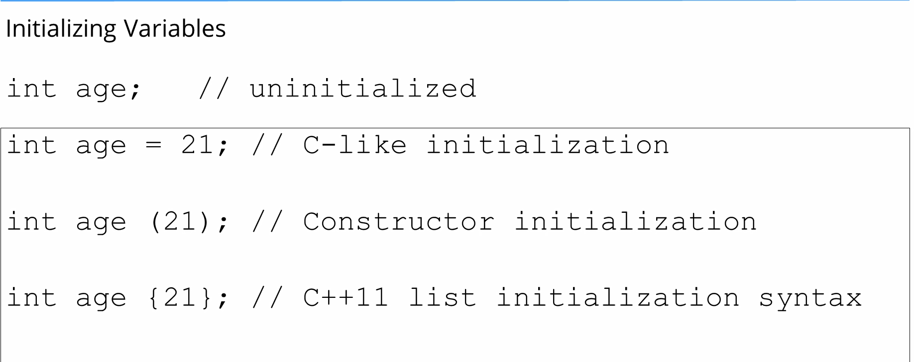

# cpp
learn and practice with cpp

* [Object file](#object-file-obj-o)
* [Keywords](#keywords)
    * [Extern](#extern)
* [void * & void **](#void)

## Object File (*.obj, *.o)
A C++ object file is an intermediate file produced by a C++ compiler from a C++ implementation file and the C++ header files that the implementation file includes. The C++ linker produces the output executable or library of your project from your C++ object files.

Object files (or object code) are machine code files generated by a compiler from source code.

The difference with an executable is that the object file isn't linked, so references to functions, symbols, etc aren't defined yet (their memory addresses is basically left blank).


Object files (or object code) are machine code files generated by a compiler from source code.

The difference with an executable is that the object file isn't linked, so references to functions, symbols, etc aren't defined yet (their memory addresses is basically left blank).

When you compile a C file with GCC:

```
gcc -Wall -o test test.c
```

Here you are compiling AND linking. So you'll got an executable, containing all the memory addresses references for the symbols it contains (libraries, headers, etc).

But when you do this:

```
gcc -Wall -o test.o -c test.c
```

You'll produce and object file. It's also machine code, but it will need to be linked in order to produce an executable, or a library.

When you have a project with many C files (for instance), you'll compile each one into object code, and then you will link all object files together in order to produce the final product.

For instance:
```
gcc -Wall -o foo.o -c foo.c              // Object file for foo.c
gcc -Wall -o bar.o -c bar.c              // Object file for bar.c
gcc -Wall -o main.o -c main.c            // Object file for main.c
gcc -Wall -o software foo.o bar.o main.o // Executable (foo + bar + main)
```

## Keywords
### Extern
The extern keyword in C++ is used to declare a global variable or function which can be accessed from any part of the program or from other files included in the program's header. The variables or functions declared with the extern keyword will have a larger scope than normally declared variables. Those variables can be accessed from any part of the program

extern keyword in C applies to C variables (data objects) and C functions. Basically, the extern keyword extends the visibility of the C variables and C functions. That’s probably the reason why it was named extern

Though most people probably understand the difference between the “declaration” and the “definition” of a variable or function, for the sake of completeness, let’s clarify it

* **Declaration** of a variable or function simply declares that the variable or function exists somewhere in the program, but the memory is not allocated for them. The declaration of a variable or function serves an important role–it tells the program what its type is going to be. In the case of function declarations, it also tells the program the arguments, their data types, the order of those arguments, and the return type of the function. So that’s all about the declaration.
* Coming to the **definition**, when we define a variable or function, in addition to everything that a declaration does, it also allocates memory for that variable or function. Therefore, we can think of the definition as a superset of the declaration (or declaration as a subset of the definition).
* Extern is a short name for external.
* The extern variable is used when a particular files need to access a variable from another file.

#### Syntax of extern
The syntax to define an extern variable in C++ is just to use the extern keyword before the variable declaration.

```
extern data_type variable_name;
```

Example of extern
```
#include <iostream> 
  
int a;            // int var;  ->  declaration and definition 
extern int b;     // extern int var;  -> declaration 
                  
  
int main()  
{   
   std::cout << b << std::endl;    
   return 0; 
}
```

#### Properties of extern Variable
* When we write extern some_data_type some_variable_name;  no memory is allocated. Only the property of the variable is announced.

* The extern variable says to the compiler  “Go outside my scope and you will find the definition of the variable that I declared.”

* The compiler believes that whatever that extern variable said is true and produces no error. Linker throws an error when it finds no such variable exists.

* When an extern variable is initialized, then memory for this is allocated and it will be considered defined.

A variable or function can be declared any number of times, but it can be defined only once. (Remember the basic principle that you can’t have two locations of the same variable or function).

## Preprocessor
The C++ preprocessor is a program that processes your source code befor the compiler sees it.

### C++ Preprocessors and Macros
As the name suggests, C++ preprocessors are tools that transform (preprocess) our program before it is compiled.

Preprocessors use preprocessor directives in order to control the code transformation. For example,

```
#include <iostream>
```

Here, #include is a preprocessor directive that inserts the contents of the <iostream> header file into our program before compiling it.


### Preprocessor Directives

In C++, all preprocessor directives begin with the # symbol. For example, #include, #define, #if, and so on.
Some of the common applications of C++ preprocessors are:

* #include - to include header files
* #define - to define macros
* #if - to provide conditional compilation

Now, let's learn about each of these preprocessor directives in detail.

### #include Preprocessor Directive
The #include directive is used to include header files in our program. For example,

```
#include <cmath>
```

Here, cmath is a header file. The #include directive tells the preprocessor to replace the above line of code with the contents of the cmath header file.

This is the reason we need to use #include <cmath> to use functions like pow() and sqrt().

We can also create our own custom header files and use them in our program using the #include directive. For example,

```
#include "path_to_file/my_header.h"
```

Here, we have included a custom header file named my_header.h in our program.

This way, we can divide a larger program into multiple files.

### #define Preprocessor Directive
The #define directive is used to "define" preprocessor variables which can be used in our programs. For example,

```
#define PI 3.1415   // value of pi
```

Now, when we use PI in our program, it is replaced with 3.1415.
Here, PI is known as a macro. A macro is a fragment of code which has been given a name.

#### Example 1: C++ #define
```
#include <iostream>

// create a macro named PI
// with the value 3.1415
#define PI 3.1415

using namespace std;

int main() {

    double radius, area;
    
    cout << "Enter the radius: ";
    cin >> radius;

    // use PI to calculate area of a circle
    area = PI * radius * radius;
    cout << "Area = " << area;
    
    return 0;
}
```

Output
```
Enter the radius: 4
Area = 50.264
```

### Function-like Macros
We can also use #define to create macros that work like a function. For example,

```
#define circleArea(r) (3.1415 * r * r)
```

Let's take a working example:
```
#include <iostream>
#define PI 3.1415

// macro that calculates area of circle
// and takes parameter 'r'
#define circle_area(r) (PI * r * r)

using namespace std;

int main() {
    
    double radius = 2.5;

    // call the circle_area() macro
    // pass radius as an argument
    cout << "Area = " << circle_area(radius);
    
    return 0;
}
```

Output
```
Area = 19.6344
Here, the code circleArea(radius); expands to 3.1415 * 2.5 * 2.5.
```

### #if Preprocessor Directive
The #if directive is used to instruct the preprocessor whether to include a block of code or not depending on certain conditions.

It can also be used in conjunction with the #else and #elif directives in case of multiple conditions.

Hence, the #if, #else, and #elif directives are quite similar to if...else statements in C++ with one major difference.

The if...else statements are tested during execution time to check if the block of code should be executed or not.

On the other hand, conditional directives are tested by the preprocessor before compilation to decide whether to include a block of code in the program or not.
```
Here's a simple example,
#include <iostream>  

// create NUMBER macro with a value of 3
#define NUMBER 3 

using namespace std;

int main() {
    
    // use #if directive to check
    // if NUMBER is greater than 0
    #if (NUMBER > 0) 
        cout << NUMBER << " is greater than 0.";
    #else
        cout << NUMBER << " is less than 0.";
    #endif         
 
    return 0;    
}
```

Output
```
3 is greater than 0.
```

Here, the #endif directive is used to indicate the completion of the #if and #else directives.

However, if...else statements are preferred over preprocessor directives for deciding which part of the code to execute during runtime.

Nevertheless, there are a few situations where #if directives are more applicable:

* To use different code depending on the operating system (platform-specific code).
* To include debugging codes (like printing debugging messages) that are run only on debugging builds.
* To toggle features on and off depending on certain conditions.
* To include code that is specific to certain versions or releases of the software (version-specific code).

Example 2: Platform-Specific C++ Code
```
#include <iostream>
using namespace std;

int main() {
    
    // include if running on windows
    #ifdef _WIN32
        cout << "Hello from Windows!" << endl;
    
    // include if running on linux
    #elif __linux__
        cout << "Hello from Linux!" << endl;
    
    // include if running on some other system
    #else
        cout << "Hello from an unknown platform!" << endl;
    #endif

    return 0;
}
```

Output
```
Hello from Linux!
```
This is an example of platform-specific code using conditional compiling.

Here,

* _WIN32 - a macro defined by the Microsoft Visual C++ compiler on Windows platforms
* __linux__ - a macro defined by GNU C Compiler on Linux systems
* #ifdef - a variant of #if which checks if a macro has been defined or not
The macros _WIN32 and __linux__ are used to determine the system on which the program is running.

### Predefined Macros
Here are some commonly used predefined macros in C++ programming.

```
Macro	Value
__DATE__	A string containing the current date.
__FILE__	A string containing the file name of the currently executing program.
__LINE__	An integer representing the current line number.
__TIME__	A string containing the current time (GMT).
```

Example 3: Predefined Macros
```
#include <iostream>
using namespace std;

int main() {

  // print the current time
  cout << "Current time: " << __TIME__;

  return 0;
}
```

Output
```
Current time: 04:23:31
```

This program prints the current time (GMT) using the __TIME__ macro.

## Comments
The compiler is never going to see commnet this because the preprocessor will see the comment and strip it out and just replace it with a single space

## Initial varible
the best way to initialize variables in C++ is using {}. Because it ensures type safety, let's talk more about it.

### Type Safety
Every object in C++ is used according to its type and an object needs to be initialized before its use.

### Safe Initialization: {}
The compiler protects from information loss during type conversion. For example,
```
int a{7}; The initialization is OK
int b{7.5} Compiler shows ERROR because of information loss.
```

### Unsafe Initialization: = or ()
The compiler doesn't protect from information loss during type conversion.
```
int a = 7 The initialization is OK
int a = 7.5 The initialization is OK, but information loss occurs. The actual value of a will become 7.0
int c(7) The initialization is OK
int c(7.5) The initialization is OK, but information loss occurs. The actual value of a will become 7.0
```


In C++, there are three main ways to initialize variables: using the assignment operator (`=`), using parentheses (`()`), and using braces (`{}`). Each of these methods has its own implications and uses. Here’s a detailed explanation of the differences between them:

### 1. Initializing a Variable using the Assignment Operator (`=`)

This is the most traditional way of initializing variables. It’s straightforward and easy to understand.

```cpp
int x = 10;       // x is initialized to 10
double y = 3.14;  // y is initialized to 3.14
std::string str = "Hello";  // str is initialized to "Hello"
```

### 2. Initializing a Variable using Parentheses (`()`)

This syntax is commonly used in the context of constructors and is especially common in object initialization.

```cpp
int x(10);       // x is initialized to 10
double y(3.14);  // y is initialized to 3.14
std::string str("Hello");  // str is initialized to "Hello"
```

### 3. Initializing a Variable using Braces (`{}`)

This is known as brace or uniform initialization, introduced in C++11. It provides a uniform way to initialize variables and objects and helps to avoid certain pitfalls like narrowing conversions.

```cpp
int x{10};       // x is initialized to 10
double y{3.14};  // y is initialized to 3.14
std::string str{"Hello"};  // str is initialized to "Hello"
```

#### Differences and Specifics

1. **Type Safety and Narrowing Conversions:**
   - Brace initialization `{}` prevents narrowing conversions, which means you cannot initialize a variable if it would lose data in the process.
   ```cpp
   int x = 3.14;   // Allowed, x becomes 3
   int y(3.14);    // Allowed, y becomes 3
   int z{3.14};    // Error: narrowing conversion from double to int
   ```

2. **Default Initialization:**
   - For classes and structs, brace initialization ensures all members are initialized.
   ```cpp
   struct Point {
       int x, y;
   };
   
   Point p1;        // Members x and y are uninitialized
   Point p2{};      // Members x and y are initialized to 0
   Point p3 = {};   // Members x and y are initialized to 0
   ```

3. **Initialization of Arrays and Containers:**
   - Brace initialization is particularly useful for initializing arrays and containers.
   ```cpp
   int arr[3] = {1, 2, 3};  // Array of integers
   std::vector<int> vec{1, 2, 3};  // Vector of integers
   ```

4. **Distinguishing between Function Declarations and Variable Declarations:**
   - Parentheses can sometimes be confusing because they can be interpreted as function declarations. Brace initialization avoids this ambiguity.
   ```cpp
   int x();  // This is a function declaration, not a variable declaration
   int y{};  // This is a variable declaration and initialization
   ```

5. **Uniform Initialization for Complex Types:**
   - Brace initialization provides a uniform way to initialize complex types, including objects of classes and structs.
   ```cpp
   class MyClass {
   public:
       MyClass(int a, double b) : x(a), y(b) {}
   private:
       int x;
       double y;
   };
   
   MyClass obj1(10, 3.14);  // Using parentheses
   MyClass obj2{10, 3.14};  // Using braces (preferred)
   ```

### Summary

- **Assignment Operator (`=`):** Traditional, simple, and widely used. Allows narrowing conversions.
- **Parentheses (`()`):** Often used for direct initialization, particularly for constructors and function arguments. Can lead to ambiguity in certain contexts.
- **Braces (`{}`):** Introduced in C++11, preferred for uniform initialization. Prevents narrowing conversions, ensures all members are initialized, and avoids ambiguity.

Using brace initialization is generally recommended for its safety and clarity, especially in modern C++ code.

## limits.h 
The maximum and minimum size of integral values are quite useful or in simple terms, limits of any integral type plays quite a role in programming. Instead of remembering these values, different macros can be used.

```
<climits>(limits.h) defines sizes of integral types.
```

This header defines constants with the limits of fundamental integral types for the specific system and compiler implementation used.
The limits for fundamental floating-point types are defined in <cfloat> (<float.h>). 
The limits for width-specific integral types and other typedef types are defined in <cstdint> (<stdint.h>).

Different macro constants are :

1. CHAR_MIN : 
```
Minimum value for an object of type char
Value of CHAR_MIN is either -127 (-27+1) or less* or 0
```

2. CHAR_MAX :  
```
Maximum value for an object of type char
Value of CHAR_MAX is either 127 (27-1) or 255 (28-1) or greater*    
```

3. SHRT_MIN :  
```
Minimum value for an object of type short int
Value of SHRT_MIN is -32767 (-215+1) or less*
```

4. SHRT_MAX :  
```
Maximum value for an object of type short int
Value of SHRT_MAX is 32767 (215-1) or greater*
```

5. USHRT_MAX :  
```
Maximum value for an object of type unsigned short int    
Value of USHRT_MAX is 65535 (216-1) or greater*
```

6. INT_MIN :  
```
Minimum value for an object of type int    
Value of INT_MIN is -2147483648 (-231) or less*
```

7. INT_MAX : 
```
Maximum value for an object of type int    
Value of INT_MAX is 2147483647 ( 231-1)
```

8. UINT_MAX :  
```
Maximum value for an object of type unsigned int    
Value of UINT_MAX is 4294967295 (232-1) or greater*
```

9. LONG_MIN :  
```
Minimum value for an object of type long int    
Value of LONG_MIN is -2147483647 (-231+1) or less*
```

10. LONG_MAX :  
```
Maximum value for an object of type long int    
Value of LONG_MAX is 2147483647 (231-1) or greater*
```

## sizeof
The sizeof is a keyword, but it is a compile-time operator that determines the size, in bytes, of a variable or data type.

The sizeof operator can be used to get the size of classes, structures, unions and any other user defined data type.

The syntax of using sizeof is as follows −

sizeof (data type)
Where data type is the desired data type including classes, structures, unions and any other user defined data type.

Try the following example to understand all the sizeof operator available in C++. Copy and paste following C++ program in test.cpp file and compile and run this program.

```
#include <iostream>
using namespace std;
 
int main() {
   cout << "Size of char : " << sizeof(char) << endl;
   cout << "Size of int : " << sizeof(int) << endl;
   cout << "Size of short int : " << sizeof(short int) << endl;
   cout << "Size of long int : " << sizeof(long int) << endl;
   cout << "Size of float : " << sizeof(float) << endl;
   cout << "Size of double : " << sizeof(double) << endl;
   cout << "Size of wchar_t : " << sizeof(wchar_t) << endl;
   
   return 0;
}
```

When the above code is compiled and executed, it produces the following result, which can vary from machine to machine −

```
Size of char : 1
Size of int : 4
Size of short int : 2
Size of long int : 4
Size of float : 4
Size of double : 8
Size of wchar_t : 4
```

## Constants
In C++, a constant is a value that cannot be altered by the program during its execution. Constants are used to define values that remain the same throughout the program. There are several ways to define constants in C++. Let's go through each type with detailed explanations and examples.

### 1. Literal Constants
Literal constants are the simplest form of constants. They are values written directly in the code. Here are some examples:

- **Integer literals**: `42`, `0`, `-7`
- **Floating-point literals**: `3.14`, `-0.001`, `2.0e10`
- **Character literals**: `'a'`, `'Z'`, `'\n'` (newline)
- **String literals**: `"Hello, World!"`, `"C++"`

Example:
```cpp
#include <iostream>
using namespace std;

int main() {
    int age = 25;          // integer literal
    double pi = 3.14159;   // floating-point literal
    char grade = 'A';      // character literal
    string name = "Alice"; // string literal

    cout << "Age: " << age << endl;
    cout << "PI: " << pi << endl;
    cout << "Grade: " << grade << endl;
    cout << "Name: " << name << endl;

    return 0;
}
```

### 2. `const` Keyword
The `const` keyword is used to define variables whose values cannot be changed after initialization.

Example:
```cpp
#include <iostream>
using namespace std;

int main() {
    const int birthYear = 1995; // constant integer
    const double gravity = 9.81; // constant floating-point number

    cout << "Birth Year: " << birthYear << endl;
    cout << "Gravity: " << gravity << endl;

    // Uncommenting the following lines will cause a compilation error
    // birthYear = 2000;
    // gravity = 9.8;

    return 0;
}
```

### 3. Enumerated Constants (`enum`)
An `enum` is a user-defined type that consists of a set of named integral constants. This is useful for defining a collection of related constants.

Example:
```cpp
#include <iostream>
using namespace std;

enum Color { RED, GREEN, BLUE };

int main() {
    Color favoriteColor = BLUE;

    if (favoriteColor == BLUE) {
        cout << "Your favorite color is blue." << endl;
    }

    // The underlying values of enum constants are integers starting from 0
    cout << "Value of RED: " << RED << endl;
    cout << "Value of GREEN: " << GREEN << endl;
    cout << "Value of BLUE: " << BLUE << endl;

    return 0;
}
```

### 4. `constexpr` Keyword
The `constexpr` keyword is used to define constants that can be evaluated at compile time. This is useful for defining constants that involve complex expressions.

Example:
```cpp
#include <iostream>
using namespace std;

constexpr int getSquare(int x) {
    return x * x;
}

int main() {
    constexpr int sideLength = 5;
    constexpr int area = getSquare(sideLength);

    cout << "Side Length: " << sideLength << endl;
    cout << "Area: " << area << endl;

    return 0;
}
```

### 5. `#define` Preprocessor Directive
The `#define` directive is used to define constant macros. These are replaced by their values before the compilation process begins. However, using `#define` for constants is generally discouraged in favor of `const` or `constexpr` due to better type safety and scope control.

Example:
```cpp
#include <iostream>
using namespace std;

#define PI 3.14159
#define CIRCLE_AREA(radius) (PI * (radius) * (radius))

int main() {
    double radius = 4.5;
    double area = CIRCLE_AREA(radius);

    cout << "Radius: " << radius << endl;
    cout << "Circle Area: " << area << endl;

    return 0;
}
```

### Summary
- **Literal Constants**: Directly written values (e.g., `42`, `3.14`, `"Hello"`).
- **`const` Keyword**: Defines immutable variables.
- **`enum`**: Defines a set of related integral constants.
- **`constexpr` Keyword**: For compile-time evaluated constants.
- **`#define` Preprocessor Directive**: Defines macros, though less preferred.

Each of these types has its own use case and advantages, providing flexibility in how constants are defined and used in C++ programs.

## constexpr
constexpr is a feature added in C++ 11. The main idea is a performance improvement of programs by doing computations at compile time rather than run time. Note that once a program is compiled and finalized by the developer, it is run multiple times by users. The idea is to spend time in compilation and save time at run time (similar to template metaprogramming).  constexpr specifies that the value of an object or a function can be evaluated at compile-time and the expression can be used in other constant expressions. 

Example:
```
// C++ program to demonstrate constexpr function for product
// of two numbers. By specifying constexpr, we suggest
// compiler to evaluate value at compile time
#include <iostream>

constexpr int product(int x, int y) { return (x * y); }

int main()
{
    constexpr int x = product(10, 20);
    std::cout << x;
    return 0;
}
```
Output
```
200
```
A function be declared as constexpr

* In C++ 11, a constexpr function should contain only one return statement. C++ 14 allows more than one statement.
* constexpr function should refer only to constant global variables.
* constexpr function can call only other constexpr functions not simple functions.
* The function should not be of a void type.
* In C++11, prefix increment (++v) was not allowed in constexpr function but this restriction has been removed in C++14.

It might seem like unnecessary to write a function that just returns the multiplication of a given number as constexpr. Other than performance improvement where could this feature be useful?

The main advantage of this feature is that it allows us to use a function to evaluate compile-time constant. With this, we could calculate the size of the array at compile time which was not possible before.

```
// C++ program to demonstrate constexpr function to evaluate
// the size of array at compile time.
#include <iostream>

constexpr int product(int x, int y) { return (x * y); }

int main()
{
    int arr[product(2, 3)] = {1, 2, 3, 4, 5, 6};
    std::cout << arr[5];
    return 0;
}
```

Output
```
6
```

Another practical use case is to convert the unit from one system to another. E.g., trigonometric function in C/C++ takes angle in radian whereas most of the people finds easier to use angle in degree. So, we could write ConvertDegreeToRadian() function as constexpr without compromising with performance and readability of the code.

```
#include <iostream>
using namespace std;
const double PI = 3.14159265359;
constexpr double ConvertDegreeToRadian(const double& dDegree)
{
    return (dDegree * (PI / 180));
}

int main() 
{
    auto dAngleInRadian = ConvertDegreeToRadian(90.0);
    cout << "Angle in radian: " << dAngleInRadian;
    return 0;
}
```

Output
```
Angle in radian: 1.5708
```

Example of performance improvement by constexpr: 
```
// A C++ program to demonstrate the use of constexpr 
#include<iostream>  

constexpr long int fib(int n) 
{ 
    return (n <= 1) ? n : fib(n-1) + fib(n-2); 
} 

int main () 
{ 
    // value of res is computed at compile time. 
    constexpr long int res = fib(30); 
    std::cout << res; 
    return 0; 
} 
```

Output
```
832040
```
When the above program is run on GCC, it takes 0.003 seconds (We can measure time using the time command) If we remove const from the below line, then the value of fib(5) is not evaluated at compile-time, because the result of constexpr is not used in a const expression.

```
Change,
  constexpr long int res = fib(30);  
To,
  long int res = fib(30);
```

After making the above change, the time taken by the program becomes higher by 0.017 seconds.

constexpr with constructors: A constructor that is declared with a constexpr specifier is a constexpr constructor also constexpr can be used in the making of constructors and objects. A constexpr constructor is implicitly inline.

Restrictions on constructors that can use constexpr:
* No virtual base class
* Each parameter should be literal
* It is not a try block function

Example:
```
// C++ program to demonstrate uses 
// of constexpr in constructor 
#include <iostream> 

// A class with constexpr 
// constructor and function 
class Rectangle 
{ 
    int _h, _w; 
public: 
    // A constexpr constructor 
    constexpr Rectangle(int h, int w) : _h(h), _w(w) {} 
    
    constexpr int getArea() const { return _h * _w; } 
}; 

// driver program to test function 
int main() 
{ 
    // Below object is initialized at compile time 
    constexpr Rectangle obj(10, 20); 
    std::cout << obj.getArea(); 
    return 0; 
} 
```

## Macro
In C++, a macro is a fragment of code that is given a name. Whenever the name is used, it is replaced by the contents of the macro. Macros are defined using the `#define` directive and are a feature of the C++ preprocessor.

Macros can be used for a variety of purposes, such as defining constants, creating inline functions, and including guard headers to prevent multiple inclusions of the same file. They are generally used for code that needs to be reused in multiple places but are often avoided in favor of safer and more powerful language features like constants, inline functions, and templates.

### Defining a Macro

A simple macro definition looks like this:

```cpp
#define PI 3.14159
```

In this example, `PI` is defined as `3.14159`. Whenever `PI` is used in the code, it will be replaced by `3.14159` during preprocessing.

### Function-like Macros

Macros can also take arguments, similar to functions:

```cpp
#define SQUARE(x) ((x) * (x))
```

Here, `SQUARE(x)` is a macro that calculates the square of `x`. Whenever `SQUARE(y)` is used, it is replaced by `((y) * (y))`.

### Example Usage

Here is a simple example demonstrating the use of macros:

```cpp
#include <iostream>

#define PI 3.14159
#define SQUARE(x) ((x) * (x))

int main() {
    double radius = 5.0;
    double area = PI * SQUARE(radius);
    std::cout << "Area of the circle: " << area << std::endl;
    return 0;
}
```

Output:

```
Area of the circle: 78.53975
```

### Conditional Compilation

Macros can also be used for conditional compilation, allowing certain parts of the code to be included or excluded based on conditions:

```cpp
#ifdef DEBUG
    #define LOG(msg) std::cout << "DEBUG: " << msg << std::endl
#else
    #define LOG(msg)
#endif
```

In this example, if `DEBUG` is defined, `LOG(msg)` will output a debug message. If `DEBUG` is not defined, `LOG(msg)` will do nothing.

### Header Guards

Macros are commonly used to prevent multiple inclusions of the same header file, which can lead to errors. This is done using header guards:

```cpp
#ifndef MY_HEADER_H
#define MY_HEADER_H

// Header file content goes here

#endif // MY_HEADER_H
```

### Caution with Macros

While macros can be powerful, they can also be dangerous if not used carefully. Some potential issues include:

1. **Lack of Type Safety**: Macros do not perform type checking, which can lead to unexpected behavior.
2. **Complex Debugging**: Errors in macros can be hard to trace because they are replaced by the preprocessor before compilation.
3. **Side Effects**: Macros that take arguments can cause unintended side effects if the arguments have side effects (e.g., function calls).

### Modern Alternatives

In modern C++, many of the uses of macros can be replaced with more robust and type-safe alternatives such as:

- `const` or `constexpr` for constant values.
- Inline functions for small, reusable code snippets.
- Templates for type-safe, generic programming.

Using these alternatives can make the code safer, easier to debug, and more maintainable.

## statements and expressions
In C++, statements and expressions are fundamental components of the language that allow you to perform operations and control the flow of a program. Here's a detailed explanation of both:

### Expressions
An expression is a combination of operators and operands that computes a value. Expressions can be simple or complex, and they can include variables, constants, and function calls. In C++, expressions are used to perform computations, assign values, and produce results that can be used in further expressions or statements.

#### Examples of expressions:
- **Literal values:** `42`, `'a'`, `3.14`
- **Variable names:** `x`, `y`, `z`
- **Arithmetic operations:** `a + b`, `c * d`, `e / f`
- **Function calls:** `foo()`, `bar(a, b)`
- **Logical operations:** `x && y`, `a || b`
- **Comparison operations:** `a > b`, `x == y`

```cpp
int a = 5;
int b = 10;
int c = a + b;  // a + b is an expression that evaluates to 15
```

### Statements
A statement is a complete instruction that performs some action. Statements are typically constructed from expressions, but they can also include control structures and declarations. In C++, statements are terminated by a semicolon (`;`).

#### Types of statements:
- **Expression statement:** Any expression followed by a semicolon.
- **Declaration statement:** Declares a variable or function.
- **Compound statement:** A group of statements enclosed in curly braces `{}`.
- **Control statement:** Controls the flow of execution (e.g., `if`, `for`, `while`).

#### Examples of statements:
- **Expression statement:** `a = b + c;`
- **Declaration statement:** `int x = 42;`
- **Compound statement:**
  ```cpp
  {
      int x = 5;
      int y = 10;
      std::cout << x + y;
  }
  ```
- **Control statement:**
  ```cpp
  if (x > y) {
      std::cout << "x is greater than y";
  } else {
      std::cout << "x is not greater than y";
  }
  ```

### Putting it all together
Here's a small C++ program that combines expressions and statements:

```cpp
#include <iostream>

int main() {
    int a = 5;             // Declaration statement
    int b = 10;            // Declaration statement
    int c = a + b;         // Expression statement (a + b is an expression)
    
    std::cout << c << std::endl;  // Expression statement

    if (c > 10) {          // Control statement with an expression (c > 10)
        std::cout << "c is greater than 10" << std::endl;
    } else {
        std::cout << "c is not greater than 10" << std::endl;
    }

    return 0;              // Return statement
}
```

In this program:
- `int a = 5;`, `int b = 10;`, and `int c = a + b;` are declaration statements.
- `a + b` and `c > 10` are expressions.
- `std::cout << c << std::endl;` and `return 0;` are expression statements.
- The `if`-`else` block is a control statement containing compound statements.

Understanding the distinction between statements and expressions is crucial for writing and debugging C++ programs effectively.

Sure! Let's break down the concepts of expressions and statements in C++ with simpler explanations and more examples.

### Expressions
An expression is any valid combination of variables, constants, and operators that can be evaluated to produce a value. Think of an expression as something that computes or evaluates to a result.

#### Simple Examples of Expressions:
- `5` (just a number, evaluates to 5)
- `x` (a variable, evaluates to the value stored in `x`)
- `3 + 2` (arithmetic, evaluates to 5)
- `a * b` (multiplication, evaluates to the product of `a` and `b`)

### Statements
A statement is a complete instruction that tells the program to perform an action. Statements usually end with a semicolon (`;`).

#### Types of Statements and Examples:

1. **Expression Statement:**
   - An expression followed by a semicolon.
   - Example: `x = 5;` (assigns the value 5 to `x`)

2. **Declaration Statement:**
   - Declares a variable.
   - Example: `int y = 10;` (declares an integer variable `y` and initializes it to 10)

3. **Compound Statement:**
   - A group of statements enclosed in curly braces `{}`.
   - Example:
     ```cpp
     {
         int a = 1;
         int b = 2;
         int c = a + b;
     }
     ```
     (This block of code declares three variables and performs an addition.)

4. **Control Statement:**
   - Controls the flow of the program (like `if`, `for`, `while`).
   - Example:
     ```cpp
     if (x > y) {
         std::cout << "x is greater than y";
     } else {
         std::cout << "x is not greater than y";
     }
     ```
     (Checks if `x` is greater than `y` and prints a message accordingly.)

### More Detailed Examples

Let's look at a simple C++ program that includes both expressions and statements:

```cpp
#include <iostream>

int main() {
    // Declaration statement
    int a = 5;    // declares a variable 'a' and initializes it to 5

    // Another declaration statement
    int b = 10;   // declares a variable 'b' and initializes it to 10

    // Expression statement
    int sum = a + b; // 'a + b' is an expression that evaluates to 15, then assigns it to 'sum'

    // Output statement (also an expression statement)
    std::cout << sum << std::endl; // evaluates to printing the value of 'sum' (which is 15)

    // Control statement with a compound statement inside
    if (sum > 10) {
        std::cout << "sum is greater than 10" << std::endl;
    } else {
        std::cout << "sum is not greater than 10" << std::endl;
    }

    // Return statement
    return 0;  // Ends the 'main' function and returns 0 to the operating system
}
```

### Breaking Down the Program:
1. **Declaration Statements:**
   - `int a = 5;` declares `a` and initializes it to 5.
   - `int b = 10;` declares `b` and initializes it to 10.
   - `int sum = a + b;` declares `sum` and initializes it to the result of `a + b`.

2. **Expression Statements:**
   - `a + b` is an expression that evaluates to 15.
   - `std::cout << sum << std::endl;` prints the value of `sum`.

3. **Control Statements:**
   - `if (sum > 10)` checks if `sum` is greater than 10.
   - Inside the `if`, the compound statement `{ std::cout << "sum is greater than 10" << std::endl; }` executes if the condition is true.
   - `else { std::cout << "sum is not greater than 10" << std::endl; }` executes if the condition is false.

4. **Return Statement:**
   - `return 0;` ends the `main` function.

By understanding these simple examples and explanations, you can see how expressions and statements form the building blocks of C++ programs.

### [Statement vs Expression](https://www.freecodecamp.org/news/statement-vs-expression-whats-the-difference-in-programming/)
Learning the syntax of a programming language is key if you want to use that language effectively. This is true for both new and experienced developers.

And one of the most important things to pay attention to while learning a programming language is whether the code you're dealing with is a statement or an expression.

It can sometimes be confusing to differentiate between statements and expressions in programming. So this article is meant to simplify the differences so that you can improve your programming skills and become a better developer.

An expression is any word or group of words or symbols that is a value. In programming, an expression is a value, or anything that executes and ends up being a value.

It is necessary to understand that a value is unique. For example, const, let, 2, 4, s, a, true, false, and world are values because each of them is unique in meaning or character.

Let's look at some code as an example:

```
const price = 500;
```

Judging from the code above, const, price, =, and 500 are expressions because each of them has a definite and unique meaning or value. But if we take all of them together const price = 500 - then we have a statement.

Let's look at another example:

```
let multiply = function (firstNumber, secondNumber) {
    return firstNumber * secondNumber;
}
```

Looking at the code above, you can see an anonymous function is assigned to a variable. Oh, wait! You might know that any function is a statement. Can it also be an expression?

Yes! A "function" and a "class" are both statements and expressions because they can perform actions (do or not do tasks) and still execute to a value.

### What is a Statement in Programming?
A statement is a group of expressions and/or statements that you design to carry out a task or an action.

Statements are two-sided – that is, they either do tasks or don't do them. Any statement that can return a value is automatically qualified to be used as an expression. That is why a function or class is a statement and also an expression in JavaScript.

If you look at the example of the function under the section on expressions, you can see it is assigned and execute to a value passed to a variable. That is why it is an expression in that case.

Examples of Statements in Programming
Inline statements
```
let amount = $2000;
```
The whole of the code above is a statement because it carries out the task of assigning $2000 to amount. It is safe to say a line of code is a statement because most compilers or interpreters don't execute any standalone expression.

### Block statements
Look at the below if statement:
```
if( iLoveYou ) {
    let status = "you should know I mean it"; 

    console.log(status)
}
```
The if statement is a statement because it helps us check whether I love you or not. As I have said before, it is two-sided: this code finds out whether "I love you" or not, and that is why it is a statement. Also, it doesn't return any value but it can create side effects.

Here's a loop statement:
```
for( ) {
   //code block
}

while ( counter < 5 ) {
   console.log(' less than 5' );
}
```
In short, any loop is a statement because if it can only do the tasks it is meant to do or not – does loop and doesn't loop. But a loop can't execute to a value in the end. They can only have side effects in JavaScript. Once they can execute to a value in a programming language, then they can also be used as an expression.

For example, you can use forloop and if statement as expressions in Python.
```
# Define a list of numbers
numbers = [1, 2, 3, 4, 5]

# compute the sum of the numbers
total = sum([num for num in numbers])
```
There is also an "IF" expression in Python. That means that something that is a statement in one language can be an expression (or both statement and expression) in another.
```
a = 1
result = 'even' if a % 2 == 0 else 'odd'
print(result)
```
Look at the below function statement:
```
//we define the function as a statement
function add(firstNumber, secondNumber) {
    return firstNumber * secondNumber;
}

//we call it as a statement
add(2, 3);

```
We declare the function add(firstNumber, secondNumber) and it returns a value. The function is called with two arguments as in add(2, 3) by declaration and so it is a statement. If you pay close attention, you will realize that calling the function as a statement is useless since it has no side effect.

Hey, stop! How can we turn it into an expression? Oh yeah, we can do it like this:
```
   const five = add(2, 3)
```
Though the function is now an expression the way it is called above, the whole of the code is still a statement.

Check out this class statement:
```
let User = class Person {
  sayHi() {
    alert("Hi");
  }
};
```
You can see that we declare the class "Person" and instantiate and assign it to "User" immediately. So, it is used as an expression.

Now, let's use it as a statement:
```
//We write class as a statement
class Person {
  sayHi() {
    alert("Hi");
  }
}

// we instantiate it as a statement.
new Person().sayHi();

// we instantiate it as an expression
let User = Person();
```
A class is similar to a function in the sense that it can be declared, assigned, or used as an operand just like a class. So, a class is a statement and/or an expression.

### The Main Differences Between an Expression and a Statement in Programming
Expressions can be assigned or used as operands, while statements can only be declared.

Statements create side effects to be useful, while expressions are values or execute to values.

Expressions are unique in meaning, while statements are two-sided in execution. For example, 1 has a certain value while go( ) may be executed or not.

Statements are the whole structure, while expressions are the building blocks. For example, a line or a block of code is a statement.

### Why You Should Know the Difference
First of all, understanding the difference between statements and expressions should make learning new programming languages less surprising. If you're used to JavaScript, you may be surprised by Python's ability to assign an if statement as a variable which is not possible in JavaScript.

Second, it makes it easy to use programming paradigms across different programming languages.

For example, a JavaScript "if statement" cannot be used as an expression because it can't execute to a value – it can only create side effects. Yet, you can use the ternary operator if you want to avoid the side effects of using an if statement in JavaScript.

For this reason, you can understand why some programmers avoid if statements by using the ternary operator in JavaScript. It is because they want to avoid side effects.

It also makes your realize why you have to be always careful about the scope of your variables whenever you use a statement. This is true because statements mostly have side effects to be useful, and it is reasonable to understand the scope of your variables and operations. For example,
```
let counter = 0;

function addFive() {
    counter += 5
    console.log(counter)
}

function addTwo() {
    counter += 2
    console.log(counter)
}

addFive(counter);// what will this show in the console?
addTwo(counter);// what will this show in the console?
```

Hey wait! What would be logged in the console if you ran the code above?

Tell yourself the answer first and then paste the code in the console to confirm. If you you're wrong, you need to learn more about scope and side effects. But if you're right, try to make those functions a bit better to avoid the confusion they may generate.

Knowing the difference also helps you to easily identify non-composable and composable syntaxes (functions, classes, modules, and so on) of a programming language. This makes porting your experience from one programming language to another more interesting and direct.

### Wrapping Up
Now that you understand the difference between expressions and statements in programming, and you know why understanding the differences is important, you can identify pieces of code as expressions or statements while coding.

Next time, we'll go even further and help make learning a second programming language easier.

## How do I catch a Ctrl+C event in C++?
The CTRL + C is used to send an interrupt to the current executing task. In this program, we will see how to catch the CTRL + C event using C++.

The CTRL + C is one signal in C or C++. So we can catch by signal catching technique. For this signal, the code is SIGINT (Signal for Interrupt). Here the signal is caught by signal() function. Then one callback address is passed to call function after getting the signal.

Please see the program to get the better idea.

Example
```
#include <unistd.h>
#include <iostream>
#include <cstdlib>
#include <signal.h>
using namespace std;
// Define the function to be called when ctrl-c (SIGINT) is sent to process
void signal_callback_handler(int signum) {
   cout << "Caught signal " << signum << endl;
   // Terminate program
   exit(signum);
}
int main(){
   // Register signal and signal handler
   signal(SIGINT, signal_callback_handler);
   while(true){
      cout << "Program processing..." << endl;
      sleep(1);
   }
   return EXIT_SUCCESS;
}
```

Output
```
$ g++ test.cpp
$ ./a.out
Program processing...
Program processing...
Program processing...
Program processing...
Program processing...
Program processing...
^CCaught signal 2
```

## Signal Handling
Signals are the interrupts delivered to a process by the operating system which can terminate a program prematurely. You can generate interrupts by pressing Ctrl+C on a UNIX, LINUX, Mac OS X or Windows system.

There are signals which can not be caught by the program but there is a following list of signals which you can catch in your program and can take appropriate actions based on the signal. These signals are defined in C++ header file <csignal>.

Sr.No	Signal & Description
1. SIGABRT
Abnormal termination of the program, such as a call to abort.

2. SIGFPE
An erroneous arithmetic operation, such as a divide by zero or an operation resulting in overflow.

3. SIGILL
Detection of an illegal instruction.

4. SIGINT
Receipt of an interactive attention signal.

5. SIGSEGV
An invalid access to storage.

6. SIGTERM
A termination request sent to the program.

### The signal() Function
C++ signal-handling library provides function signal to trap unexpected events. Following is the syntax of the signal() function −

```
void (*signal (int sig, void (*func)(int)))(int); 
```

Keeping it simple, this function receives two arguments: first argument as an integer which represents signal number and second argument as a pointer to the signal-handling function.

Let us write a simple C++ program where we will catch SIGINT signal using signal() function. Whatever signal you want to catch in your program, you must register that signal using signal function and associate it with a signal handler. Examine the following example −

```
#include <iostream>
#include <csignal>

using namespace std;

void signalHandler( int signum ) {
   cout << "Interrupt signal (" << signum << ") received.\n";

   // cleanup and close up stuff here  
   // terminate program  

   exit(signum);  
}

int main () {
   // register signal SIGINT and signal handler  
   signal(SIGINT, signalHandler);  

   while(1) {
      cout << "Going to sleep...." << endl;
      sleep(1);
   }

   return 0;
}
```
When the above code is compiled and executed, it produces the following result −
```
Going to sleep....
Going to sleep....
Going to sleep....
```

Now, press Ctrl+c to interrupt the program and you will see that your program will catch the signal and would come out by printing something as follows −
```
Going to sleep....
Going to sleep....
Going to sleep....
Interrupt signal (2) received.
```

### The raise() Function
You can generate signals by function raise(), which takes an integer signal number as an argument and has the following syntax.
```
int raise (signal sig);
```

Here, sig is the signal number to send any of the signals: SIGINT, SIGABRT, SIGFPE, SIGILL, SIGSEGV, SIGTERM, SIGHUP. Following is the example where we raise a signal internally using raise() function as follows −

```
#include <iostream>
#include <csignal>

using namespace std;

void signalHandler( int signum ) {
   cout << "Interrupt signal (" << signum << ") received.\n";

   // cleanup and close up stuff here  
   // terminate program  

   exit(signum);  
}

int main () {
   int i = 0;
   // register signal SIGINT and signal handler  
   signal(SIGINT, signalHandler);  

   while(++i) {
      cout << "Going to sleep...." << endl;
      if( i == 3 ) {
         raise( SIGINT);
      }
      sleep(1);
   }

   return 0;
}
```
When the above code is compiled and executed, it produces the following result and would come out automatically −
```
Going to sleep....
Going to sleep....
Going to sleep....
Interrupt signal (2) received
```

In C++, signals are a form of inter-process communication used to notify a process that a specific event has occurred. The signals you've mentioned (`SIGABRT`, `SIGFPE`, `SIGILL`, `SIGINT`, `SIGSEGV`, and `SIGTERM`) are standard signals defined in the POSIX standard, and they are used to handle various runtime errors and conditions.

Let's go through each one in detail, with examples to illustrate how they might occur.

### 1. **SIGABRT (Signal Abort)**
   - **Description**: `SIGABRT` is generated when a process calls the `abort()` function. This function is usually called by the program itself, often when an unrecoverable error is detected. The signal typically results in the termination of the process and can produce a core dump for debugging.
   - **Common Cause**: Explicit call to `abort()`, or in some cases, library functions (like `assert()` failure).
   - **Example**:
     ```cpp
     #include <iostream>
     #include <cstdlib>

     int main() {
         std::cout << "Before abort" << std::endl;
         abort();  // This will raise SIGABRT
         std::cout << "After abort" << std::endl; // This line will not be executed
         return 0;
     }
     ```
     - **Explanation**: In the example, `abort()` is called explicitly, causing the program to terminate and raise `SIGABRT`. The line after `abort()` is never executed.

### 2. **SIGFPE (Signal Floating-Point Exception)**
   - **Description**: `SIGFPE` is sent to a process when an erroneous arithmetic operation is performed, such as division by zero or an overflow.
   - **Common Cause**: Division by zero, integer overflow, or other floating-point errors.
   - **Example**:
     ```cpp
     #include <iostream>
     #include <csignal>

     int main() {
         int x = 0;
         int y = 1;
         std::cout << "Before division by zero" << std::endl;
         int z = y / x;  // This will raise SIGFPE
         std::cout << "After division by zero" << std::endl;
         return 0;
     }
     ```
     - **Explanation**: In the example, the division `y / x` attempts to divide by zero, which causes a `SIGFPE` signal. This results in program termination.

### 3. **SIGILL (Signal Illegal Instruction)**
   - **Description**: `SIGILL` is generated when the process attempts to execute an illegal, malformed, or privileged instruction. This can occur due to corruption in the executable, or a bug that causes the program to jump to an invalid code location.
   - **Common Cause**: Executing an illegal machine instruction or a corrupted binary.
   - **Example**:
     ```cpp
     #include <iostream>
     #include <csignal>

     void illegal_instruction() {
         raise(SIGILL);  // This will explicitly raise SIGILL
     }

     int main() {
         std::cout << "Before illegal instruction" << std::endl;
         illegal_instruction();
         std::cout << "After illegal instruction" << std::endl; // This line will not be executed
         return 0;
     }
     ```
     - **Explanation**: The `raise(SIGILL)` function is used to manually generate a `SIGILL` signal. Normally, this signal would be raised by executing invalid instructions rather than being manually triggered.

### 4. **SIGINT (Signal Interrupt)**
   - **Description**: `SIGINT` is sent when a user interrupts the program by pressing `Ctrl+C`. It is typically used to request that a process terminates gracefully.
   - **Common Cause**: User presses `Ctrl+C` in the terminal.
   - **Example**:
     ```cpp
     #include <iostream>
     #include <csignal>

     void handle_sigint(int sig) {
         std::cout << "Caught SIGINT (" << sig << "). Exiting..." << std::endl;
         exit(0);
     }

     int main() {
         signal(SIGINT, handle_sigint);  // Register the signal handler
         std::cout << "Press Ctrl+C to exit..." << std::endl;
         while (true) { }  // Infinite loop, waiting for Ctrl+C
         return 0;
     }
     ```
     - **Explanation**: In this example, `signal(SIGINT, handle_sigint);` registers a handler that will be invoked when `SIGINT` is received (when the user presses `Ctrl+C`). The handler prints a message and exits the program.

### 5. **SIGSEGV (Signal Segmentation Violation)**
   - **Description**: `SIGSEGV` is sent to a process when it makes an invalid memory reference, such as dereferencing a null or dangling pointer.
   - **Common Cause**: Dereferencing null pointers, accessing memory out of bounds.
   - **Example**:
     ```cpp
     #include <iostream>

     int main() {
         int *ptr = nullptr;
         std::cout << "Before dereferencing nullptr" << std::endl;
         *ptr = 42;  // This will raise SIGSEGV
         std::cout << "After dereferencing nullptr" << std::endl; // This line will not be executed
         return 0;
     }
     ```
     - **Explanation**: The program attempts to dereference a null pointer (`ptr`), causing a segmentation fault and raising `SIGSEGV`.

### 6. **SIGTERM (Signal Termination)**
   - **Description**: `SIGTERM` is a signal used to request graceful termination of a process. Unlike `SIGKILL`, it can be caught, blocked, or ignored, allowing the process to clean up resources before exiting.
   - **Common Cause**: Termination request from another process or system (e.g., `kill` command).
   - **Example**:
     ```cpp
     #include <iostream>
     #include <csignal>

     void handle_sigterm(int sig) {
         std::cout << "Caught SIGTERM (" << sig << "). Cleaning up and exiting..." << std::endl;
         exit(0);
     }

     int main() {
         signal(SIGTERM, handle_sigterm);  // Register the signal handler
         std::cout << "Waiting for SIGTERM..." << std::endl;
         while (true) { }  // Infinite loop, waiting for SIGTERM
         return 0;
     }
     ```
     - **Explanation**: Similar to `SIGINT`, `SIGTERM` can be caught using a signal handler. This allows the program to clean up resources or perform specific actions before terminating.

### Summary
- **`SIGABRT`**: Abort signal, typically from `abort()`.
- **`SIGFPE`**: Floating-point exception, like division by zero.
- **`SIGILL`**: Illegal instruction, often from executing invalid code.
- **`SIGINT`**: Interrupt signal, typically from `Ctrl+C`.
- **`SIGSEGV`**: Segmentation fault, usually from invalid memory access.
- **`SIGTERM`**: Termination request, allowing graceful shutdown.

Each of these signals is critical in handling runtime errors or providing ways to manage program termination effectively.

## void
In C and C++, `void*` and `void**` are used to handle generic pointers. Here's a detailed explanation of what they represent:

### 1. `void*` (Pointer to void)

A `void*` is a generic pointer type in C and C++. It is often referred to as a "pointer to an unknown type" or a "generic pointer" because it can point to any type of object but doesn’t have any specific type information.

- **Key Characteristics:**
  - You can assign a pointer of any data type (e.g., `int*`, `char*`, `struct*`) to a `void*` without casting.
  - You cannot directly dereference a `void*` pointer because the compiler does not know what type of object it points to.
  - To dereference a `void*` pointer, you must first cast it back to a pointer of the appropriate type.

- **Use Cases:**
  - `void*` is often used in functions that deal with data of unknown or varying types (e.g., memory allocation functions like `malloc()`).
  - It is used in APIs that need to handle various data types generically.

- **Example:**
    ```c
    void* ptr;
    int a = 10;
    ptr = &a;  // Assigning int* to void*

    // To use the value of `a`, you must cast `ptr` back to `int*`
    int* intPtr = (int*)ptr;
    printf("%d\n", *intPtr);  // Output: 10
    ```

### 2. `void**` (Pointer to pointer to void)

A `void**` is a pointer to a `void*` (i.e., a pointer to a generic pointer). This means it can point to a `void*` variable, which itself points to data of any type.

- **Key Characteristics:**
  - A `void**` allows you to pass a pointer to a `void*` to a function. This is often useful when a function needs to modify the address held by a `void*` (i.e., you want to modify a pointer indirectly).
  - Like `void*`, you cannot directly dereference a `void**` without casting.

- **Use Cases:**
  - It is often used when a function needs to return a dynamically allocated value through a pointer argument.
  - It is used in cases where you need to modify the pointer itself inside a function (e.g., to allocate memory for a pointer passed to a function).

- **Example:**
    ```c
    void allocateMemory(void** ptr) {
        *ptr = malloc(100);  // Allocating memory and assigning it to the void* passed in
    }

    int main() {
        void* data = NULL;
        allocateMemory(&data);  // Passing the address of the void* variable
        // Now `data` points to the allocated memory
        free(data);  // Don't forget to free allocated memory
    }
    ```

In this example, `allocateMemory()` receives a `void**`, which points to the `void*` variable `data`. Inside the function, memory is allocated and assigned to `*ptr`, which updates `data` in the caller.

### Summary

- `void*` is a generic pointer type that can hold the address of any data type.
- `void**` is a pointer to a `void*`, which is used when you need to modify the address of a `void*` pointer inside a function.

Both of these are essential in C and C++ for working with generic data and writing flexible code that can handle different types of data at runtime.

Let's dive into a more detailed example for both `void*` and `void**` in C and C++, using practical cases to demonstrate their usage.

### 1. `void*` Example: Generic Pointer

Here’s an example where we use `void*` to handle different types of data without needing to specify the exact data type.

```c
#include <stdio.h>

void printValue(void* ptr, char type) {
    switch (type) {
        case 'i':  // Handle int
            printf("Integer: %d\n", *((int*)ptr));
            break;
        case 'f':  // Handle float
            printf("Float: %f\n", *((float*)ptr));
            break;
        case 'c':  // Handle char
            printf("Char: %c\n", *((char*)ptr));
            break;
        default:
            printf("Unknown type\n");
    }
}

int main() {
    int i = 42;
    float f = 3.14;
    char c = 'A';

    printValue(&i, 'i');  // Passing int pointer as void*
    printValue(&f, 'f');  // Passing float pointer as void*
    printValue(&c, 'c');  // Passing char pointer as void*

    return 0;
}
```

#### Explanation:
- The `printValue` function takes a `void* ptr` and a `char type` to indicate the type of data the pointer is pointing to.
- Inside the function, we cast the `void*` back to the correct type (`int*`, `float*`, or `char*`) based on the value of `type` and then dereference the pointer to print the value.

**Output:**
```
Integer: 42
Float: 3.140000
Char: A
```

This shows how `void*` can handle different data types generically.

### 2. `void**` Example: Pointer to Pointer (used for dynamic memory allocation)

Now, let’s look at a situation where `void**` is used. In this example, a function dynamically allocates memory and returns the address of that memory through a `void*` pointer.

```c
#include <stdio.h>
#include <stdlib.h>

void allocateMemory(void** ptr, size_t size) {
    *ptr = malloc(size);  // Allocate memory of given size and assign to *ptr
    if (*ptr == NULL) {
        printf("Memory allocation failed\n");
    } else {
        printf("Memory allocated at address %p\n", *ptr);
    }
}

int main() {
    int* intPtr = NULL;  // Initially the pointer is NULL

    // Pass the address of intPtr as void** so that the function can modify it
    allocateMemory((void**)&intPtr, sizeof(int));

    if (intPtr != NULL) {
        *intPtr = 100;  // Assign a value to the allocated memory
        printf("Value at allocated memory: %d\n", *intPtr);

        free(intPtr);  // Don't forget to free the memory!
    }

    return 0;
}
```

#### Explanation:
- In this example, the `allocateMemory` function takes a `void** ptr`. The function is responsible for allocating memory and modifying the value of the pointer in the caller function.
- We pass the address of `intPtr` (which is `int**`) to `allocateMemory`, but since the function takes a `void**`, we cast it to `(void**)`.
- Inside `allocateMemory`, `malloc` is used to allocate memory, and the address of the allocated memory is assigned to `*ptr`, which updates `intPtr` in the `main` function.
- Once memory is allocated, we assign a value to the allocated space and free it afterward.

**Output:**
```
Memory allocated at address 0x55f774dd23a0
Value at allocated memory: 100
```

### Detailed Breakdown:

1. **In `main()` function:**
   - `intPtr` is a pointer to an integer, initially set to `NULL`.
   - We pass `&intPtr` (address of `intPtr`, which is of type `int**`) to the `allocateMemory` function after casting it to `void**`.

2. **In `allocateMemory() function:**
   - The `void**` parameter `ptr` points to the address of `intPtr` from `main()`.
   - The `malloc(size)` call allocates memory and assigns it to `*ptr`. This changes the value of `intPtr` in the caller.
   - Back in `main()`, after the function call, `intPtr` now points to the newly allocated memory, where we can store an integer.

### Summary of the Concepts:

- **`void*` allows you to create a pointer that can point to any data type.** This is useful in situations where you want a single function to work with multiple types.
- **`void**` allows you to pass a pointer to a `void*` (or any pointer) to a function,** so that the function can modify the original pointer's value, which is often necessary in dynamic memory allocation scenarios.

Both `void*` and `void**` give flexibility when working with pointers, especially in cases where types are not known at compile time, such as in generic programming or dealing with raw memory operations.