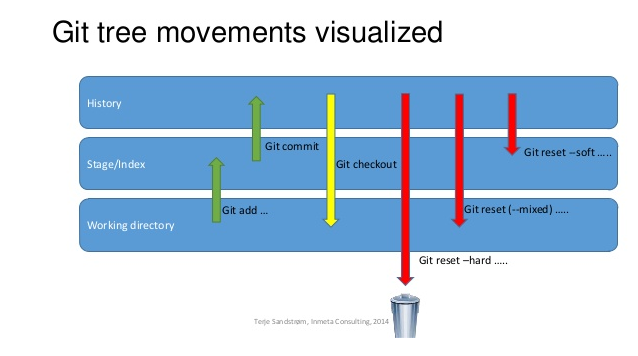

### Add to stage
```
git add <file>
```

### Add stage to repository 
```
git commit -m "<message>"
```


### To unstage (Remove New Files from Staged Files)
```
git restore --staged <file>
```


### To discard changes in working directory (Remove Existing Files from Staged Files)
```
git restore <file>
```

### Move stage to last commit -> The command can also be used to restore the content in the index with --staged, or restore both the working tree and the index with --staged --worktree.
```
git restore --staged --worktree <file>
or
git reset --hard HEAD 
```

### If you have happened to stage files using 'git add [fileName]' and you want to untrack them from the stage, you can use the following command:
```
git rm -r --cached [fileName]
```

### Git log of commits 
```
git log --oneline 
```

### Git reset

* --soft: **uncommit changes**, changes are left staged (index).
* --mixed (default): **uncommit + unstage changes**, changes are left in working tree.
* --hard: uncommit + **unstage + delete changes**, nothing left.

### Explain more git reset
* --hard should be easy to understand, it restores everything
* --mixed (default) :
    - unstaged files: don't change
    - staged files: move to unstaged
    - commit files: move to unstaged
* --soft:
    - unstaged files: don't change
    - staged files: dont' change
    - commit files: move to staged

```
git reset [--soft, --mixed, --hard] <ref>
```
### List all of the branches in your repository. This is synonymous with git branch --list.
```
git branch
```

### Create a new branch called ＜branch＞. This does **not check out the new branch.**
```
git branch <branch>
```

### One can use git switch <branch name> to switch branches.
```
git switch <branch name>
```

### If the destination branch does not exist, you have to append the “-b” option, otherwise you won’t be able to switch to that branch.
```
git checkout <existing_branch>
git checkout -b <new_branch>
```

### If the destination branch does not exist, you have to specify the “-c” option (for “create branch“), otherwise you will get an error message when switching to that branch.
```
git switch <existing_branch>
git switch -c <non_existing_branch>
```

### Delete the specified branch. This is a “safe” operation in that Git prevents you from deleting the branch if it has unmerged changes.
```
git branch -d <branch>
```

### Force delete the specified branch, even if it has unmerged changes. This is the command to use if you want to permanently throw away all of the commits associated with a particular line of development.
```
git branch -D <branch>
```

### Rename the current branch to ＜branch＞.
```
git branch -m <branch>
git branch -m <old branch name> <new branch name>  
```

### Git revert creates a new commit with the changes that are rolled back. git reset erases your Git history instead of making a new commit. The steps after are the same as any other commit.

*   **git revert** requires the id of the commit you want to **remove keeping it into your history**
*   **git reset** requires the commit you want to keep, and will consequentially **remove anything after that from history.**

```
git revert <insert bad commit hash here>
```

----------------
```
-e
--edit
```
### This is a default option and doesn't need to be specified. This option will open the configured system editor and prompts you to edit the commit message prior to committing the revert

----------------

```
--no-edit
```
### This is the inverse of the -e option. The revert will not open the editor.

----------------
```
-n
--no-commit
```

### Passing this option will prevent git revert from creating a new commit that inverses the target commit. Instead of creating the new commit this option will add the inverse changes to the Staging Index and Working Directory. These are the other trees Git uses to manage the state of the repository. For more info visit the git reset page.
----------------


### Git merge
```
git merge <branch>
```
### Important Options
----------------
```
--no-ff
```
### Creates a merge commit even when a fast-forward would be possible.

----------------

```
--squash
```

### Combines all integrated changes into a single commit, instead of preserving them as individual commits.

----------------

```
--abort
```

### When a conflict occurs, this option can be used to abort the merge and restore the project's state as it was before starting the merge.

----------------