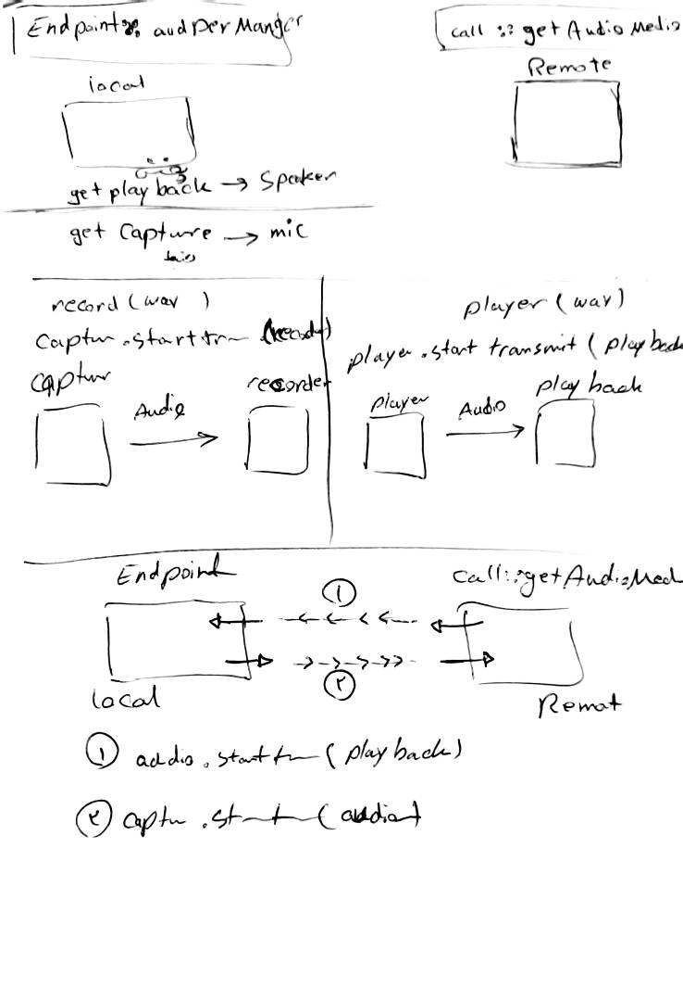

# Overview
PJSIP is a free and open source multimedia communication library written in C language, implementing standard based protocols such as SIP, SDP, RTP, STUN, TURN, and ICE. It combines signaling protocol (SIP) with rich multimedia framework and NAT traversal functionality into high level API that is portable and suitable for almost any type of systems ranging from desktops, embedded systems, to mobile handsets.

PJSIP is both compact and feature rich. It supports audio, video, presence, and instant messaging, and has extensive documentation. PJSIP is very portable. On mobile devices, it abstracts system dependent features and in many cases is able to utilize the native multimedia capabilities of the device.

PJSIP is developed by a small team working exclusively for the project since 2005, with participation of hundreds of developers from around the world, and is routinely tested at SIP Interoperability Event (SIPit) since 2007.

# Libraries Architecture
PJSIP contains several libraries, which can be grouped into three main components:

* SIP protocol stack, in PJSIP
* Media stack, in PJMEDIA
* NAT traversal stack, in PJNATH

These libraries are then integrated into high-level libraries, namely PJSUA-LIB API (written in C) and PJSUA2 API (written in C++).
There are also low level libraries that abstracts operating system differences (PJLIB) as well as a utility libraries (PJLIB-UTIL)

To avoid naming confusion between PJSIP as organization name (as in PJSIP.ORG) and PJSIP as libraries that provide SIP protocol implementation above, we also call this project PJPROJECT.

Below is architecture diagram of libraries in PJPROJECT. Click the link on the diagram to go to the documentation.


# PJSIP, PJMEDIA, and PJNATH Level
At the lower level there are collection of C libraries, which consist of PJSIP, PJMEDIA, and PJNATH, with PJLIB-UTIL and PJLIB as support libraries. This level provides the most flexibility, but it’s also more low level.

Some of the reasons for wanting to use libraries at this level are:

* You only need the individual library (say, PJNATH)
* You need to be very very tight in footprint (say when things need to be measured in Kilobytes instead of Megabytes)
* You are not developing a SIP client

Use the corresponding PJSIP, PJMEDIA, and PJNATH manuals and samples for information on how to use the libraries.

# PJSUA-LIB API
Next up is PJSUA-LIB API that combines all those libraries into a high level, integrated client user agent library written in C. This is the library that most PJSIP users use, and the highest level abstraction before PJSUA2 was created.

Motivations for using PJSUA-LIB library include:

* Developing client application (PJSUA-LIB is optimized for developing client app)
* Better efficiency than higher level API

# PJSUA-LIB API
Next up is PJSUA-LIB API that combines all those libraries into a high level, integrated client user agent library written in C. This is the library that most PJSIP users use, and the highest level abstraction before PJSUA2 was created.

Motivations for using PJSUA-LIB library include:

* Developing client application (PJSUA-LIB is optimized for developing client app)
* Better efficiency than higher level API

# PJSUA2 C++ API
PJSUA2 API is an objected oriented, C++ API created on top of PJSUA-LIB. The API is different than PJSUA-LIB, but it should be even easier to use and it should have better documentation too (see PJSUA2 Guide). The PJSUA2 API removes most cruxes typically associated with PJSIP, such as the pool and pj_str_t, and adds new features such as object persistence so you can save your configs to JSON file, for example. All data structures are rewritten for more clarity.

A C++ application can use PJSUA2 natively, while at the same time still has access to the lower level C objects if it needs to. This means that the C++ application should not lose any information from using the C++ abstraction, compared to if it is using PJSUA-LIB directly. The C++ application also should not lose the ability to extend the library. It would still be able to register a custom PJSIP module, pjmedia_port, pjmedia_transport, and so on.

Benefits of using PJSUA2 C++ API include:
* Cleaner object oriented API
* Uniform API for higher level language such as Java, Python, and C#
* Persistence API
* The ability to access PJSUA-LIB and lower level libraries when needed (including the ability to extend the libraries, for example creating custom PJSIP module, pjmedia_port, pjmedia_transport, etc.)

Some considerations on using PJSUA2 C++ API are:
* Instead of returning error, the API uses exception for error reporting
* It uses standard C++ library (STL)
* The performance penalty due to the API abstraction should be negligible on typical modern device

# PJSUA2 API for Java, Python, C#, and Others
The PJSUA2 API is also available for non-native code via SWIG binding. Configurations for Java, Python, and C# are provided with the distribution. See Building PJSUA2 section for more information. Thanks to SWIG, other language bindings may be generated relatively easily in the future.

The PJSUA2 API for non-native code is effectively the same as PJSUA2 C++ API. You can peek at the Hello world section to see how these look like. However, unlike C++, you cannot access PJSUA-LIB and the underlying C libraries from the scripting language, hence you are limited to what PJSUA2 provides.

You can use this API if native application development is not available in target platform (such as Android), or if you prefer to develop with non-native code instead of C/C++.


# Introduction to PJSUA2
PJSUA2 API is a C++ library on top of PJSUA-LIB API to provide high level API for constructing Session Initiation Protocol (SIP) multimedia user agent applications (a.k.a Voice over IP/VoIP softphones).

PJSUA2 wraps together the signaling, media, and NAT traversal functionality into easy to use call control API, account management, buddy list management, presence, and instant messaging, along with multimedia features such as local audio and video conferencing, file streaming, local playback, and voice recording, and powerful NAT traversal techniques utilizing STUN, TURN, ICE, and uPnP.

PJSUA2 provides SWIG interface for generating modules for high level languages such as Java, Python, and C#. In the next sections we will learn how to build and use PJSUA2 in these languages.

# Building PJSUA2
The PJSUA2 C++ library is built by default by PJSIP build system. Standard C++ library is required.

## Common Requirements
1. On Linux/MacOS X/Unix, you need to build PJPROJECT with -fPIC option. You can either put it in user.mak file in root pjproject directory like this:

```
CFLAGS += -fPIC
```

or you can specify it when calling ./configure:

```
./configure CFLAGS="-fPIC"
```
Then rebuild pjproject.

2. Install SWIG
For Debian based distributions (such as Ubuntu):

```
sudo apt-get install swig
```
For Windows and other platforms please see https://www.swig.org/download.html

## Classes Overview
Here are the main classes of the PJSUA2:

## pj::Endpoint
This is the main class of PJSUA2. You need to instantiate one and exactly one of this class, and from the instance you can then initialize and start the library.

## pj::Account
An account specifies the identity of the person (or endpoint) on one side of SIP conversation. At least one account instance needs to be created before anything else, and from the account instance you can start making/receiving calls as well as adding buddies.

## pj::Media
This is an abstract base class that represents a media element which is capable to either produce media or takes media. It is then subclassed into pj::AudioMedia, which is then subclassed into concrete classes such as pj::AudioMediaPlayer and pj::AudioMediaRecorder.

## pj::Call
This class represents an ongoing call (or speaking technically, an INVITE session) and can be used to manipulate it, such as to answer the call, hangup the call, put the call on hold, transfer the call, etc.

## pj::Buddy
This class represents a remote buddy (a person, or a SIP endpoint). You can subscribe to presence status of a buddy to know whether the buddy is online/offline/etc., and you can send and receive instant messages to/from the buddy.

## Guidelines
## Class Usage Patterns
With the methods of the main classes above, you will be able to invoke various operations to the object quite easily. But how can we get events/notifications from these classes? Each of the main classes above (except Media) will get their events in the callback methods. So to handle these events, just derive a class from the corresponding class (Endpoint, Call, Account, or Buddy) and implement/override the relevant method (depending on which event you want to handle). More will be explained in later sections.

## Error Handling
We use exceptions as means to report error, as this would make the program flows more naturally. Operations which yield error will raise pj::Error exception. If you prefer to display the error in more structured manner, the pj::Error class has several members to explain the error, such as the operation name that raised the error, the error code, and the error message itself.

## Asynchronous Operations
If you have developed applications with PJSIP, you’ll know about this already. In PJSIP, all operations that involve sending and receiving SIP messages are asynchronous, meaning that the function that invokes the operation will complete immediately, and you will be given the completion status in a callback.

Take a look for example the pj::Call::makeCall() method of the pj::Call class. This function is used to initiate outgoing call to a destination. When this function returns successfully, it does not mean that the call has been established, but rather it means that the call has been initiated successfully. You will be given the report of the call progress and/or completion in the pj::Call::onCallState() callback method of pj::Call class.

## Threading
For platforms that require polling, the PJSUA2 module provides its own worker thread to poll PJSIP, so it is not necessary to instantiate own your polling thread. Application should be prepared to have the callbacks called by different thread than the main thread. The PJSUA2 module itself is thread safe.

Often though, especially if you use PJSUA2 with high level languages such as Python, it is required to disable PJSUA2 internal worker threads by setting EpConfig.uaConfig.threadCnt to 0, because Python doesn’t like to be called by external thread (such as PJSIP’s worker thread).

## Problems with Garbage Collection
Garbage collection (GC) exists in run-time such as Java and Python, and there are some problems with it when it comes to PJSUA2 usage:

it delays the destruction of objects (including PJSUA2 objects), causing the code in object’s destructor to be executed out of order

the GC operation may run on different thread not previously registered to PJLIB, causing assertion

Due to problems above, application ‘’’MUST immediately destroy PJSUA2 objects using object’s delete() method (in Java)’’’, instead of relying on the GC to clean up the object.

For example, to delete an Account, it’s NOT enough to just let it go out of scope. Application MUST delete it manually like this (in Java):

```
acc.delete();
```

## Objects Persistence
PJSUA2 includes pj::PersistentObject class to provide functionality to read/write data from/to a document (string or file). The data can be simple data types such as boolean, number, string, and string arrays, or a user defined object. Currently the implementation supports reading and writing from/to JSON document (RFC 4627), but the framework allows application to extend the API to support other document formats.

As such, classes which inherit from PersistentObject, such as pj::EpConfig (endpoint configuration), pj::AccountConfig (account configuration), and pj::BuddyConfig (buddy configuration) can be loaded/saved from/to a file. Heres an example to save a config to a file:
```
EpConfig epCfg;
JsonDocument jDoc;
epCfg.uaConfig.maxCalls = 61;
epCfg.uaConfig.userAgent = "Just JSON Test";
jDoc.writeObject(epCfg);
jDoc.saveFile("jsontest.json");
```

To load from the file:

```
EpConfig epCfg;
JsonDocument jDoc;
jDoc.loadFile("jsontest.json");
jDoc.readObject(epCfg);
```

## C++
Below is a sample application that initializes the library, creates an account, registers to our pjsip.org SIP server, and quit.

```
#include <pjsua2.hpp>
#include <iostream>

using namespace pj;

// Subclass to extend the Account and get notifications etc.
class MyAccount : public Account {
public:
    virtual void onRegState(OnRegStateParam &prm) {
        AccountInfo ai = getInfo();
        std::cout << (ai.regIsActive? "*** Register:" : "*** Unregister:")
                  << " code=" << prm.code << std::endl;
    }
};

int main()
{
    Endpoint ep;

    ep.libCreate();

    // Initialize endpoint
    EpConfig ep_cfg;
    ep.libInit( ep_cfg );

    // Create SIP transport. Error handling sample is shown
    TransportConfig tcfg;
    tcfg.port = 5060;
    try {
        ep.transportCreate(PJSIP_TRANSPORT_UDP, tcfg);
    } catch (Error &err) {
        std::cout << err.info() << std::endl;
        return 1;
    }

    // Start the library (worker threads etc)
    ep.libStart();
    std::cout << "*** PJSUA2 STARTED ***" << std::endl;

    // Configure an AccountConfig
    AccountConfig acfg;
    acfg.idUri = "sip:test@sip.pjsip.org";
    acfg.regConfig.registrarUri = "sip:sip.pjsip.org";
    AuthCredInfo cred("digest", "*", "test", 0, "secret");
    acfg.sipConfig.authCreds.push_back( cred );

    // Create the account
    MyAccount *acc = new MyAccount;
    acc->create(acfg);

    // Here we don't have anything else to do..
    pj_thread_sleep(10000);

    // Delete the account. This will unregister from server
    delete acc;

    // This will implicitly shutdown the library
    return 0;
}
```

### Tip
View this file: pjsip-apps/src/samples/pjsua2_hello_reg.cpp

The C++ sample app above is built along with standard build, you can run the executable from pjsip-apps/bin/samples/.. directory.

# The Endpoint
Table of Contents

The Endpoint
* Instantiating the endpoint
* Creating the library
* Initializing and configuring the library
* Creating one or more transports
* Starting the library
* Shutting down the library

The pj::Endpoint class is a singleton class, and application MUST create this class instance before it can do anything else, and similarly, once this class is destroyed, application must NOT call any library API. This class is the core class of PJSUA2, and it provides the following functions:

* Starting up and shutting down
* Customization of configurations, such as core UA (User Agent) SIP configuration, media configuration, and logging configuration

This chapter will describe the functions above.

## Instantiating the endpoint
Before anything else, you must instantiate the Endpoint class:

```
Endpoint *ep = new Endpoint;
```

Once the endpoint is instantiated, you can retrieve the Endpoint instance using pj::Endpoint::instance() static method.

## Creating the library
Create the library by calling its pj::Endpoint::libCreate() method:
```
try {
    ep->libCreate();
} catch(Error& err) {
    cout << "Startup error: " << err.info() << endl;
}
```
The libCreate() method will raise exception if error occurs, so we need to trap the exception using try/catch clause as above. See pj::Error for reference.

## Initializing and configuring the library
The pj::EpConfig class provides endpoint configuration which allows the customization of the following settings:

* pj::UAConfig, to specify core SIP user agent settings.
* pj::MediaConfig, to specify various media global settings
* pj::LogConfig, to customize logging settings.

### Tip
Some settings can be specified on per account basis, in the pj::AccountConfig, when creating an pj::Account. Creating accounts will be explained in next section.

To customize the settings, create instance of EpConfig class and specify them during the endpoint initialization (will be explained more later), for example:
```
EpConfig ep_cfg;
ep_cfg.logConfig.level = 5;
ep_cfg.uaConfig.maxCalls = 4;
ep_cfg.mediaConfig.sndClockRate = 16000;
```

Next, you can initialize the library by calling pj::Endpoint::libInit():

```
try {
    EpConfig ep_cfg;
    // Specify customization of settings in ep_cfg
    ep->libInit(ep_cfg);
} catch(Error& err) {
    cout << "Initialization error: " << err.info() << endl;
}
```
The snippet above initializes the library with the default settings.

## Creating one or more transports
Application needs to create one or more transports before it can send or receive SIP messages:
```
try {
    TransportConfig tcfg;
    tcfg.port = 5060;
    TransportId tid = ep->transportCreate(PJSIP_TRANSPORT_UDP, tcfg);
} catch(Error& err) {
    cout << "Transport creation error: " << err.info() << endl;
}
```
The pj::Endpoint::transportCreate() method returns the newly created Transport ID and it takes the transport type and pj::TransportConfig object to customize the transport settings like bound address and listening port number. Without this, by default the transport will be bound to INADDR_ANY and any available port.

There is no real use of the Transport ID, except to create userless account (with pj::Account::create(), as will be explained later), and perhaps to display the list of transports to user if the application wants it.

## Starting the library
Now we’re ready to start the library. We need to start the library to finalize the initialization phase, e.g. to complete the initial STUN address resolution, initialize/start the sound device, etc. To start the library, call pj::Endpoint::libStart() method:
```
try {
    ep->libStart();
} catch(Error& err) {
    cout << "Startup error: " << err.info() << endl;
}
```

## Shutting down the library
Once the application exits, the library needs to be shutdown so that resources can be released back to the operating system. Although this can be done by deleting the Endpoint instance, which will internally call pj::Endpoint::libDestroy(), it is better to call it manually because on Java or Python there are problems with garbage collection as explained earlier:
```
ep->libDestroy();
delete ep;
```

# Accounts
Table of Contents

Accounts
* Subclassing the Account class
* Creating userless accounts
* Creating account
* Account configurations
* Account operations

Accounts provide identity (or identities) of the user who is currently using the application. Each account has one SIP Uniform Resource Identifier (URI) associated with it. In SIP terms, this URI acts as Address of Record (AOR) of the person and is used in the From header in outgoing requests.

Account may or may not have client registration associated with it. An account is also associated with route-set and some authentication credentials, which are used when sending SIP request messages using the account. An account also has presence status, which will be reported to remote peer when they subscribe to the account’s presence, or which is published to a presence server if presence publication is enabled for the account.

At least one account MUST be created in the application, since any outgoing requests require an account context. If no user association is required, application can create a userless (see Creating userless accounts below). A userless account identifies local endpoint instead of a particular user, and it corresponds to a particular transport ID.

Also one account must be set as the default account, which will be used as the account identity when pjsua fails to match incoming request with any accounts using the stricter matching rules.

## Subclassing the Account class
To use the pj::Account class, normally application SHOULD create its own subclass, in order to receive notifications for the account. For example:
```
class MyAccount : public Account
{
public:
    MyAccount() {}
    ~MyAccount() {}

    virtual void onRegState(OnRegStateParam &prm)
    {
        AccountInfo ai = getInfo();
        cout << (ai.regIsActive? "*** Register: code=" : "*** Unregister: code=")
             << prm.code << endl;
    }

    virtual void onIncomingCall(OnIncomingCallParam &iprm)
    {
        Call *call = new MyCall(*this, iprm.callId);

        // Just hangup for now
        CallOpParam op;
        op.statusCode = PJSIP_SC_DECLINE;
        call->hangup(op);

        // And delete the call
        delete call;
    }
};
```

In the subclass, application can implement the account callbacks to process events related to the account, such as:

* the status of SIP registration
* incoming calls
* incoming presence subscription requests
* incoming instant message not from buddy
Application can override the relevant callback methods in the derived class to handle these particular events.
If the events are not handled, default actions will be invoked:

* incoming calls will not be handled
* incoming presence subscription requests will be accepted
* incoming instant messages from non-buddy will be ignored

## Creating userless accounts
A userless account identifies a particular SIP endpoint rather than a particular user. Some other SIP softphones may call this peer-to-peer mode, which means that we are calling another computer via its address rather than calling a particular user ID. For example, we might identify ourselves as “sip:192.168.0.15” (a userless account) rather than, say, “sip:alice@pjsip.org”.

In the lower layer PJSUA-LIB API, a userless account is associated with a SIP transport, and is created with pjsua_acc_add_local() API. This concept has been deprecated in PJSUA2, and rather, a userless account is a “normal” account with a userless ID URI (e.g. “sip:192.168.0.15”) and without registration. Thus creating a userless account is exactly the same as creating “normal” account.

## Creating account
Configure pj::AccountConfig and call pj::Account::create() to create the account. At the very minimum, only account ID is required, which is an URI to identify the account. Note that the URI can also be enclosed in name-addr form ([ display-name ] <SIP/SIPS URI>) (this is also applicable for all URI parameters used in PJSIP library, such as when making a call, adding a buddy, etc). Below is an example:
```
AccountConfig acc_cfg;
acc_cfg.idUri = "sip:test1@pjsip.org";
// This is also valid
// acc_cfg.idUri = "Test <sip:test1@pjsip.org>";

MyAccount *acc = new MyAccount;
try {
    acc->create(acc_cfg);
} catch(Error& err) {
    cout << "Account creation error: " << err.info() << endl;
}
```

The account created above doesn’t do anything except to provide identity in the “From:” header for outgoing requests. The account will not register to SIP server.

In order to register to a SIP server, we will need to configure some more settings in pj::AccountConfig, something like this:
```
AccountConfig acc_cfg;
acc_cfg.idUri = "sip:test1@pjsip.org";
acc_cfg.regConfig.registrarUri = "sip:pjsip.org";
acc_cfg.sipConfig.authCreds.push_back( AuthCredInfo("digest", "*", "test1", 0, "secret1") );

MyAccount *acc = new MyAccount;
try {
    acc->create(acc_cfg);
} catch(Error& err) {
    cout << "Account creation error: " << err.info() << endl;
}
```
## Account configurations
More settings can be specified in pj::AccountConfig:

* pj::AccountRegConfig, the registration settings, such as registrar server and retry interval.
* pj::AccountSipConfig, the SIP settings, such as credential information and proxy server.
* pj::AccountCallConfig, the call settings, such as whether reliable provisional response (SIP 100rel) is required.
* pj::AccountPresConfig, the presence settings, such as whether presence publication (PUBLISH) is enabled.
* pj::AccountMwiConfig, the MWI (Message Waiting Indication) settings.
* pj::AccountNatConfig, the NAT settings, such as whether STUN or ICE is used.
* pj::AccountMediaConfig, the media settings, such as Secure RTP (SRTP) related settings.
* pj::AccountVideoConfig, the video settings, such as default capture and render device.
* pj::AccountIpChangeConfig, the settings during IP change.

## Account operations

Some of the operations to the pj::Account object:

* manage registration
* manage buddies/contacts
* manage presence online status

Please see the reference documentation for pj::Account for more info. Calls, presence, and buddy will be explained in later chapters.

## Working with audio media
Table of Contents

Working with audio media
* The conference bridge
* Playing a WAV file
* Recording to WAV file
* Local audio loopback
* Looping audio
* Call’s media
* Second call
* Conference call
* Recording the Conference

Media objects are objects that are capable of producing or reading media. PJSUA2 media objects are derived from pj::Media class.

An important subclass of Media is pj::AudioMedia which represents audio media. There are several types of audio media objects supported in PJSUA2:

* Capture device’s AudioMedia, to capture audio from the sound device.
* Playback device’s AudioMedia, to play audio to the sound device.
* Call’s AudioMedia, to transmit and receive audio to/from remote person.
* pj::AudioMediaPlayer, to play WAV file(s).
* pj::AudioMediaRecorder, to record audio to a WAV file.

## The conference bridge
The conference bridge provides a simple but yet powerful concept to manage audio flow between the audio medias. The principle is very simple; application connects audio source to audio destination, and the bridge makes the audio flows from that source to the specified destination, and that’s it. If more than one sources are transmitting to the same destination, then the audio from the sources will be mixed. If one source is transmitting to more than one destinations, the bridge will take care of duplicating the audio from the source to the multiple destinations. The bridge will even take care of mixing medias with different clock rates and ptime.

In PJSUA2, all audio media objects are registered to the central conference bridge for easier manipulation. At first, a registered audio media will not be connected to anything, so media will not flow from/to any objects. An audio media source can start/stop the transmission to a destination by using the API pj::AudioMedia::startTransmit() and pj::AudioMedia::stopTransmit().

### Note
An audio media object registered to the conference bridge will be given a port ID number that identifies the object in the bridge. Application can use the API pj::AudioMedia::getPortId() to retrieve the port ID. Normally, application should not need to worry about the conference bridge and its port ID (as all will be taken care of by the pj::Media class) unless application wants to create its own custom audio media.

As a convention in PJSUA-LIB API, port zero of the conference bridge is denoted for the sound device. Hence connecting a media to port zero will play that media to speaker, and connecting port zero to a media will capture audio from the microphone.

## Playing a WAV file
To playback the WAV file to the sound device, create a WAV playback and call pj::AudioMedia::startTransmit() sound device’s playback media:
```
AudioMediaPlayer player;
AudioMedia& speaker_media = Endpoint::instance().audDevManager().getPlaybackDevMedia();
try {
    player.createPlayer("file.wav");
    player.startTransmit(speaker_media);
} catch(Error& err) {
}
```
See pj::AudioMediaPlayer and pj::Endpoint::audDevManager() for reference.

By default, the WAV file will be played in a loop. To disable the loop, specify PJMEDIA_FILE_NO_LOOP when creating the player:

```
player.createPlayer("file.wav", PJMEDIA_FILE_NO_LOOP);
```

Without looping, silence will be played once the playback has reached the end of the WAV file.

If application wants to be notified on playback EOF event, it can subclass pj::AudioMediaPlayer and implement pj::AudioMediaPlayer::onEof2() callback.

Once application is done with the playback, just call pj::AudioMedia::stopTransmit() to stop the playback:
```
try {
    player.stopTransmit(speaker_media);
} catch(Error& err) {
}
```
Resuming the transmission (by calling pj::AudioMedia::startTransmit()) after the playback is stopped will resume playback from the last play position. Use pj::AudioMediaPlayer::setPos() to set playback position to a desired location.

## Recording to WAV file
The example below starts recording audio from the microphone to a WAV file, by using pj::AudioMediaRecorder class:
```
AudioMediaRecorder wav_writer;
AudioMedia& mic_media = Endpoint::instance().audDevManager().getCaptureDevMedia();
try {
    wav_writer.createRecorder("file.wav");
    mic_media.startTransmit(wav_writer);
} catch(Error& err) {
}
```
See pj::AudioMediaRecorder and pj::Endpoint::audDevManager() for reference.

Media will flow from the sound device to the WAV recorder as soon as pj::AudioMedia::startTransmit() is called. As usual, to stop or pause recording, just call pj::AudioMedia::stopTransmit():
```
try {
   mic_media.stopTransmit(wav_writer);
} catch(Error& err) {
}
```
Note that stopping the transmission to the WAV recorder as above does not close the WAV file, and you can resume recording by connecting a source (any source, doesn’t have to be the same source) to the WAV recorder again. You cannot playback the recorded WAV file until you close it. To close the WAV recorder, simply delete it:

## delete wav_writer;
Local audio loopback
A useful test to check whether the local sound device (capture and playback device) is working properly is by transmitting the audio from the capture device directly to the playback device (i.e. local loopback). Application can do this by:
```
mic_media.startTransmit(speaker_media);
```
## Looping audio
Application can loop the audio of an audio media object to itself (i.e. the audio received from the object will be transmitted to itself). You can loop-back audio from any objects, as long as the object has bidirectional media. That means you can loop the call’s audio media, so that audio received from the remote person will be transmitted back to her/him. But you can’t loop the WAV player or recorder since these objects can only play or record and not both.

## Call’s media
A single call can have more than one media (for example, audio and video). Application can retrieve the audio media by utilizing pj::Call::getInfo() and pj::Call::getMedia(). Usually for a normal call, bidirectional audio is established with the remote person, which can be done by connecting the sound device to the call’s audio media:
```
CallInfo ci = call.getInfo();
AudioMedia *aud_med = NULL;

for (unsigned i=0; i<ci.media.size(); ++i) {
    if (ci.media[i].type == PJMEDIA_TYPE_AUDIO) {
        aud_med = (AudioMedia *)call.getMedia(i);
        break;
    }
}

if (aud_med) {
    mic_media.startTransmit(*aud_med);
    aud_med->startTransmit(speaker_media);
}
```
## Second call
PJSUA2 supports more than one simultaneous calls. Suppose we want to talk with two remote parties at the same time. Since we already have bidirectional media connection with one party, we just need to add bidirectional connection with the other party by repeating the same procedure for the second call:

```
CallInfo ci2 = call2.getInfo();
AudioMedia *aud_med2 = NULL;

for (unsigned i=0; i<ci2.media.size(); ++i) {
    if (ci2.media[i].type == PJMEDIA_TYPE_AUDIO) {
        aud_med2 = (AudioMedia *)call2.getMedia(i);
        break;
    }
}

if (aud_med2) {
    mic_media->startTransmit(*aud_med2);
    aud_med2->startTransmit(speaker_media);
}
```
Now we can talk to both parties at the same time, and we will hear audio from either party. But at this stage, the remote parties can’t talk or hear each other (i.e. we’re not in full conference mode yet).

## Conference call
To enable both parties talk to each other, just establish bidirectional media between them:
```
aud_med->startTransmit(*aud_med2);
aud_med2->startTransmit(*aud_med);
```
Now the three parties (us and both remote parties) will be able to talk to each other.

## Recording the Conference
While doing the conference, application can record the conference to a WAV file, by connecting the microphone and both calls to the WAV recorder:
```
mic_media.startTransmit(wav_writer);
aud_med->startTransmit(wav_writer);
aud_med2->startTransmit(wav_writer);
```

# Calls
Table of Contents

* Calls
* Subclassing the Call class
* Making outgoing calls
* Receiving Incoming Calls
* Call Properties
* Call Disconnection
* Working with Call’s Audio Media
* Call Operations
* Instant Messaging(IM)
* Calls are represented by pj::Call class.

## Subclassing the Call class
To use the Call class, application SHOULD subclass it, such as:
```
class MyCall : public Call
{
public:
    MyCall(Account &acc, int call_id = PJSUA_INVALID_ID)
    : Call(acc, call_id)
    { }

    ~MyCall()
    { }

    // Notification when call's state has changed.
    virtual void onCallState(OnCallStateParam &prm);

    // Notification when call's media state has changed.
    virtual void onCallMediaState(OnCallMediaStateParam &prm);
};
```
Application implement Call’s callbacks to process events related to the call, such as pj::Call::onCallState(), and many more. See pj::Call class for more info.

## Making outgoing calls
Make outgoing call is by invoking pj::Call::makeCall() with the destination URI string (something like "sip:alice@example.com"). The URI can also be enclosed in name-addr form ([ display-name ] <SIP/SIPS URI>) (such as "Alice <sip:alice@example.com;transport=tcp>"). Note that an account instance is required to create a call instance:

```
Call *call = new MyCall(*acc);
CallOpParam prm(true); // Use default call settings
try {
    call->makeCall(dest_uri, prm);
} catch(Error& err) {
    cout << err.info() << endl;
}
```

## Receiving Incoming Calls
Incoming calls are reported as pj::Account::onIncomingCall() callback. Note that this is the callback of the pj::Account class (not pj::Call). You must derive a class from the pj::Account class to handle incoming calls.

Below is a sample code of the callback implementation:
```
void MyAccount::onIncomingCall(OnIncomingCallParam &iprm)
{
    Call *call = new MyCall(*this, iprm.callId);
    CallOpParam prm;
    prm.statusCode = PJSIP_SC_OK;
    call->answer(prm);
}
```
For incoming calls, the call instance is created in the callback function as shown above. Application should make sure to store the call instance during the lifetime of the call (that is until the call is disconnected (see Call Disconnection below)).

## Call Properties
All call properties such as state, media state, remote peer information, etc. are stored in pj::CallInfo class, which can be retrieved from the call object with using pj::Call::getInfo() method.

## Call Disconnection
Call disconnection event is a special event since once the callback that reports this event returns, the call is no longer valid and any operations invoked to the call object will raise error exception. Thus, it is recommended to delete the call object inside the callback.

The call disconnection is reported in pj::Call::onCallState() callback. Below is a sample implementation:

```
void MyCall::onCallState(OnCallStateParam &prm)
{
    CallInfo ci = getInfo();
    if (ci.state == PJSIP_INV_STATE_DISCONNECTED) {
        /* Delete the call */
        delete this;
    }
}
```

## Working with Call’s Audio Media
Application can only operate the call’s audio media when the call’s audio media state is ready (or active). Usually this happens once the call has been established, although media can active before that (it is called early media), and established call can have no media (such as when it is being put on-hold).

The changes to the call’s media state is reported in pj::Call::onCallMediaState() callback. Only when the call’s audio media state is ready (or active) the function pj::Call::getMedia() will return a valid audio media.

Below is a sample code to connect the call to the sound device when the media is active:

```
void MyCall::onCallMediaState(OnCallMediaStateParam &prm)
{
    CallInfo ci = getInfo();

    for (unsigned i = 0; i < ci.media.size(); i++) {
        if (ci.media[i].type==PJMEDIA_TYPE_AUDIO && getMedia(i)) {
            AudioMedia *aud_med = (AudioMedia *)getMedia(i);

            // Connect the call audio media to sound device
            AudDevManager& mgr = Endpoint::instance().audDevManager();
            aud_med->startTransmit(mgr.getPlaybackDevMedia());
            mgr.getCaptureDevMedia().startTransmit(*aud_med);
        }
    }
}
```
When the audio media becomes inactive (for example when the call is put on hold), there is no need to stop the call’s audio media transmission since they will be removed automatically from the conference bridge, and this will automatically remove all connections to/from the call.

## Call Operations
Call have many other operations, such as hanging up, putting the call on hold, sending re-INVITE, etc. See pj::Call reference for more info.

## Instant Messaging(IM)

### Note
Usually it is more appropriate to do instant messaging outside the context of a call. Application can send IM and typing indication outside a call by using pj::Buddy::sendInstantMessage() and pj::Buddy::sendTypingIndication(). More will be explained in the next section.

Application can send IM within a call using pj::Call::sendInstantMessage(). The transmission status of outgoing instant messages is reported in pj::Call::onInstantMessageStatus() callback.

In addition, you can also send typing indication using pj::Call::sendTypingIndication().

Incoming IM and typing indication received within a call will be reported in pj::Call::onInstantMessage() and pj::Call::onTypingIndication() callbacks.

While it is recommended to send IM outside call context, application should handle incoming IM inside call context for robustness.

# Media (V2 docs)
Media objects are objects that are capable to either produce media or takes media.

An important subclass of Media is AudioMedia which represents audio media. There are several type of audio media objects supported in PJSUA2:

Capture device’s AudioMedia, to capture audio from the sound device.

Playback device’s AudioMedia, to play audio to the sound device.

Call’s AudioMedia, to transmit and receive audio to/from remote person.

AudioMediaPlayer, to play WAV file(s).

AudioMediaRecorder, to record audio to a WAV file.

More media objects may be added in the future.

## The Audio Conference Bridge
The conference bridge provides a simple but yet powerful concept to manage audio flow between the audio medias. The principle is very simple, that is you connect audio source to audio destination, and the bridge will make the audio flows from the source to destination, and that’s it. If more than one sources are transmitting to the same destination, then the audio from the sources will be mixed. If one source is transmitting to more than one destinations, the bridge will take care of duplicating the audio from the source to the multiple destinations. The bridge will even take care medias with different clock rates and ptime.

In PJSUA2, all audio media objects are plugged-in to the central conference bridge for easier manipulation. At first, a plugged-in audio media will not be connected to anything, so media will not flow from/to any objects. An audio media source can start/stop the transmission to a destination by using the API AudioMedia.startTransmit() / AudioMedia.stopTransmit().

An audio media object plugged-in to the conference bridge will be given a port ID number that identifies the object in the bridge. Application can use the API AudioMedia.getPortId() to retrieve the port ID. Normally, application should not need to worry about the conference bridge and its port ID (as all will be taken care of by the Media class) unless application want to create its own custom audio media.

## Playing a WAV File
To playback the WAV file to the sound device, just start the transmission of the WAV playback object to the sound device’s playback media:

```
AudioMediaPlayer player;
AudioMedia& play_med = Endpoint::instance().audDevManager().getPlaybackDevMedia();
try {
    player.createPlayer("file.wav");
    player.startTransmit(play_med);
} catch(Error& err) {
}
```

By default, the WAV file will be played in a loop. To disable the loop, specify PJMEDIA_FILE_NO_LOOP when creating the player:

```
player.createPlayer("file.wav", PJMEDIA_FILE_NO_LOOP);
```

Without looping, silence will be played once the playback has reached the end of the WAV file.

Once you’re done with the playback, just stop the transmission to stop the playback:

```
try {
    player.stopTransmit(play_med);
} catch(Error& err) {
}
```

Resuming the transmission after the playback is stopped will resume playback from the last play position. Use player.setPos() to set playback position to a desired location.

## Recording to WAV File
Or if you want to record the audio from the sound device to the WAV file, simply do this:

```
AudioMediaRecorder recorder;
AudioMedia& cap_med = Endpoint::instance().audDevManager().getCaptureDevMedia();
try {
    recorder.createRecorder("file.wav");
    cap_med.startTransmit(recorder);
} catch(Error& err) {
}
```

And the media will flow from the sound device to the WAV record file. As usual, to stop or pause recording, just stop the transmission:

```
try {
   cap_med.stopTransmit(recorder);
} catch(Error& err) {
}
```

Note that stopping the transmission to the WAV recorder as above does not close the WAV file, and you can resume recording by connecting a source to the WAV recorder again. You cannot playback the recorded WAV file before you close it. To close the WAV recorder, simply delete it:

```
delete recorder;
```

## Local Audio Loopback
A useful test to check whether the local sound device (capture and playback device) is working properly is by transmitting the audio from the capture device directly to the playback device (i.e. local loopback). You can do this by:
```
cap_med.startTransmit(play_med);
```

## Looping Audio
If you want, you can loop the audio of an audio media object to itself (i.e. the audio received from the object will be transmitted to itself). You can loop-back audio from any objects, as long as the object has bidirectional media. That means you can loop the call’s audio media, so that audio received from the remote person will be transmitted back to her/him. But you can’t loop the WAV player or recorder since these objects can only play or record and not both.

## Normal Call
A single call can have more than one media (for example, audio and video). Application can retrieve the audio media by using the API Call.getMedia(). Then for a normal call, we would want to establish bidirectional audio with the remote person, which can be done easily by connecting the sound device and the call audio media and vice versa:

```
CallInfo ci = call.getInfo();
AudioMedia *aud_med = NULL;

// Find out which media index is the audio
for (unsigned i=0; i<ci.media.size(); ++i) {
    if (ci.media[i].type == PJMEDIA_TYPE_AUDIO) {
        aud_med = (AudioMedia *)call.getMedia(i);
        break;
    }
}

if (aud_med) {
    // This will connect the sound device/mic to the call audio media
    cap_med.startTransmit(*aud_med);

    // And this will connect the call audio media to the sound device/speaker
    aud_med->startTransmit(play_med);
}
```




# Low Level
### **`pjsip_endpt_register_module` in Detail**

In **PJSIP**, modules are the core building blocks for handling various types of SIP-related tasks such as transactions, message processing, transport layers, and application-level processing. Modules are typically registered to the **SIP endpoint**, which acts as the central entity managing SIP events.

The function `pjsip_endpt_register_module` registers a module with the SIP endpoint so that the module can be involved in handling incoming and outgoing SIP messages.

### **Function Signature:**

```cpp
pj_status_t pjsip_endpt_register_module(pjsip_endpoint *endpt, const pjsip_module *module);
```

- **`endpt`**: The SIP endpoint with which the module will be registered. This is generally obtained by calling `pjsua_get_pjsip_endpt()` when using **PJSUA**.
- **`module`**: A pointer to a **pjsip_module** structure that defines the module's behavior, including callbacks to handle incoming requests, responses, and transactions.

The function returns `PJ_SUCCESS` if the module is successfully registered.

### **Structure of `pjsip_module`:**

The `pjsip_module` structure defines the behavior of a module. Here's an example of the `pjsip_module` structure and its key fields:

```cpp
typedef struct pjsip_module {
    pj_str_t  name;        // The name of the module.
    pj_uint32_t id;        // Unique module ID (auto-assigned if set to -1).
    pj_uint32_t priority;  // Priority of the module.
    pj_bool_t (*on_rx_request)(pjsip_rx_data *rdata);  // Callback for incoming requests.
    pj_bool_t (*on_rx_response)(pjsip_rx_data *rdata); // Callback for incoming responses.
    pj_bool_t (*on_tx_request)(pjsip_tx_data *tdata);  // Callback for outgoing requests.
    pj_bool_t (*on_tx_response)(pjsip_tx_data *tdata); // Callback for outgoing responses.
} pjsip_module;
```

### **Important Fields:**
- **`name`**: The name of the module. It is a string of `pj_str_t` type, which is a PJSIP-defined structure for strings.
- **`id`**: The unique identifier for the module. If set to `-1`, PJSIP will auto-assign an ID.
- **`priority`**: The priority of the module. Higher-priority modules will be processed before lower-priority ones.
- **`on_rx_request`**: A callback function invoked when an incoming SIP request (like `INVITE`, `REGISTER`, `MESSAGE`, etc.) is received.
- **`on_rx_response`**: A callback function invoked when an incoming SIP response is received.
- **`on_tx_request`**: A callback function invoked when an outgoing SIP request is being transmitted.
- **`on_tx_response`**: A callback function invoked when an outgoing SIP response is being transmitted.

### **Basic Example Using `pjsip_endpt_register_module`**

The following is an example that demonstrates how to register a simple module that intercepts incoming SIP messages (requests) and prints them.

```cpp
#include <pjsua-lib/pjsua.h>
#include <iostream>

// Callback for handling incoming SIP requests
pj_bool_t on_rx_request(pjsip_rx_data *rdata) {
    // Print the incoming SIP message
    std::cout << "Received SIP message: " << std::endl;
    std::cout << std::string(rdata->msg_info.msg_buf, rdata->msg_info.len) << std::endl;

    // Respond with 200 OK (if needed)
    pjsip_tx_data *tdata;
    pjsip_endpt_create_response(pjsua_get_pjsip_endpt(), rdata, 200, NULL, &tdata);
    pjsip_endpt_send_response(pjsua_get_pjsip_endpt(), rdata, tdata, NULL, NULL);

    return PJ_TRUE; // Return PJ_TRUE to indicate that the message has been processed.
}

int main() {
    pj_status_t status;

    // Initialize PJSUA (PJSIP library)
    status = pjsua_create();
    if (status != PJ_SUCCESS) {
        std::cerr << "Error creating PJSUA" << std::endl;
        return 1;
    }

    // Configure PJSUA
    pjsua_config cfg;
    pjsua_config_default(&cfg);

    // Set logging configuration
    pjsua_logging_config log_cfg;
    pjsua_logging_config_default(&log_cfg);
    log_cfg.console_level = 4;

    // Media configuration
    pjsua_media_config media_cfg;
    pjsua_media_config_default(&media_cfg);

    // Initialize PJSUA
    status = pjsua_init(&cfg, &log_cfg, &media_cfg);
    if (status != PJ_SUCCESS) {
        std::cerr << "Error initializing PJSUA" << std::endl;
        return 1;
    }

    // Create transport (UDP)
    pjsua_transport_config transport_cfg;
    pjsua_transport_config_default(&transport_cfg);
    transport_cfg.port = 5060;  // Default SIP port

    status = pjsua_transport_create(PJSIP_TRANSPORT_UDP, &transport_cfg, NULL);
    if (status != PJ_SUCCESS) {
        std::cerr << "Error creating transport" << std::endl;
        return 1;
    }

    // Start PJSUA
    status = pjsua_start();
    if (status != PJ_SUCCESS) {
        std::cerr << "Error starting PJSUA" << std::endl;
        return 1;
    }

    // Define a module that intercepts incoming SIP requests
    pjsip_module my_module = {
        NULL, NULL, { "mod-sip-handler", 15 }, -1, 
        PJSIP_MOD_PRIORITY_APPLICATION, NULL, NULL, 
        &on_rx_request, NULL, NULL, NULL, NULL
    };

    // Register the module with PJSIP
    status = pjsip_endpt_register_module(pjsua_get_pjsip_endpt(), &my_module);
    if (status != PJ_SUCCESS) {
        std::cerr << "Error registering module" << std::endl;
        return 1;
    }

    std::cout << "PJSIP is now listening for SIP messages..." << std::endl;

    // Keep the program running to handle incoming events
    while (true) {
        pj_time_val delay = { 0, 10 };
        pjsua_handle_events(&delay);
    }

    // Clean up PJSUA before exiting
    pjsua_destroy();
    return 0;
}
```

### **Explanation:**
1. **`pjsip_module my_module`**: Defines a module named `"mod-sip-handler"` that has the `on_rx_request` callback. The module will intercept incoming SIP requests.
2. **`pjsip_endpt_register_module(pjsua_get_pjsip_endpt(), &my_module)`**: Registers the module with the PJSIP endpoint, enabling it to process incoming SIP messages.
3. **`on_rx_request`**: The callback function for processing incoming SIP requests. It prints the entire SIP message to the console and optionally responds with a `200 OK`.

### **Processing Flow:**
1. When an incoming SIP request (e.g., `INVITE`, `REGISTER`, `MESSAGE`) arrives, **PJSIP** invokes the `on_rx_request` callback of the registered module.
2. The callback handles the request by printing the SIP message and optionally responding to the sender.
3. The program runs an infinite loop using `pjsua_handle_events()` to keep processing incoming SIP messages and events.

### **Practical Use Cases:**
- **Call Processing**: You can intercept and process SIP `INVITE` messages for call management.
- **Message Handling**: For handling SIP `MESSAGE` requests in messaging applications.
- **Custom Logic**: You can add custom behavior (such as routing or logging) based on specific SIP requests.

This modular approach enables extensibility and flexibility in handling SIP communication within **PJSIP** applications.

Let me know if you need further clarification!


The `pjsip_module my_module = {...};` structure is a definition of a **PJSIP module** that will be registered with the **PJSIP endpoint**. Each module in PJSIP defines specific functionality related to handling SIP messages or transactions. Here's a detailed breakdown of the initialization of `my_module`:

### **Structure Breakdown**

```cpp
pjsip_module my_module = {
    NULL, NULL, { "mod-sip-handler", 15 }, -1,
    PJSIP_MOD_PRIORITY_APPLICATION, NULL, NULL,
    &on_rx_request, NULL, NULL, NULL, NULL
};
```

Each part of this structure corresponds to different fields in the **`pjsip_module`** structure, which controls how the module behaves.

### **Field-by-Field Explanation**

1. **`NULL`** (first position):
   - **Type**: `pj_caching_pool *cpool`
   - **Explanation**: This is an optional field for a **caching pool** pointer, typically used when a module needs memory pools for its internal operations. Since this module doesn’t use a caching pool, we set it to `NULL`.

2. **`NULL`** (second position):
   - **Type**: `pj_pool_t *pool`
   - **Explanation**: This is an optional field for specifying a memory pool to be used by the module for its operations. This field is also set to `NULL` since we are not using a dedicated memory pool for the module.

3. **`{ "mod-sip-handler", 15 }`**:
   - **Type**: `pj_str_t name`
   - **Explanation**: This defines the **name of the module**. The `pj_str_t` structure is a string type used in PJSIP, where the first parameter is the string value and the second parameter is its length. 
   - **"mod-sip-handler"** is the name of this module, and `15` is the length of the string.

4. **`-1`**:
   - **Type**: `pj_uint32_t id`
   - **Explanation**: This is the unique ID of the module. If set to `-1`, PJSIP will automatically assign a unique ID to the module. This is useful when you don’t need to manually manage module IDs.

5. **`PJSIP_MOD_PRIORITY_APPLICATION`**:
   - **Type**: `pj_uint32_t priority`
   - **Explanation**: The **priority** of the module. Modules with higher priorities are executed before modules with lower priorities when processing SIP messages. 
   - **`PJSIP_MOD_PRIORITY_APPLICATION`** is a predefined priority level used for application modules. This constant indicates that this module is intended to be used at the application layer.

6. **`NULL` (third position)**:
   - **Type**: `pj_bool_t (*load)()`
   - **Explanation**: This is a pointer to a **load callback** function. This function will be called when the module is loaded or registered with the SIP endpoint. In this case, we don’t need any special initialization, so it is set to `NULL`.

7. **`NULL` (fourth position)**:
   - **Type**: `void (*start)()`
   - **Explanation**: This is a pointer to a **start callback** function, which is called after the module is fully initialized and started. Since we don’t have a start process, it is set to `NULL`.

8. **`&on_rx_request`**:
   - **Type**: `pj_bool_t (*on_rx_request)(pjsip_rx_data *rdata)`
   - **Explanation**: This is the **callback function** that will be called when the module receives an incoming SIP **request** (e.g., `INVITE`, `REGISTER`, `MESSAGE`). 
   - The function **`on_rx_request`** is defined elsewhere in the code and will handle the SIP request by, for example, printing the request or responding to it. When an incoming SIP request is received, this function gets invoked with the **`rdata`** (received data) structure.

9. **`NULL` (fifth position)**:
   - **Type**: `pj_bool_t (*on_rx_response)(pjsip_rx_data *rdata)`
   - **Explanation**: This is the callback for handling incoming **SIP responses** (such as responses to a previously sent request like `200 OK`, `404 Not Found`, etc.). Since we are not interested in responses in this module, it is set to `NULL`.

10. **`NULL` (sixth position)**:
    - **Type**: `pj_bool_t (*on_tx_request)(pjsip_tx_data *tdata)`
    - **Explanation**: This is the callback for handling outgoing **SIP requests** (like `INVITE`, `REGISTER`, etc.). If you wanted to inspect or modify outgoing requests before they are sent, you could implement a function here. In this case, it is set to `NULL` because we are not modifying outgoing requests.

11. **`NULL` (seventh position)**:
    - **Type**: `pj_bool_t (*on_tx_response)(pjsip_tx_data *tdata)`
    - **Explanation**: This is the callback for handling outgoing **SIP responses** (such as responses to incoming requests like `200 OK`, `404 Not Found`, etc.). If you wanted to inspect or modify outgoing responses, you could implement a function here. In this case, it is set to `NULL` because we are not modifying outgoing responses.

12. **`NULL` (eighth position)**:
    - **Type**: `void (*on_tsx_state)(pjsip_transaction *tsx, pjsip_event *event)`
    - **Explanation**: This is the callback for handling **transaction state changes**. A SIP transaction represents a single unit of SIP request/response exchange. This callback can be used to track the state of SIP transactions. Since this module does not need to handle transaction state, we set it to `NULL`.

### **Summary of the Module Setup:**
- The module is named `"mod-sip-handler"` and is assigned a priority of `PJSIP_MOD_PRIORITY_APPLICATION`, which indicates it will be processed at the application level.
- The key feature of this module is the **`on_rx_request`** callback, which intercepts incoming SIP requests. This callback is set to the function `&on_rx_request`, which you need to define separately.
- Other callbacks like `on_rx_response`, `on_tx_request`, and `on_tx_response` are not required for this module, so they are set to `NULL`.

### **Usage in SIP Applications:**
This module will be used to intercept incoming SIP requests, allowing the application to react to SIP messages, such as printing them, routing them, or generating responses.

Once registered via `pjsip_endpt_register_module()`, this module will process incoming SIP requests received by the SIP endpoint and execute the `on_rx_request` function when a request arrives. 

Here's an example of how the `on_rx_request` function might look:

```cpp
pj_bool_t on_rx_request(pjsip_rx_data *rdata) {
    // Print the incoming SIP message
    std::cout << "Received SIP message: " << std::endl;
    std::cout << std::string(rdata->msg_info.msg_buf, rdata->msg_info.len) << std::endl;

    // Send a 200 OK response if required
    pjsip_tx_data *tdata;
    pjsip_endpt_create_response(pjsua_get_pjsip_endpt(), rdata, 200, NULL, &tdata);
    pjsip_endpt_send_response(pjsua_get_pjsip_endpt(), rdata, tdata, NULL, NULL);

    return PJ_TRUE; // Return PJ_TRUE to indicate the message has been handled
}
```

### **Final Flow:**
1. You define the module (`my_module`), specifying only the required parts, such as the incoming request handler (`on_rx_request`).
2. You register the module using `pjsip_endpt_register_module()`.
3. When an incoming SIP request is received, **PJSIP** invokes the `on_rx_request` callback, which prints the message and optionally responds to it.

Let me know if you need more clarification or further details!

To parse the SDP (Session Description Protocol) part of a SIP INVITE message using PJSIP in C++, we need to create a simple SIP stack that can handle incoming messages and extract the SDP information from a SIP INVITE. This example assumes you have PJSIP installed and linked properly in your project.

Here's an example C++ code that listens for incoming SIP INVITE messages, extracts the SDP, and prints the SDP details such as the media types, connection information, and codec formats.

### Example Code:

```cpp
#include <pjsua-lib/pjsua.h>
#include <iostream>

// Logger configuration
#define THIS_FILE "SDP_PARSER"
#define LOG_LEVEL 4

// Callback for handling incoming SIP requests, such as INVITE
static void on_incoming_request(pjsip_rx_data *rdata) {
    // Check if the request is a SIP INVITE
    if (rdata->msg_info.msg->line.req.method.id == PJSIP_INVITE_METHOD) {
        std::cout << "Received SIP INVITE request!" << std::endl;

        // Check if the message contains an SDP body
        pjsip_msg_body *body = rdata->msg_info.msg->body;
        if (body && pj_strcmp2(&body->content_type.type, "application") == 0 &&
            pj_strcmp2(&body->content_type.subtype, "sdp") == 0) {

            // Create a memory pool for SDP parsing
            pj_pool_t *pool = pjsua_pool_create("sdp_pool", 1024, 1024);
            pjmedia_sdp_session *sdp;
            pj_status_t status = pjmedia_sdp_parse(pool, body->data, body->len, &sdp);

            if (status != PJ_SUCCESS) {
                std::cerr << "Failed to parse SDP!" << std::endl;
                return;
            }

            // SDP successfully parsed, print session details
            std::cout << "SDP parsed successfully!" << std::endl;
            if (sdp->name.slen > 0) {
                std::cout << "Session Name: " << sdp->name.ptr << std::endl;
            }

            // Print connection information (e.g., IP address)
            if (sdp->conn) {
                std::cout << "Connection Address: " << sdp->conn->addr.ptr << std::endl;
            }

            // Print media details (e.g., audio/video)
            for (unsigned i = 0; i < sdp->media_count; ++i) {
                pjmedia_sdp_media *media = sdp->media[i];
                std::cout << "Media Type: " << media->desc.media.ptr << std::endl;
                std::cout << "Port: " << media->desc.port << std::endl;
                std::cout << "Transport: " << media->desc.transport.ptr << std::endl;

                // Print formats (codecs)
                for (unsigned j = 0; j < media->desc.fmt_count; ++j) {
                    std::cout << "Format: " << media->desc.fmt[j].ptr << std::endl;
                }
            }

            // Release memory pool
            pj_pool_release(pool);
        } else {
            std::cerr << "No SDP found in the INVITE message!" << std::endl;
        }
    }
}

// Callback to handle incoming calls (optional)
static void on_call_state(pjsua_call_id call_id, pjsip_event *e) {
    // This can handle call state changes (e.g., incoming call notification)
}

// Main function to initialize PJSIP and start the SIP listener
int main() {
    pjsua_config cfg;
    pjsua_logging_config log_cfg;
    pjsua_media_config media_cfg;
    pjsua_transport_config transport_cfg;

    // Initialize PJSUA
    pj_status_t status = pjsua_create();
    if (status != PJ_SUCCESS) {
        std::cerr << "Error initializing PJSUA" << std::endl;
        return 1;
    }

    // Configure the PJSUA settings
    pjsua_config_default(&cfg);
    cfg.cb.on_incoming_request = &on_incoming_request;
    cfg.cb.on_call_state = &on_call_state;

    // Configure logging
    pjsua_logging_config_default(&log_cfg);
    log_cfg.console_level = LOG_LEVEL;

    // Configure media settings
    pjsua_media_config_default(&media_cfg);

    // Initialize PJSUA with the configuration
    status = pjsua_init(&cfg, &log_cfg, &media_cfg);
    if (status != PJ_SUCCESS) {
        std::cerr << "Error initializing PJSUA" << std::endl;
        return 1;
    }

    // Create a UDP transport for SIP communication
    pjsua_transport_config_default(&transport_cfg);
    transport_cfg.port = 5060; // Default SIP port
    status = pjsua_transport_create(PJSIP_TRANSPORT_UDP, &transport_cfg, NULL);
    if (status != PJ_SUCCESS) {
        std::cerr << "Error creating transport" << std::endl;
        return 1;
    }

    // Start the PJSUA stack
    status = pjsua_start();
    if (status != PJ_SUCCESS) {
        std::cerr << "Error starting PJSUA" << std::endl;
        return 1;
    }

    std::cout << "SIP stack is running and waiting for SIP INVITE messages..." << std::endl;

    // Run the PJSUA event loop
    while (true) {
        pj_time_val timeout = { 0, 10 };
        pjsua_handle_events(timeout);
    }

    // Clean up PJSUA before exiting
    pjsua_destroy();

    return 0;
}
```

### Code Breakdown:
1. **Initialization**:
    - PJSIP is initialized with `pjsua_create()` and basic configurations are set using `pjsua_config_default()`.
    - We also set up logging and media configurations.

2. **Handling Incoming SIP INVITE**:
    - A callback function `on_incoming_request()` is registered to handle incoming SIP requests.
    - When an INVITE message is received, it checks whether the message contains an SDP (which is typical in INVITE requests).
    - The SDP body is parsed using `pjmedia_sdp_parse()`, and details about the SDP session (e.g., media types, connection info) are printed.

3. **SIP Transport**:
    - A UDP SIP transport is created and bound to port 5060, which is the default SIP port.

4. **Main Event Loop**:
    - The program enters a loop where it waits for incoming SIP messages, processes them, and handles SDP parsing.

### Compilation:
To compile the code, you need to ensure that you have PJSIP installed and properly linked. Use the following command (adjust the paths to your PJSIP installation if necessary):

```bash
g++ -o sdp_parser sdp_parser.cpp -lpjsua -lpjsip-ua -lpjsip -lpjmedia -lpjlib-util -lpj
```

### Run the Program:
Once compiled, run the program. It will start listening for SIP INVITE messages on port 5060, and when an INVITE message is received, it will parse the SDP part of the message and print the media information.

Let me know if you need further clarifications or modifications!


### **Provided SIP Message:**

```sip
Max-Forwards: 70
Content-Length: 2414
User-Agent: OpenSIPS (3.5.0-dev (x86_64/linux))
Require: siprec
Content-Type: multipart/mixed;boundary=OSS-unique-boundary-42
```

### **Optional Headers Present in the Message:**

While not required, the following headers are commonly used to provide additional information:

1. **User-Agent**
    - **Purpose:** Identifies the software agent originating the request.
    - **Example:**
      ```
      User-Agent: OpenSIPS (3.5.0-dev (x86_64/linux))
      ```

2. **Require**
    - **Purpose:** Indicates that the server must support certain SIP extensions to process the request.
    - **Example:**
      ```
      Require: siprec
      ```
    - **Note:** In this case, `siprec` refers to the SIP Recording extension, signaling that the request requires support for recording sessions as per the [SIPREC specifications](https://tools.ietf.org/html/draft-ietf-siprec-siprec-framework-13).

### **Additional Insights:**

- **`Require: siprec` Header:**
    - This header indicates that the sender requires the SIP REC (Recording) extension to be supported by all SIP entities that handle this request. If any proxy or server in the request's path does not support this extension, it should respond with a `420 Bad Extension` error.

- **`User-Agent` Header:**
    - While not required, it provides valuable information about the software handling the SIP request, which can be useful for troubleshooting and compatibility checks.

### **Require**

   ```sip
   Require: siprec
   ```

- **Purpose:**
    - **Specify Required SIP Extensions:** Indicates that the sender requires support for specific SIP extensions to process the request.

- **Components:**
    - **Extension Token:** `siprec` refers to the SIP Recording extension.

  - **Usage:**
      - SIP entities receiving the request must support all extensions listed in the `Require` header.
      - If any required extension isn't supported, the receiver must respond with a `420 Bad Extension` error.

  - **About `siprec`:**
      - **SIP Recording (`siprec`):** Defined in [RFC 7866](https://datatracker.ietf.org/doc/html/rfc7866), `siprec` facilitates the recording of SIP-based media sessions.
      - **Functionality:** Allows for the passive recording of calls by intercepting media streams without interfering with the actual communication between endpoints.
      - **Use Cases:** Common in call centers, legal recordings, and compliance scenarios.

---------------------------------------------------------
Certainly! Let's delve into the **`Supported: 100rel`** SIP header, exploring its purpose, functionality, usage scenarios, and how to implement or handle it within **PJSIP**. This comprehensive guide will provide you with a thorough understanding of this SIP extension and its practical applications.

---

## **Table of Contents**

1. [Introduction to `100rel`](#introduction-to-100rel)
2. [Understanding the `Supported` Header](#understanding-the-supported-header)
3. [Purpose and Functionality of `Supported: 100rel`](#purpose-and-functionality-of-supported-100rel)
4. [Usage Scenarios](#usage-scenarios)
5. [Practical SIP Message Examples](#practical-sip-message-examples)
6. [Implementing and Handling `Supported: 100rel` in PJSIP](#implementing-and-handling-supported-100rel-in-pjsip)
    - [Adding `Supported: 100rel` to Outgoing SIP Messages](#adding-supported-100rel-to-outgoing-sip-messages)
    - [Processing Incoming `Supported: 100rel` Headers](#processing-incoming-supported-100rel-headers)
7. [Best Practices and Considerations](#best-practices-and-considerations)
8. [Additional Resources](#additional-resources)
9. [Conclusion](#conclusion)

---

## **Introduction to `100rel`**

### **What is `100rel`?**

- **`100rel`** stands for **"Reliable Provisional Responses"** in SIP (Session Initiation Protocol).
- It is defined in **[RFC 3262](https://datatracker.ietf.org/doc/html/rfc3262)**.
- The extension enhances SIP's reliability by ensuring that provisional responses (like `100 Trying`, `180 Ringing`, etc.) are delivered reliably, similar to final responses (`200 OK`, `486 Busy Here`, etc.).

### **Why was `100rel` Introduced?**

- **Reliability Issues:** In standard SIP, provisional responses are sent unreliably over UDP, which can lead to issues like missed signaling, causing SIP dialogs to be established incorrectly.
- **Enhanced User Experience:** Reliable delivery of provisional responses ensures that call progress indicators (like ringing) are accurately reflected on the caller's side.
- **Support for Advanced Features:** Reliable provisional responses are essential for certain SIP features, such as call forking and early media handling.

---

## **Understanding the `Supported` Header**

### **Purpose of the `Supported` Header**

- The **`Supported`** header in SIP is used to **declare the SIP extensions** that the sender **supports**.
- It allows SIP entities (like user agents, proxies, and servers) to **advertise their capabilities**, enabling more informed decision-making during SIP message exchanges.

### **Syntax of the `Supported` Header**

```plaintext
Supported: <token1>, <token2>, ..., <tokenN>
```

- **`<token>`** represents the name of a SIP extension.
- Multiple extensions can be listed, separated by commas.

### **Example:**

```plaintext
Supported: 100rel, replaces, timer
```

- Indicates support for:
    - **`100rel`**: Reliable Provisional Responses
    - **`replaces`**: Replacing existing dialogs
    - **`timer`**: SIP Timer Framework for managing transaction timeouts

---

## **Purpose and Functionality of `Supported: 100rel`**

### **Why Use `Supported: 100rel`?**

Including **`Supported: 100rel`** in SIP messages communicates to the recipient that the sender can handle reliable provisional responses. This enables both parties to leverage the enhanced reliability features provided by the `100rel` extension.

### **How `100rel` Enhances SIP Communication**

1. **Reliable Delivery of Provisional Responses:**
    - Ensures that provisional responses (e.g., `180 Ringing`) are acknowledged and retransmitted if necessary, similar to how final responses are handled.

2. **State Management:**
    - Helps in maintaining accurate call state information, preventing scenarios where a caller is unaware of call progress due to lost provisional responses.

3. **Support for Advanced Features:**
    - Essential for features like **call forking**, where multiple branches may be handling a single SIP request.

### **Interaction with Other SIP Headers**

- **`Require: 100rel`**:
    - When a SIP message includes **`Require: 100rel`**, it mandates that the recipient **must** support the `100rel` extension to process the request.

- **`Proxy-Require: 100rel`**:
    - Similar to `Require`, but specifically enforces that **intermediate proxies** must support `100rel`.

- **`Supported: 100rel`**:
    - **Declares support** without mandating its use. It allows the recipient to decide whether to utilize the `100rel` features.

---

## **Usage Scenarios**

1. **Call Progress Indication:**
    - Ensuring that callers receive accurate call progress updates, such as ringing, by reliably delivering provisional responses.

2. **Call Forking:**
    - In scenarios where a SIP request forks to multiple endpoints, `100rel` ensures that each forked branch can reliably communicate provisional responses.

3. **Early Media Handling:**
    - Facilitating the exchange of media before the call is fully established, relying on reliable provisional signaling.

4. **Network Reliability Improvements:**
    - Enhancing the robustness of SIP communications over unreliable transport protocols like UDP.

---

## **Practical SIP Message Examples**

### **1. Outgoing SIP INVITE with `Supported: 100rel`**

```plaintext
INVITE sip:bob@example.com SIP/2.0
Via: SIP/2.0/UDP 192.168.1.100:5060;branch=z9hG4bK776asdhds
Max-Forwards: 70
From: "Alice" <sip:alice@example.com>;tag=1928301774
To: "Bob" <sip:bob@example.com>
Call-ID: a84b4c76e66710@client.example.com
CSeq: 314159 INVITE
Contact: <sip:alice@192.168.1.100:5060>
Supported: 100rel
Content-Type: application/sdp
Content-Length: 142

v=0
o=alice 53655765 2353687637 IN IP4 192.168.1.100
s=Example Session
c=IN IP4 192.168.1.100
t=0 0
m=audio 5004 RTP/AVP 0
a=sendrecv
```

**Explanation:**

- **`Supported: 100rel`**: Indicates that Alice's SIP client supports reliable provisional responses.
- This allows Bob's SIP client to utilize `100rel` features, enhancing call setup reliability.

### **2. SIP Response Utilizing `100rel`**

```plaintext
SIP/2.0 180 Ringing
Via: SIP/2.0/UDP 192.168.1.100:5060;branch=z9hG4bK776asdhds
From: "Alice" <sip:alice@example.com>;tag=1928301774
To: "Bob" <sip:bob@example.com>;tag=314159
Call-ID: a84b4c76e66710@client.example.com
CSeq: 314159 INVITE
Supported: 100rel
RSeq: 1
Require: 100rel
Content-Length: 0
```

**Explanation:**

- **`Supported: 100rel`**: Bob's SIP server declares support for `100rel`.
- **`Require: 100rel`**: Bob's SIP server mandates that reliable provisional responses be used for this call.
- **`RSeq: 1`**: Part of the `100rel` extension, it provides a reliable sequence number for provisional responses.
- This response ensures that the provisional response (`180 Ringing`) is reliably transmitted and acknowledged by Alice's SIP client.

---

In SIP (Session Initiation Protocol), the `Require` header is used to indicate that a certain extension or feature is mandatory for the recipient of the SIP message to understand and support. If the recipient does not support the required feature, it should respond with an error indicating the feature is not supported. This is useful for making sure that both sides of a SIP communication session are compatible in terms of features or capabilities.

Let’s break down each of the specific `Require` values (`siprec`, `100rel`, `replaces`, and `timer`) with detailed explanations and examples.

### 1. `Require: siprec`

- **Explanation**: This indicates that the sender requires support for SIP recording (also known as SIPREC). SIPREC is a protocol that allows for media and signaling to be recorded during a SIP session. When the `Require: siprec` header is present, it tells the other party that it must support session recording as part of the communication session.

- **Use Case**: This might be used in call centers or for compliance purposes where all conversations need to be recorded.

- **Example**:
  ```plaintext
  INVITE sip:agent@company.com SIP/2.0
  Via: SIP/2.0/UDP 203.0.113.1:5060
  From: <sip:user@company.com>;tag=1234
  To: <sip:agent@company.com>
  Call-ID: abcdefg@203.0.113.1
  CSeq: 1 INVITE
  Require: siprec
  Contact: <sip:user@203.0.113.1>
  Content-Length: 0
  ```

- **Meaning**: In this example, the SIP `INVITE` message is being sent to initiate a session, but the sender demands that the receiving agent (callee) supports SIP recording. If the callee does not support SIPREC, it would reject the request.

### 2. `Require: 100rel`

- **Explanation**: This requires the recipient to support *reliable provisional responses* (specifically 1xx responses) as defined in RFC 3262. Normally, provisional responses (like "180 Ringing") are not guaranteed to reach the sender. With `100rel`, these responses must be sent reliably using PRACK (Provisional Acknowledgement).

- **Use Case**: Often used in situations where you need to ensure that intermediate signaling (before the session is fully established) is reliably delivered. It’s common in environments where losing provisional responses could cause issues, like in certain VoIP systems.

- **Example**:
  ```plaintext
  INVITE sip:agent@company.com SIP/2.0
  Via: SIP/2.0/UDP 203.0.113.1:5060
  From: <sip:user@company.com>;tag=1234
  To: <sip:agent@company.com>
  Call-ID: abcdefg@203.0.113.1
  CSeq: 1 INVITE
  Require: 100rel
  Contact: <sip:user@203.0.113.1>
  Content-Length: 0
  ```

- **Meaning**: The `Require: 100rel` indicates that the sender expects the recipient to send reliable provisional responses. For example, if the recipient sends a "180 Ringing" response, it must ensure that the sender acknowledges receiving it via PRACK.

### 3. `Require: replaces`

- **Explanation**: This means the sender requires the recipient to support the `Replaces` header, which is used in call control operations. The `Replaces` header allows a new call to replace an existing call leg (usually used in call transfer or call parking scenarios).

- **Use Case**: Commonly used for advanced call handling features like call transfer. For example, if user A is talking to user B, and user C wants to replace user B, the `Replaces` header facilitates this switch.

- **Example**:
  ```plaintext
  INVITE sip:agent@company.com SIP/2.0
  Via: SIP/2.0/UDP 203.0.113.1:5060
  From: <sip:user@company.com>;tag=1234
  To: <sip:agent@company.com>
  Call-ID: abcdefg@203.0.113.1
  CSeq: 1 INVITE
  Require: replaces
  Contact: <sip:user@203.0.113.1>
  Content-Length: 0
  ```

- **Meaning**: In this case, the `Require: replaces` signals that the sender expects the callee to be able to handle call replacement. If the call involves replacing an existing call leg, the recipient must be able to process it.

### 4. `Require: timer`

- **Explanation**: This indicates that the sender requires the recipient to support session timers as defined in RFC 4028. Session timers are used to keep SIP sessions alive by periodically refreshing them with re-INVITE or UPDATE requests. The timer helps detect dead sessions (e.g., due to network failures) and prevents hanging call legs.

- **Use Case**: Particularly useful in long-duration SIP sessions, where periodic checks are needed to make sure both sides are still active. Common in VoIP systems to ensure that if a call is dropped, it can be detected and cleared.

- **Example**:
  ```plaintext
  INVITE sip:agent@company.com SIP/2.0
  Via: SIP/2.0/UDP 203.0.113.1:5060
  From: <sip:user@company.com>;tag=1234
  To: <sip:agent@company.com>
  Call-ID: abcdefg@203.0.113.1
  CSeq: 1 INVITE
  Require: timer
  Session-Expires: 1800;refresher=uas
  Contact: <sip:user@203.0.113.1>
  Content-Length: 0
  ```

- **Meaning**: Here, the sender expects the callee to support session timers, meaning both sides need to periodically refresh the session to keep it alive. The session will expire after 1800 seconds unless refreshed.

### Summary of Each `Require` Value:
- **`siprec`**: Requires support for SIP session recording.
- **`100rel`**: Requires support for reliable provisional responses (PRACK).
- **`replaces`**: Requires support for call leg replacement (used in call transfers).
- **`timer`**: Requires support for session timers to manage session expiration.

---
## Endpoint.audDevManager().setNullDev()
In PJSIP, `Endpoint.audDevManager().setNullDev()` is used to manage the audio device in the application. Here's a detailed explanation:

- **PJSIP** is a multimedia communication library that implements standard protocols such as SIP (Session Initiation Protocol), SDP (Session Description Protocol), and RTP (Real-Time Transport Protocol). It is commonly used for VoIP (Voice over IP) applications.

- **`Endpoint`**: This is a high-level API in PJSIP that represents the entire application. It provides functions to create and manage different PJSIP components, such as transports, accounts, and audio/video management.

- **`audDevManager()`**: The `audDevManager()` method of `Endpoint` is used to access the **Audio Device Manager**. This component is responsible for managing the audio devices used in the application, such as speakers, microphones, or other audio input/output devices.

- **`setNullDev()`**: The `setNullDev()` method configures PJSIP to use a "null" audio device, meaning no real audio device is used for the media session. This can be useful in scenarios where you want to establish SIP sessions but do not need actual audio transmission. For example:
    - **Testing or Development**: During testing or debugging, you may want to establish SIP sessions without real audio.
    - **Server Applications**: In server-side applications like SIP proxies, there may be a need to manage call sessions without actually transmitting audio.

By using `setNullDev()`, you effectively disable audio capture and playback. The media streams will still be processed, but no sound will be transmitted or played.

Here’s an example use case:
```cpp
// Access the audio device manager
AudioDevManager& adm = Endpoint::instance().audDevManager();

// Set the audio device to null
adm.setNullDev();
```

This will make the PJSIP endpoint avoid interacting with any hardware device for audio, and the media sessions will have no actual audio input/output.


