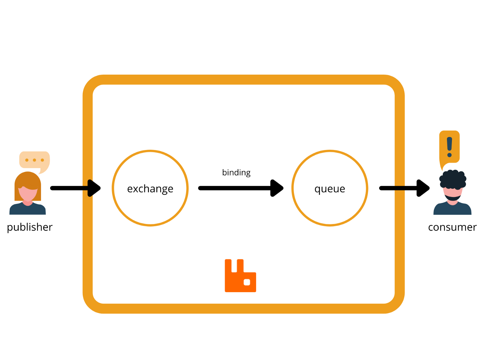

# Installation 
## Install Erlang
```
sudo apt install erlang
```

## Install RabbitMQ Server Ubuntu
```
sudo apt install rabbitmq-server
```

# Rabbitmq
RabbitMQ is a message-queueing software also known as a message broker or queue manager. Simply said; it is software where queues are defined, to which applications connect in order to transfer a message or messages.


A message can include any kind of information. It could, for example, have information about a process or task that should start on another application (which could even be on another server), or it could be just a simple text message. The queue-manager software stores the messages until a receiving application connects and takes a message off the queue. The receiving application then processes the message. 

## RabbitMQ Example

A message broker acts as a middleman for various services (e.g. a web application, as in this example). They can be used to reduce loads and delivery times of web application servers by delegating tasks that would normally take up a lot of time or resources to a third party that has no other job.

In this guide, we follow a scenario where a web application allows users to upload information to a website. The site will handle this information, generate a PDF, and email it back to the user. Handling the information, generating the PDF, and sending the email will, in this example case, take several seconds. That is one of the reasons why a message queue will be used to perform the task.

When the user has entered user information into the web interface, the web application will create a "PDF processing" message that includes all of the important information the user needs into a message and place it onto a queue defined in RabbitMQ. 




The basic architecture of a message queue is simple - there are client applications called producers that create messages and deliver them to the broker (the message queue). Other applications, called consumers, connect to the queue and subscribe to the messages to be processed. Software may act as a producer, or consumer, or both a consumer and a producer of messages. Messages placed onto the queue are stored until the consumer retrieves them. 

## When and why should you use RabbitMQ?

Message queueing allows web servers to respond to requests quickly instead of being forced to perform resource-heavy procedures on the spot that may delay response time. Message queueing is also good when you want to distribute a message to multiple consumers or to balance loads between workers.

The consumer takes a message off the queue and starts processing the PDF. At the same time, the producer is queueing up new messages. The consumer can be on a totally different server than the producer or they can be located on the same server. The request can be created in one programming language and handled in another programming language. The point is, the two applications will only communicate through the messages they are sending to each other, which means the sender and receiver have low coupling. 


1. The user sends a PDF creation request to the web application.
2. The web application (the producer) sends a message to RabbitMQ that includes data from the request such as name and email.
3. An exchange accepts the messages from the producer and routes them to correct message queues for PDF creation.
4. The PDF processing worker (the consumer) receives the task message and starts processing the PDF.
