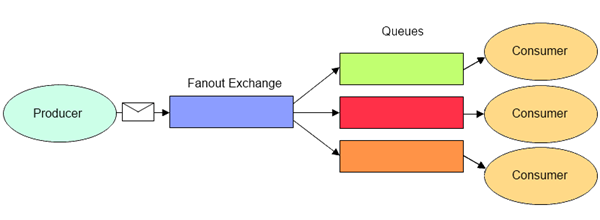

# Installation 
## Install Erlang
```
sudo apt install erlang
```

## Install RabbitMQ Server Ubuntu
```
sudo apt install rabbitmq-server
```

# Rabbitmq
RabbitMQ is a message-queueing software also known as a message broker or queue manager. Simply said; it is software where queues are defined, to which applications connect in order to transfer a message or messages.


A message can include any kind of information. It could, for example, have information about a process or task that should start on another application (which could even be on another server), or it could be just a simple text message. The queue-manager software stores the messages until a receiving application connects and takes a message off the queue. The receiving application then processes the message. 

## RabbitMQ Example

A message broker acts as a middleman for various services (e.g. a web application, as in this example). They can be used to reduce loads and delivery times of web application servers by delegating tasks that would normally take up a lot of time or resources to a third party that has no other job.

In this guide, we follow a scenario where a web application allows users to upload information to a website. The site will handle this information, generate a PDF, and email it back to the user. Handling the information, generating the PDF, and sending the email will, in this example case, take several seconds. That is one of the reasons why a message queue will be used to perform the task.

When the user has entered user information into the web interface, the web application will create a "PDF processing" message that includes all of the important information the user needs into a message and place it onto a queue defined in RabbitMQ. 


The basic architecture of a message queue is simple - there are client applications called producers that create messages and deliver them to the broker (the message queue). Other applications, called consumers, connect to the queue and subscribe to the messages to be processed. Software may act as a producer, or consumer, or both a consumer and a producer of messages. Messages placed onto the queue are stored until the consumer retrieves them. 

## When and why should you use RabbitMQ?

Message queueing allows web servers to respond to requests quickly instead of being forced to perform resource-heavy procedures on the spot that may delay response time. Message queueing is also good when you want to distribute a message to multiple consumers or to balance loads between workers.

The consumer takes a message off the queue and starts processing the PDF. At the same time, the producer is queueing up new messages. The consumer can be on a totally different server than the producer or they can be located on the same server. The request can be created in one programming language and handled in another programming language. The point is, the two applications will only communicate through the messages they are sending to each other, which means the sender and receiver have low coupling. 


1. The user sends a PDF creation request to the web application.
2. The web application (the producer) sends a message to RabbitMQ that includes data from the request such as name and email.
3. An exchange accepts the messages from the producer and routes them to correct message queues for PDF creation.
4. The PDF processing worker (the consumer) receives the task message and starts processing the PDF.

## Exchanges

Messages are not published directly to a queue; instead, the producer sends messages to an exchange. An exchange is responsible for routing the messages to different queues with the help of bindings and routing keys. A binding is a link between a queue and an exchange. 


## Message flow in RabbitMQ

1. The producer publishes a message to an exchange. When creating an exchange, the type must be specified. This topic will be covered later on.
2. The exchange receives the message and is now responsible for routing the message. The exchange takes different message attributes into account, such as the routing key, depending on the exchange type.
3. Bindings must be created from the exchange to queues. 
4. In this case, there are two bindings to two different queues from the exchange. The exchange routes the message into the queues depending on message attributes.
The messages stay in the queue until they are handled by a consumer
5. The consumer handles the message.

## Types of exchanges 


Direct: The message is routed to the queues whose binding key exactly matches the routing key of the message. For example, if the queue is bound to the exchange with the binding key pdfprocess, a message published to the exchange with a routing key pdfprocess is routed to that queue.


Fanout: A fanout exchange routes messages to all of the queues bound to it.



Topic: The topic exchange does a wildcard match between the routing key and the routing pattern specified in the binding.


Headers: Headers exchanges use the message header attributes for routing.


## RabbitMQ and server concepts

Some important concepts need to be described before we dig deeper into RabbitMQ. The default virtual host, the default user, and the default permissions are used in the examples, so let’s go over the elements and concepts:

* Producer: Application that sends the messages.

* Consumer: Application that receives the messages.

* Queue: Buffer that stores messages.

* Message: Information that is sent from the producer to a consumer through RabbitMQ.

* Connection: A TCP connection between your application and the RabbitMQ broker.

* Channel: A virtual connection inside a connection. When publishing or consuming messages from a queue - it's all done over a channel.


* Exchange: Receives messages from producers and pushes them to queues depending on rules defined by the exchange type. To receive messages, a queue needs to be bound to at least one exchange.

* Binding: A binding is a link between a queue and an exchange.

* Routing key: A key that the exchange looks at to decide how to route the message to queues. Think of the routing key like an address for the message.

* AMQP: Advanced Message Queuing Protocol is the protocol used by RabbitMQ for messaging. 

* Users: It is possible to connect to RabbitMQ with a given username and password. Every user can be assigned permissions such as rights to read, write and configure privileges within the instance. Users can also be assigned permissions for specific virtual hosts.

* Vhost, virtual host: Provides a way to segregate applications using the same RabbitMQ instance. Different users can have different permissions to different vhost and queues and exchanges can be created, so they only exist in one vhost. 

# Hello World!
(using the Pika Python client)

In this part of the tutorial we'll write two small programs in Python; a producer (sender) that sends a single message, and a consumer (receiver) that receives messages and prints them out. It's a "Hello World" of messaging.

In the diagram below, "P" is our producer and "C" is our consumer. The box in the middle is a queue - a message buffer that RabbitMQ keeps on behalf of the consumer.

Our overall design will look like:


Producer sends messages to the "hello" queue. The consumer receives messages from that queue.

In this tutorial series we're going to use Pika 1.0.0, which is the Python client recommended by the RabbitMQ team. To install it you can use the pip package management tool:

```
pip install pika
```

Our first program `send.py` will send a single message to the queue. The first thing we need to do is to establish a connection with RabbitMQ server.

```
#!/usr/bin/env python
import pika

connection = pika.BlockingConnection(pika.ConnectionParameters('localhost'))
channel = connection.channel()
```

We're connected now, to a broker on the local machine - hence the localhost. If we wanted to connect to a broker on a different machine we'd simply specify its name or IP address here.

Next, before sending we need to make sure the recipient queue exists. If we send a message to non-existing location, RabbitMQ will just drop the message. Let's create a hello queue to which the message will be delivered:

```
channel.queue_declare(queue='hello')
```

At this point we're ready to send a message. Our first message will just contain a string Hello World! and we want to send it to our hello queue.

In RabbitMQ a message can never be sent directly to the queue, it always needs to go through an exchange. But let's not get dragged down by the details ‒ you can read more about exchanges in the third part of this tutorial. All we need to know now is how to use a default exchange identified by an empty string. This exchange is special ‒ it allows us to specify exactly to which queue the message should go. The queue name needs to be specified in the routing_key parameter:

```
channel.basic_publish(exchange='',
                      routing_key='hello',
                      body='Hello World!')
print(" [x] Sent 'Hello World!'")
```

Before exiting the program we need to make sure the network buffers were flushed and our message was actually delivered to RabbitMQ. We can do it by gently closing the connection.

```
connection.close()
```

Our second program receive.py will receive messages from the queue and print them on the screen.

Again, first we need to connect to RabbitMQ server. The code responsible for connecting to Rabbit is the same as previously.

The next step, just like before, is to make sure that the queue exists. Creating a queue using queue_declare is idempotent ‒ we can run the command as many times as we like, and only one will be created.

```
channel.queue_declare(queue='hello')
```

You may ask why we declare the queue again ‒ we have already declared it in our previous code. We could avoid that if we were sure that the queue already exists. For example if send.py program was run before. But we're not yet sure which program to run first. In such cases it's a good practice to repeat declaring the queue in both programs.

Receiving messages from the queue is more complex. It works by subscribing a callback function to a queue. Whenever we receive a message, this callback function is called by the Pika library. In our case this function will print on the screen the contents of the message.

```
def callback(ch, method, properties, body):
    print(" [x] Received %r" % body)
```

Next, we need to tell RabbitMQ that this particular callback function should receive messages from our hello queue:

```
channel.basic_consume(queue='hello',
                      auto_ack=True,
                      on_message_callback=callback)
```

For that command to succeed we must be sure that a queue which we want to subscribe to exists. Fortunately we're confident about that ‒ we've created a queue above ‒ using queue_declare.

The auto_ack parameter will be described later on.

And finally, we enter a never-ending loop that waits for data and runs callbacks whenever necessary, and catch KeyboardInterrupt during program shutdown.

```
print(' [*] Waiting for messages. To exit press CTRL+C')
channel.start_consuming()

if __name__ == '__main__':
    try:
        main()
    except KeyboardInterrupt:
        print('Interrupted')
        try:
            sys.exit(0)
        except SystemExit:
            os._exit(0)
```

Now we can try out our programs in a terminal. First, let's start a consumer, which will run continuously waiting for deliveries:

```
python receive.py
# => [*] Waiting for messages. To exit press CTRL+C
```

Now start the producer in a new terminal. The producer program will stop after every run:

```
python send.py
# => [x] Sent 'Hello World!'
```

The consumer will print the message:

```
# => [*] Waiting for messages. To exit press CTRL+C
# => [x] Received 'Hello World!'
```

Hurray! We were able to send our first message through RabbitMQ. As you might have noticed, the receive.py program doesn't exit. It will stay ready to receive further messages, and may be interrupted with Ctrl-C.

Try to run send.py again in a new terminal.
