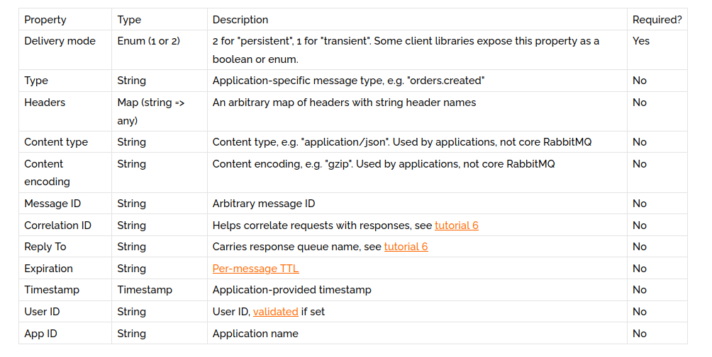

# Installation 
## Install Erlang
```
sudo apt install erlang
```

## Install RabbitMQ Server Ubuntu
```
sudo apt install rabbitmq-server
```

# Rabbitmq
RabbitMQ is a message-queueing software also known as a message broker or queue manager. Simply said; it is software where queues are defined, to which applications connect in order to transfer a message or messages.


A message can include any kind of information. It could, for example, have information about a process or task that should start on another application (which could even be on another server), or it could be just a simple text message. The queue-manager software stores the messages until a receiving application connects and takes a message off the queue. The receiving application then processes the message. 

## RabbitMQ Example

A message broker acts as a middleman for various services (e.g. a web application, as in this example). They can be used to reduce loads and delivery times of web application servers by delegating tasks that would normally take up a lot of time or resources to a third party that has no other job.

In this guide, we follow a scenario where a web application allows users to upload information to a website. The site will handle this information, generate a PDF, and email it back to the user. Handling the information, generating the PDF, and sending the email will, in this example case, take several seconds. That is one of the reasons why a message queue will be used to perform the task.

When the user has entered user information into the web interface, the web application will create a "PDF processing" message that includes all of the important information the user needs into a message and place it onto a queue defined in RabbitMQ. 


The basic architecture of a message queue is simple - there are client applications called producers that create messages and deliver them to the broker (the message queue). Other applications, called consumers, connect to the queue and subscribe to the messages to be processed. Software may act as a producer, or consumer, or both a consumer and a producer of messages. Messages placed onto the queue are stored until the consumer retrieves them. 

## When and why should you use RabbitMQ?

Message queueing allows web servers to respond to requests quickly instead of being forced to perform resource-heavy procedures on the spot that may delay response time. Message queueing is also good when you want to distribute a message to multiple consumers or to balance loads between workers.

The consumer takes a message off the queue and starts processing the PDF. At the same time, the producer is queueing up new messages. The consumer can be on a totally different server than the producer or they can be located on the same server. The request can be created in one programming language and handled in another programming language. The point is, the two applications will only communicate through the messages they are sending to each other, which means the sender and receiver have low coupling. 


1. The user sends a PDF creation request to the web application.
2. The web application (the producer) sends a message to RabbitMQ that includes data from the request such as name and email.
3. An exchange accepts the messages from the producer and routes them to correct message queues for PDF creation.
4. The PDF processing worker (the consumer) receives the task message and starts processing the PDF.

## Exchanges

Messages are not published directly to a queue; instead, the producer sends messages to an exchange. An exchange is responsible for routing the messages to different queues with the help of bindings and routing keys. A binding is a link between a queue and an exchange. 


## Message flow in RabbitMQ

1. The producer publishes a message to an exchange. When creating an exchange, the type must be specified. This topic will be covered later on.
2. The exchange receives the message and is now responsible for routing the message. The exchange takes different message attributes into account, such as the routing key, depending on the exchange type.
3. Bindings must be created from the exchange to queues. 
4. In this case, there are two bindings to two different queues from the exchange. The exchange routes the message into the queues depending on message attributes.
The messages stay in the queue until they are handled by a consumer
5. The consumer handles the message.

## Types of exchanges 


Direct: The message is routed to the queues whose binding key exactly matches the routing key of the message. For example, if the queue is bound to the exchange with the binding key pdfprocess, a message published to the exchange with a routing key pdfprocess is routed to that queue.


Fanout: A fanout exchange routes messages to all of the queues bound to it.


Topic: The topic exchange does a wildcard match between the routing key and the routing pattern specified in the binding.


Headers: Headers exchanges use the message header attributes for routing.


## RabbitMQ and server concepts

Some important concepts need to be described before we dig deeper into RabbitMQ. The default virtual host, the default user, and the default permissions are used in the examples, so let’s go over the elements and concepts:

* Producer: Application that sends the messages.

* Consumer: Application that receives the messages.

* Queue: Buffer that stores messages.

* Message: Information that is sent from the producer to a consumer through RabbitMQ.

* Connection: A TCP connection between your application and the RabbitMQ broker.

* Channel: A virtual connection inside a connection. When publishing or consuming messages from a queue - it's all done over a channel.


* Exchange: Receives messages from producers and pushes them to queues depending on rules defined by the exchange type. To receive messages, a queue needs to be bound to at least one exchange.

* Binding: A binding is a link between a queue and an exchange.

* Routing key: A key that the exchange looks at to decide how to route the message to queues. Think of the routing key like an address for the message.

* AMQP: Advanced Message Queuing Protocol is the protocol used by RabbitMQ for messaging. 

* Users: It is possible to connect to RabbitMQ with a given username and password. Every user can be assigned permissions such as rights to read, write and configure privileges within the instance. Users can also be assigned permissions for specific virtual hosts.

* Vhost, virtual host: Provides a way to segregate applications using the same RabbitMQ instance. Different users can have different permissions to different vhost and queues and exchanges can be created, so they only exist in one vhost. 

# Hello World!
(using the Pika Python client)

In this part of the tutorial we'll write two small programs in Python; a producer (sender) that sends a single message, and a consumer (receiver) that receives messages and prints them out. It's a "Hello World" of messaging.

In the diagram below, "P" is our producer and "C" is our consumer. The box in the middle is a queue - a message buffer that RabbitMQ keeps on behalf of the consumer.

Our overall design will look like:


Producer sends messages to the "hello" queue. The consumer receives messages from that queue.

In this tutorial series we're going to use Pika 1.0.0, which is the Python client recommended by the RabbitMQ team. To install it you can use the pip package management tool:

```
pip install pika
```

Our first program `send.py` will send a single message to the queue. The first thing we need to do is to establish a connection with RabbitMQ server.

```
#!/usr/bin/env python
import pika

connection = pika.BlockingConnection(pika.ConnectionParameters('localhost'))
channel = connection.channel()
```

We're connected now, to a broker on the local machine - hence the localhost. If we wanted to connect to a broker on a different machine we'd simply specify its name or IP address here.

Next, before sending we need to make sure the recipient queue exists. If we send a message to non-existing location, RabbitMQ will just drop the message. Let's create a hello queue to which the message will be delivered:

```
channel.queue_declare(queue='hello')
```

At this point we're ready to send a message. Our first message will just contain a string Hello World! and we want to send it to our hello queue.

In RabbitMQ a message can never be sent directly to the queue, it always needs to go through an exchange. But let's not get dragged down by the details ‒ you can read more about exchanges in the third part of this tutorial. All we need to know now is how to use a default exchange identified by an empty string. This exchange is special ‒ it allows us to specify exactly to which queue the message should go. The queue name needs to be specified in the routing_key parameter:

```
channel.basic_publish(exchange='',
                      routing_key='hello',
                      body='Hello World!')
print(" [x] Sent 'Hello World!'")
```

Before exiting the program we need to make sure the network buffers were flushed and our message was actually delivered to RabbitMQ. We can do it by gently closing the connection.

```
connection.close()
```

Our second program receive.py will receive messages from the queue and print them on the screen.

Again, first we need to connect to RabbitMQ server. The code responsible for connecting to Rabbit is the same as previously.

The next step, just like before, is to make sure that the queue exists. Creating a queue using queue_declare is idempotent ‒ we can run the command as many times as we like, and only one will be created.

```
channel.queue_declare(queue='hello')
```

You may ask why we declare the queue again ‒ we have already declared it in our previous code. We could avoid that if we were sure that the queue already exists. For example if send.py program was run before. But we're not yet sure which program to run first. In such cases it's a good practice to repeat declaring the queue in both programs.

Receiving messages from the queue is more complex. It works by subscribing a callback function to a queue. Whenever we receive a message, this callback function is called by the Pika library. In our case this function will print on the screen the contents of the message.

```
def callback(ch, method, properties, body):
    print(" [x] Received %r" % body)
```

Next, we need to tell RabbitMQ that this particular callback function should receive messages from our hello queue:

```
channel.basic_consume(queue='hello',
                      auto_ack=True,
                      on_message_callback=callback)
```

For that command to succeed we must be sure that a queue which we want to subscribe to exists. Fortunately we're confident about that ‒ we've created a queue above ‒ using queue_declare.

The auto_ack parameter will be described later on.

And finally, we enter a never-ending loop that waits for data and runs callbacks whenever necessary, and catch KeyboardInterrupt during program shutdown.

```
print(' [*] Waiting for messages. To exit press CTRL+C')
channel.start_consuming()

if __name__ == '__main__':
    try:
        main()
    except KeyboardInterrupt:
        print('Interrupted')
        try:
            sys.exit(0)
        except SystemExit:
            os._exit(0)
```

Now we can try out our programs in a terminal. First, let's start a consumer, which will run continuously waiting for deliveries:

```
python receive.py
# => [*] Waiting for messages. To exit press CTRL+C
```

Now start the producer in a new terminal. The producer program will stop after every run:

```
python send.py
# => [x] Sent 'Hello World!'
```

The consumer will print the message:

```
# => [*] Waiting for messages. To exit press CTRL+C
# => [x] Received 'Hello World!'
```

Hurray! We were able to send our first message through RabbitMQ. As you might have noticed, the receive.py program doesn't exit. It will stay ready to receive further messages, and may be interrupted with Ctrl-C.

Try to run send.py again in a new terminal.

# rabbitmq-plugins

This command lists all plugins:
```
rabbitmq-plugins list
```

This command lists all plugins whose name contains "management".
```
rabbitmq-plugins list -v
```

This command lists all implicitly or explicitly enabled RabbitMQ plugins. 
```
rabbitmq-plugins list -v management
```

For example, this command enables the "shovel" and "management" plugins and all their dependencies:
```
rabbitmq-plugins enable rabbitmq_shovel rabbitmq_management
```

For example, this command disables "rabbitmq_management" and all plugins that depend on it:
```
rabbitmq-plugins disable rabbitmq_management
```

## Usage
### Management UI Access

The management UI can be accessed using a Web browser at http://{node-hostname}:15672/.

For example, for a node running on a machine with the hostname of warp10.local, it can be accessed by users with sufficient privileges at either http://warp10.local:15672/ or http://localhost:15672/ (provided that localhost resolves correctly).

# rabbitmqctl

rabbitmqctl — tool for managing RabbitMQ nodes

## User Management

Note that all user management commands rabbitmqctl only can manage users in the internal RabbitMQ database. Users from any alternative authentication backends such as LDAP cannot be inspected or managed with those commands.

### add_user
```
rabbitmqctl add_user username password
```

### delete_user
```
rabbitmqctl delete_user username
```

### list_users
Lists users. Each result row will contain the user name followed by a list of the tags set for that user.
For example, this command instructs the RabbitMQ broker to list all users:

```    
rabbitmqctl list_users
```

### set_user_tags
For example, this command instructs the RabbitMQ broker to ensure the user named "janeway" is an administrator:
```
rabbitmqctl set_user_tags janeway administrator
```

This has no effect when the user authenticates using a messaging protocol, but can be used to permit the user to manage users, virtual hosts and permissions when the user logs in via some other means (for example with the management plugin).

This command instructs the RabbitMQ broker to remove any tags from the user named "janeway":
```
rabbitmqctl set_user_tags janeway
```


# Work Queues

In this one we'll create a Work Queue that will be used to distribute time-consuming tasks among multiple workers.

The main idea behind Work Queues (aka: Task Queues) is to avoid doing a resource-intensive task immediately and having to wait for it to complete. Instead we schedule the task to be done later. We encapsulate a task as a message and send it to the queue. A worker process running in the background will pop the tasks and eventually execute the job. When you run many workers the tasks will be shared between them.

This concept is especially useful in web applications where it's impossible to handle a complex task during a short HTTP request window.

In the previous part of this tutorial we sent a message containing "Hello World!". Now we'll be sending strings that stand for complex tasks. We don't have a real-world task, like images to be resized or pdf files to be rendered, so let's fake it by just pretending we're busy - by using the time.sleep() function. We'll take the number of dots in the string as its complexity; every dot will account for one second of "work". For example, a fake task described by Hello... will take three seconds.

We will slightly modify the send.py code from our previous example, to allow arbitrary messages to be sent from the command line. This program will schedule tasks to our work queue, so let's name it new_task.py:

```
import sys

message = ' '.join(sys.argv[1:]) or "Hello World!"
channel.basic_publish(exchange='',
                      routing_key='hello',
                      body=message)
print(" [x] Sent %r" % message)
```

Our old receive.py script also requires some changes: it needs to fake a second of work for every dot in the message body. It will pop messages from the queue and perform the task, so let's call it worker.py:

```
import time

def callback(ch, method, properties, body):
    print(" [x] Received %r" % body.decode())
    time.sleep(body.count(b'.'))
    print(" [x] Done")
```

## Round-robin dispatching

One of the advantages of using a Task Queue is the ability to easily parallelise work. If we are building up a backlog of work, we can just add more workers and that way, scale easily.

First, let's try to run two worker.py scripts at the same time. They will both get messages from the queue, but how exactly? Let's see.

You need three consoles open. Two will run the worker.py script. These consoles will be our two consumers - C1 and C2.

```
# shell 1
python worker.py
# => [*] Waiting for messages. To exit press CTRL+C
```

```
# shell 2
python worker.py
# => [*] Waiting for messages. To exit press CTRL+C
```

In the third one we'll publish new tasks. Once you've started the consumers you can publish a few messages:

```
# shell 3
python new_task.py First message.
python new_task.py Second message..
python new_task.py Third message...
python new_task.py Fourth message....
python new_task.py Fifth message.....
```

Let's see what is delivered to our workers:

```
# shell 1
python worker.py
# => [*] Waiting for messages. To exit press CTRL+C
# => [x] Received 'First message.'
# => [x] Received 'Third message...'
# => [x] Received 'Fifth message.....'
```
```
# shell 2
python worker.py
# => [*] Waiting for messages. To exit press CTRL+C
# => [x] Received 'Second message..'
# => [x] Received 'Fourth message....'
```

By default, RabbitMQ will send each message to the next consumer, in sequence. On average every consumer will get the same number of messages. This way of distributing messages is called round-robin. Try this out with three or more workers.

## Message acknowledgment

Doing a task can take a few seconds, you may wonder what happens if a consumer starts a long task and it terminates before it completes. With our current code once RabbitMQ delivers message to the consumer, it immediately marks it for deletion. In this case, if you terminate a worker, the message it was just processing is lost. The messages that were dispatched to this particular worker but were not yet handled are also lost.

But we don't want to lose any tasks. If a worker dies, we'd like the task to be delivered to another worker.

In order to make sure a message is never lost, RabbitMQ supports message acknowledgments. An ack(nowledgement) is sent back by the consumer to tell RabbitMQ that a particular message had been received, processed and that RabbitMQ is free to delete it.

If a consumer dies (its channel is closed, connection is closed, or TCP connection is lost) without sending an ack, RabbitMQ will understand that a message wasn't processed fully and will re-queue it. If there are other consumers online at the same time, it will then quickly redeliver it to another consumer. That way you can be sure that no message is lost, even if the workers occasionally die.

A timeout (30 minutes by default) is enforced on consumer delivery acknowledgement. This helps detect buggy (stuck) consumers that never acknowledge deliveries. You can increase this timeout as described in Delivery Acknowledgement Timeout.

Manual message acknowledgments are turned on by default. In previous examples we explicitly turned them off via the auto_ack=True flag. It's time to remove this flag and send a proper acknowledgment from the worker, once we're done with a task.


### auto acknowledgement mode
**(autoAck): the messages are automatically removed from the queue as soon as they are sent to the consumer, this is**

### manual Acknowledgement mode
**(manualAck): the consumer subscribes to a queue, and the messages are removed only when the consumer has sent back an acknowledgement (Ack) back to the broker**


```
def callback(ch, method, properties, body):
    print(" [x] Received %r" % body.decode())
    time.sleep(body.count(b'.') )
    print(" [x] Done")
    ch.basic_ack(delivery_tag = method.delivery_tag)

channel.basic_consume(queue='hello', on_message_callback=callback)
```

Using this code, you can ensure that even if you terminate a worker using CTRL+C while it was processing a message, nothing is lost. Soon after the worker terminates, all unacknowledged messages are redelivered.

Acknowledgement must be sent on the same channel that received the delivery. Attempts to acknowledge using a different channel will result in a channel-level protocol exception

## Message durability

We have learned how to make sure that even if the consumer dies, the task isn't lost. But our tasks will still be lost if RabbitMQ server stops.

When RabbitMQ quits or crashes it will forget the queues and messages unless you tell it not to. Two things are required to make sure that messages aren't lost: we need to mark both the queue and messages as durable.

First, we need to make sure that the queue will survive a RabbitMQ node restart. In order to do so, we need to declare it as durable:

```
channel.queue_declare(queue='hello', durable=True)
```

Although this command is correct by itself, it won't work in our setup. That's because we've already defined a queue called hello which is not durable. RabbitMQ doesn't allow you to redefine an existing queue with different parameters and will return an error to any program that tries to do that. But there is a quick workaround - let's declare a queue with different name, for example task_queue:

```
channel.queue_declare(queue='task_queue', durable=True)
```

This queue_declare change needs to be applied to both the producer and consumer code.

At that point we're sure that the task_queue queue won't be lost even if RabbitMQ restarts. Now we need to mark our messages as persistent - by supplying a delivery_mode property with the value of pika.spec.PERSISTENT_DELIVERY_MODE

```
channel.basic_publish(exchange='',
                      routing_key="task_queue",
                      body=message,
                      properties=pika.BasicProperties(
                         delivery_mode = pika.spec.PERSISTENT_DELIVERY_MODE
                      ))
```

## Fair dispatch

You might have noticed that the dispatching still doesn't work exactly as we want. For example in a situation with two workers, when all odd messages are heavy and even messages are light, one worker will be constantly busy and the other one will do hardly any work. Well, RabbitMQ doesn't know anything about that and will still dispatch messages evenly.

This happens because RabbitMQ just dispatches a message when the message enters the queue. It doesn't look at the number of unacknowledged messages for a consumer. It just blindly dispatches every n-th message to the n-th consumer.


In order to defeat that we can use the Channel#basic_qos channel method with the prefetch_count=1 setting. This uses the basic.qos protocol method to tell RabbitMQ not to give more than one message to a worker at a time. Or, in other words, don't dispatch a new message to a worker until it has processed and acknowledged the previous one. Instead, it will dispatch it to the next worker that is not still busy.

```
channel.basic_qos(prefetch_count=1)
```

## Explain 
def callback(ch, method, properties, body): 

### method


### properties


#  Publish/Subscribe

To illustrate the pattern, we're going to build a simple logging system. It will consist of two programs -- the first will emit log messages and the second will receive and print them.

In our logging system every running copy of the receiver program will get the messages. That way we'll be able to run one receiver and direct the logs to disk; and at the same time we'll be able to run another receiver and see the logs on the screen


## Exchanges

In previous parts of the tutorial we sent and received messages to and from a queue. Now it's time to introduce the full messaging model in Rabbit.

Let's quickly go over what we covered in the previous tutorials:

* A producer is a user application that sends messages.
* A queue is a buffer that stores messages.
* A consumer is a user application that receives messages.

**The core idea in the messaging model in RabbitMQ is that the producer never sends any messages directly to a queue. Actually,** **quite often the producer doesn't even know if a message will be delivered to any queue at all.**

Instead, the producer can only send messages to an exchange. An exchange is a very simple thing. On one side it receives messages from producers and on the other side it pushes them to queues. The exchange must know exactly what to do with a message it receives. Should it be appended to a particular queue? Should it be appended to many queues? Or should it get discarded. The rules for that are defined by the exchange type.
An exchange: The producer can only send messages to an exchange. One side of the exchange receives messages from producers and the other side pushes them to queues.

There are a few exchange types available: direct, topic, headers and fanout. We'll focus on the last one -- the fanout. Let's create an exchange of that type, and call it logs:

```
channel.exchange_declare(exchange='logs',
                         exchange_type='fanout')
```

The fanout exchange is very simple. As you can probably guess from the name, it just broadcasts all the messages it receives to all the queues it knows. And that's exactly what we need for our logger.


## Listing exchanges

To list the exchanges on the server you can run the ever useful rabbitmqctl:

```
sudo rabbitmqctl list_exchanges
```

In this list there will be some amq.* exchanges and the default (unnamed) exchange. These are created by default, but it is unlikely you'll need to use them at the moment.

## The default exchange

In previous parts of the tutorial we knew nothing about exchanges, but still were able to send messages to queues. That was possible because we were using a default exchange, which we identify by the empty string ("").

Recall how we published a message before:

```
channel.basic_publish(exchange='',
                        routing_key='hello',
                        body=message)

```

The exchange parameter is the name of the exchange. The empty string denotes the default or nameless exchange: messages are routed to the queue with the name specified by routing_key, if it exists.

Now, we can publish to our named exchange instead:

```
channel.basic_publish(exchange='logs',
                      routing_key='',
                      body=message)
```

## Temporary queues

As you may remember previously we were using queues that had specific names (remember hello and task_queue?). Being able to name a queue was crucial for us -- we needed to point the workers to the same queue. Giving a queue a name is important when you want to share the queue between producers and consumers.

But that's not the case for our logger. We want to hear about all log messages, not just a subset of them. We're also interested only in currently flowing messages not in the old ones. To solve that we need two things.

Firstly, whenever we connect to Rabbit we need a fresh, empty queue. To do it we could create a queue with a random name, or, even better - let the server choose a random queue name for us. We can do this by supplying empty queue parameter to queue_declare:

```
result = channel.queue_declare(queue='')
```

At this point result.method.queue contains a random queue name. For example it may look like amq.gen-JzTY20BRgKO-HjmUJj0wLg.

Secondly, once the consumer connection is closed, the queue should be deleted. There's an exclusive flag for that:

```
result = channel.queue_declare(queue='', exclusive=True)
```

You can learn more about the exclusive flag and other queue properties in the guide on queues.

## Bindings
The exchange sends messages to a queue. The relationship between the exchange and a queue is called a binding.

We've already created a fanout exchange and a queue. Now we need to tell the exchange to send messages to our queue. That relationship between exchange and a queue is called a binding.

```
channel.queue_bind(exchange='logs',
                   queue=result.method.queue)
```

From now on the logs exchange will append messages to our queue.

### Listing bindings
You can list existing bindings using, you guessed it,

```
rabbitmqctl list_bindings
```


## Putting it all together

The producer program, which emits log messages, doesn't look much different from the previous tutorial. The most important change is that we now want to publish messages to our logs exchange instead of the nameless one. We need to supply a routing_key when sending, but its value is ignored for fanout exchanges.

`emit_log.py`
```
#!/usr/bin/env python
import pika
import sys

connection = pika.BlockingConnection(
    pika.ConnectionParameters(host='localhost'))
channel = connection.channel()

channel.exchange_declare(exchange='logs', exchange_type='fanout')

message = ' '.join(sys.argv[1:]) or "info: Hello World!"
channel.basic_publish(exchange='logs', routing_key='', body=message)
print(" [x] Sent %r" % message)
connection.close()
```

As you see, after establishing the connection we declared the exchange. This step is necessary as publishing to a non-existing exchange is forbidden.

The messages will be lost if no queue is bound to the exchange yet, but that's okay for us; if no consumer is listening yet we can safely discard the message.

`receive_logs.py`
```
#!/usr/bin/env python
import pika

connection = pika.BlockingConnection(
    pika.ConnectionParameters(host='localhost'))
channel = connection.channel()

channel.exchange_declare(exchange='logs', exchange_type='fanout')

result = channel.queue_declare(queue='', exclusive=True)
queue_name = result.method.queue

channel.queue_bind(exchange='logs', queue=queue_name)

print(' [*] Waiting for logs. To exit press CTRL+C')

def callback(ch, method, properties, body):
    print(" [x] %r" % body)

channel.basic_consume(
    queue=queue_name, on_message_callback=callback, auto_ack=True)

channel.start_consuming()
```

We're done. If you want to save logs to a file, just open a console and type:

```
python receive_logs.py > logs_from_rabbit.log
```

If you wish to see the logs on your screen, spawn a new terminal and run:

```
python receive_logs.py
```

And of course, to emit logs type:

```
python emit_log.py
```

Using rabbitmqctl list_bindings you can verify that the code actually creates bindings and queues as we want. With two receive_logs.py programs running you should see something like:

```
sudo rabbitmqctl list_bindings
# => Listing bindings ...
# => logs    exchange        amq.gen-JzTY20BRgKO-HjmUJj0wLg  queue           []
# => logs    exchange        amq.gen-vso0PVvyiRIL2WoV3i48Yg  queue           []
# => ...done.
```

The interpretation of the result is straightforward: data from exchange logs goes to two queues with server-assigned names. And that's exactly what we intended.